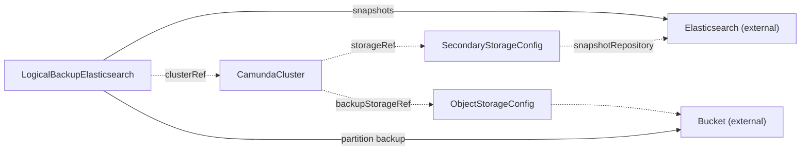

# LogicalBackupElasticsearch

`LogicalBackupElasticsearch` is one backup of a `CamundaCluster` that stores its data in Elasticsearch. You create it, or another tool creates it for you.

An orchestration cluster on Elasticsearch holds its data in three places: the web-application indices, the exported Zeebe record indices, and the Zeebe partitions. One `LogicalBackupElasticsearch` captures all three under one backup ID. The operator takes the backup while the cluster runs. A completed backup is one restore point.

One resource is one backup. The spec is immutable, and the backup runs once. To take another backup, or to retry a failed one, create a new resource. `kubectl get lbes` lists the backups with their phase, step, and backup ID.

Before you create a backup, make sure that:

- The `CamundaCluster` has `spec.backupStorageRef` and is `Ready`. It is not suspended.
- The `ElasticsearchCluster` has `spec.snapshotStorageRef` on the same `ObjectStorageConfig`. Its `SecondaryStorageConfig` carries `snapshotRepository`.
- The backup lives in the namespace of the cluster.

A `LogicalBackupElasticsearch` writes one set of artifacts under one backup ID: the snapshots of the web-application indices and of the exported Zeebe record indices, in the snapshot repository of the cluster, and the Zeebe partition backup, in the bucket of the cluster's `backupStorageRef`. The status records the ID, the repository, and the snapshot names.

The operator creates no Kubernetes resources from this kind. It calls the management API of the cluster and the Elasticsearch API of the `SecondaryStorageConfig`.

The smallest backup names the cluster:

```yaml
apiVersion: core.camunda.io/v1
kind: LogicalBackupElasticsearch
metadata:
  name: my-cluster-backup
  namespace: my-cluster-ns
spec:
  clusterRef:
    name: my-cluster
```



## Exporting

The backup pauses exporting before it writes and resumes it at the end. Records still flow into Elasticsearch, but Zeebe cannot compact its log while exporting is paused. If a step fails, the backup resumes exporting before it ends as `Failed`.

## One backup at a time

The operator runs one backup of a cluster at a time, across both backup kinds. A second backup waits in `Pending` with reason `BackupInProgress` and names the backup that runs.

## Time limits

If the management API or Elasticsearch is unreachable during a step, the backup retries for 10 minutes. After that, the step fails and the backup resumes exporting. The resume of exporting is retried for 30 minutes. After that, the backup ends as `Failed` with reason `ResumeFailed`, and exporting stays paused. While the cluster is suspended, the backup waits, and the time does not count.

## Changes

Do not change the storage or the backup bucket of the cluster while a backup runs. The backup fails, and the message names the recorded and the current value. If you delete the cluster during the run, or delete and recreate it under the same name, the backup ends as `Failed` without a call to the new cluster.

## Missing references

If the cluster, its `SecondaryStorageConfig`, or its `ObjectStorageConfig` does not exist, `Ready` reports `InvalidReference`. If the cluster publishes no `snapshotRepository`, the reason is `InvalidReference` as well. If `status.management` of the cluster names a credentials Secret that does not exist, the reason is `MissingSecret`.

## Deletion

When you delete the backup, the operator deletes the snapshots and the partition backup that this backup wrote. If the backup still runs, or ended as `ResumeFailed`, the operator resumes exporting first. It deletes only snapshots and backups that are its own. A history backup that Camunda still reports as in progress holds the deletion until it ends. If the cluster is suspended, the deletion waits until the cluster runs again. If the cluster or the bucket is gone, the operator releases the resource without cleanup and records an event that says so.

## Status

| Type | Reason | Meaning | What to do |
| --- | --- | --- | --- |
| `Ready` | `Progressing` | The backup runs, or it waits for the cluster to publish its management API in `status.management`. | Wait. The message names the current step. |
| `Ready` | `Completed` | The backup finished. `Ready` is `True`. | Nothing. Record `status.backupId` for a restore. |
| `Ready` | `Failed` | A step failed. Exporting runs again. | Read `status.failureMessage`. Correct the cause and create a new backup. |
| `Ready` | `ResumeFailed` | A step failed or finished, and exporting did not resume within 30 minutes. Exporting stays paused. | Repair the management API, then delete this backup. The deletion resumes exporting. No other backup of the cluster starts before that. |
| `Ready` | `ClusterSuspended` | The cluster is suspended, by `spec.suspend` or because another cluster holds its storage contract. The backup waits. | Set `spec.suspend` of the cluster to `false`, or give the cluster a contract of its own. |
| `Ready` | `BackupInProgress` | Another backup of the cluster runs. This one waits. | Wait. If the message says that the cluster is paused, delete or repair the named backup. |
| `Ready` | `StorageTypeMismatch` | The cluster does not store its data in Elasticsearch. | Use `LogicalBackupRDBMS` for a relational cluster. |
| `Ready` | `InvalidReference` | A referenced resource does not exist, or the cluster publishes no snapshot repository. | Read the message. Create the resource, or set `snapshotStorageRef` on the `ElasticsearchCluster`. |
| `Ready` | `MissingSecret` | `status.management` of the cluster names a credentials Secret that does not exist. | Create the Secret that the message names. |
| `Ready` | `ConnectionFailed` | The management API or Elasticsearch is unreachable. The step is retried. | Make sure that the endpoint answers. After 10 minutes the step fails. |

`status.phase` is `Pending`, `Running`, `Completed`, or `Failed`. `Completed` and `Failed` are terminal. `status.step` is the current step: `PauseExporting`, `BackupHistory`, `SnapshotRecords`, `BackupRuntime`, or `ResumeExporting`.

A restore needs these fields:

- `status.backupId` keys every part of the backup.
- `status.historySnapshots` names the snapshots of the web-application indices.
- `status.repository` names the snapshot repository.
- `status.partitionsCount` is the partition count of the cluster. A restore must match it.
- `status.version` is the Camunda version of the cluster when the backup started. A restore of this backup runs only with the exact same version.
- `status.storageSizes` holds the recorded volume sizes of Elasticsearch and Zeebe, when the operator can compute them.

`status.history`, `status.records`, and `status.runtime` report the state of each part: `Pending`, `InProgress`, `Completed`, or `Failed`. `status.failureMessage` names the step that failed. `status.resumeFailureMessage` says why exporting did not resume. `status.completionTime` is when the backup ended. `status.observedGeneration` is the last generation that the operator reconciled.

## Spec reference

Every field, with its type, whether it is required, and its default:

```yaml
apiVersion: core.camunda.io/v1
kind: LogicalBackupElasticsearch
metadata:
  name: my-cluster-backup
  namespace: my-cluster-ns
spec:
  # object. Required. The CamundaCluster to back up, in the namespace of this resource. Its secondary storage must be Elasticsearch.
  clusterRef:
    # string. Required. Name of the CamundaCluster.
    name: my-cluster
```

### Validation rules

- The whole `spec` is immutable. To retry, create a new resource.
- `spec.clusterRef.name` is required and must not be empty. The cluster must live in the namespace of the backup.

### A production-shaped example

A backup with a name that carries the date:

```yaml
apiVersion: core.camunda.io/v1
kind: LogicalBackupElasticsearch
metadata:
  name: my-cluster-backup-20260819
  namespace: my-cluster-ns
  labels:
    backup.my-company.example/schedule: nightly
spec:
  clusterRef:
    name: my-cluster
```

After the backup completes, `kubectl get lbes -n my-cluster-ns` shows the phase `Completed` and the backup ID.

## Related

- [CamundaCluster](camundacluster.md): the cluster that the backup references. Its `backupStorageRef` names the bucket.
- [ElasticsearchCluster](elasticsearchcluster.md): registers the snapshot repository when `spec.snapshotStorageRef` is set.
- [SecondaryStorageConfig](secondarystorageconfig.md): carries the Elasticsearch endpoint and `snapshotRepository`.
- [ObjectStorageConfig](objectstorageconfig.md): the bucket that holds the snapshots and the partition backup.
- [LogicalBackupRDBMS](logicalbackuprdbms.md): the backup kind for a relational cluster.
- [Backup guide](../guides/backup.md): how to set up backup storage and take a backup.
- [Secondary storage guide](../guides/secondary-storage.md): how to choose and connect the secondary storage.
