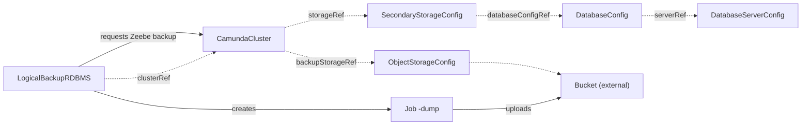

# LogicalBackupRDBMS

`LogicalBackupRDBMS` is one backup of a `CamundaCluster` that stores its data in a relational database. You create it, or another tool creates it for you.

An orchestration cluster on a relational database holds its data in two places. The Zeebe log and snapshots are the primary storage. The exported relational data is the secondary storage. One `LogicalBackupRDBMS` writes one `pg_dump` of the whole logical database to the backup bucket. Then it requests one Zeebe backup of the primary storage through the management API. The dump holds the exporter position, and the Zeebe backup holds the matching Zeebe state. Together they are one restore point.

One resource is one backup. The spec is immutable, and the backup runs once. To take another backup, or to retry a failed one, create a new resource. `kubectl get lbrdbms` lists the backups with their phase, step, and backup ID.

Before you create a backup, make sure that:

- The `CamundaCluster` has `spec.backupStorageRef` and is `Ready` for its current generation. It is not suspended.
- The `DatabaseConfig` of the cluster has `backupCredentialsSecretRef`.
- The `DatabaseServerConfig` is `Ready` and has `status.serverVersion`.
- The backup lives in the namespace of the cluster.

A `LogicalBackupRDBMS` named `<name>` runs the Job `<name>-dump` in its namespace, under the ServiceAccount that the cluster publishes in `status.serviceAccountName`. The Job runs `pg_dump` of the whole logical database and uploads the file to the bucket of the cluster's `backupStorageRef`, under the prefix of the cluster. `status.objectKey` records the key. When the upload is done, the operator requests one Zeebe backup of the primary storage through the management API. Camunda generates its ID and writes it to the same bucket. `status.zeebeBackupId` records the ID.

The Job and its pod carry the label `camunda.io/cluster: <cluster>`.

The smallest backup names the cluster:

```yaml
apiVersion: core.camunda.io/v1
kind: LogicalBackupRDBMS
metadata:
  name: my-cluster-backup
  namespace: my-cluster-ns
spec:
  clusterRef:
    name: my-cluster
```



## Pod settings

The dump pod takes its settings from `spec.backup.dump` of the cluster. If this resource sets `spec.dump`, that block replaces the cluster block as a whole. The two never merge. The image that runs `pg_dump` always comes from the cluster: `spec.backup.dump.postgresImage`, or `postgres:<serverVersion>` by default. The `extraEnv` and `extraEnvFrom` of this resource reach the container that runs `pg_dump` only, never the container that uploads.

## One backup at a time

The operator runs one backup of a cluster at a time, across both backup kinds. A second backup waits in `Pending` with reason `BackupInProgress` and names the backup that runs.

## Time limits

The dump Job fails after `activeDeadlineSeconds`, 24 hours by default. If a dependency stops resolving during the run, for example a deleted Secret, an image that does not pull, or a management API that does not answer, the backup waits 10 minutes for it to recover. After that, the backup fails.

## Changes

Do not change the backup storage of the cluster, or roll the cluster, while a backup runs. The backup waits 10 minutes with reason `InvalidReference` for the change to be reverted, then fails, because a dump and a Zeebe backup taken under different configurations do not form one restore point. A backup on a cluster that is still rolling out waits with reason `Progressing` before it starts. If you delete and recreate the cluster under the same name during the run, the backup fails at once.

## Missing references

If the cluster, its `SecondaryStorageConfig`, `DatabaseConfig`, `DatabaseServerConfig`, or `ObjectStorageConfig` does not exist, `Ready` reports `InvalidReference`. If the `DatabaseConfig` has no `backupCredentialsSecretRef`, or that Secret does not exist, the reason is `MissingSecret`. If the bucket uses static credentials and they do not resolve, the reason is `MissingCredentials`.

## Deletion

When you delete the backup, the operator deletes a Job that still runs, waits until its pods are gone, and then deletes the dump object. It never deletes Zeebe backups. If the bucket uses workload identity, the cleanup runs as the Job `<name>-cleanup` under the ServiceAccount of the cluster. A failed cleanup Job holds the deletion and records an event that names the Job. Read its logs, correct the cause, and delete the Job to retry. If the cluster, the bucket, or its credentials are gone, or the bucket now points at another location, the operator leaves the object and releases the resource. The event says what it left behind.

## Status

| Type | Reason | Meaning | What to do |
| --- | --- | --- | --- |
| `Ready` | `Progressing` | The backup runs, or it waits for the cluster to finish a rollout or to publish its management API in `status.management`. | Wait. The message names the step or the wait. |
| `Ready` | `Completed` | The backup finished. `Ready` is `True`. | Nothing. Record `status.backupId` and `status.zeebeBackupId` for a restore. |
| `Ready` | `Failed` | The backup failed. | Read `status.failureMessage`. Correct the cause and create a new backup. |
| `Ready` | `ClusterSuspended` | The cluster is suspended. The backup waits. | Set `spec.suspend` of the cluster to `false`. |
| `Ready` | `BackupInProgress` | Another backup of the cluster runs. This one waits. | Wait for the named backup to end. |
| `Ready` | `StorageTypeMismatch` | The cluster does not store its data in a relational database. | Use `LogicalBackupElasticsearch` for an Elasticsearch cluster. |
| `Ready` | `InvalidReference` | A referenced resource does not exist, the server has no current `status.serverVersion`, or the dump pod cannot pull its image. | Read the message. Create the resource, or wait for the `DatabaseServerConfig` to become `Ready`. |
| `Ready` | `MissingSecret` | The database credentials for the dump do not resolve, or the dump pod cannot start for a missing Secret. | Set `backupCredentialsSecretRef` on the `DatabaseConfig` and create the Secret. |
| `Ready` | `MissingCredentials` | The static credentials of the bucket do not resolve. | Create the Secret that the `ObjectStorageConfig` names, with all of its keys. |
| `Ready` | `ConnectionFailed` | The management API is unreachable or rejects the call. | Make sure that the cluster answers on its management port. After 10 minutes the backup fails. |

`status.phase` is `Pending`, `Running`, `Completed`, or `Failed`. `Completed` and `Failed` are terminal. `status.step` is `Dumping` or `ZeebeBackup`.

A restore needs these fields:

- `status.backupId` identifies the dump.
- `status.objectKey` is the full key of the dump in the bucket.
- `status.zeebeBackupId` is the Zeebe backup that pairs with the dump.
- `status.storageSizes.zeebe` is the recorded size of one Zeebe data volume, when the operator can compute it.

`status.jobName` names the dump Job while it exists. A failed Job stays until you delete the backup. `status.bucketRef` and `status.bucketLocation` record the bucket that holds the dump. `status.failureMessage` says why a `Failed` backup failed. `status.completionTime` is when the backup ended. `status.observedGeneration` is the last generation that the operator reconciled.

## Spec reference

Every field, with its type, whether it is required, and its default:

```yaml
apiVersion: core.camunda.io/v1
kind: LogicalBackupRDBMS
metadata:
  name: my-cluster-backup
  namespace: my-cluster-ns
spec:
  # object. Required. The CamundaCluster to back up, in the namespace of this resource. It must store its data in a relational database and have a backupStorageRef.
  clusterRef:
    # string. Required. Name of the CamundaCluster.
    name: my-cluster
  # object. Optional. Replaces the spec.backup.dump block of the cluster as a whole for this backup. The image is not part of it.
  dump:
    # object. Optional. CPU and memory of the dump pod.
    resources:
      requests:
        cpu: "500m"
        memory: "1Gi"
    # list. Optional. Extra environment variables of the dump container. Names under PG or UPLOAD_ are rejected.
    extraEnv: []
    # list. Optional, max 8. Extra environment sources of the dump container. Each source needs a prefix that cannot spell a PG* or UPLOAD_* name.
    extraEnvFrom: []
    # map. Optional. Extra labels of the dump pod.
    podLabels: {}
    # map. Optional. Extra annotations of the dump pod. Set the injection annotation of a service mesh to false here.
    podAnnotations: {}
    # object. Optional. Scheduling constraints of the dump pod.
    scheduling: {}
    # object. Optional. The volume that holds the dump before the upload. Unset is an emptyDir that the node bounds.
    scratchVolume:
      # quantity. Optional. Size of the scratch volume.
      sizeLimit: "20Gi"
      # string. Optional. Storage class of a PersistentVolumeClaim that replaces the emptyDir. Needs sizeLimit.
      storageClassName: "standard"
    # integer. Optional, default: 86400. Seconds that the Job can run before it fails.
    activeDeadlineSeconds: 86400
```

### Validation rules

- The whole `spec` is immutable. To retry, create a new resource.
- `spec.clusterRef.name` is required and must not be empty. The cluster must live in the namespace of the backup.
- `spec.dump.extraEnv` must not name a variable under the prefix `PG` or `UPLOAD_`.
- Every source in `spec.dump.extraEnvFrom` needs a `prefix`. The prefix must not start a `PG*` or `UPLOAD_*` name. At most 8 sources are allowed.
- `spec.dump.scratchVolume.storageClassName` needs `sizeLimit`.

### A production-shaped example

A backup with a larger scratch volume and a shorter deadline for this run:

```yaml
apiVersion: core.camunda.io/v1
kind: LogicalBackupRDBMS
metadata:
  name: my-cluster-backup-20260819
  namespace: my-cluster-ns
spec:
  clusterRef:
    name: my-cluster
  dump:
    resources:
      requests:
        cpu: "1"
        memory: "2Gi"
    scratchVolume:
      sizeLimit: "50Gi"
      storageClassName: "standard"
    podAnnotations:
      sidecar.istio.io/inject: "false"
    activeDeadlineSeconds: 14400
```

After the backup completes, `kubectl get lbrdbms -n my-cluster-ns` shows the phase `Completed` and the backup ID.

## Related

- [CamundaCluster](camundacluster.md): the cluster that the backup references. Its `backupStorageRef` names the bucket, and its `spec.backup.dump` shapes the dump pod.
- [DatabaseConfig](databaseconfig.md): names the database and the `backupCredentialsSecretRef` that the dump uses.
- [DatabaseServerConfig](databaseserverconfig.md): names the server. Its `status.serverVersion` picks the `pg_dump` version.
- [ObjectStorageConfig](objectstorageconfig.md): the bucket that holds the dump and the Zeebe backups.
- [LogicalBackupElasticsearch](logicalbackupelasticsearch.md): the backup kind for an Elasticsearch cluster.
- [Backup guide](../guides/backup.md): how to set up backup storage and take a backup.
- [Secondary storage guide](../guides/secondary-storage.md): how to choose and connect the secondary storage.
