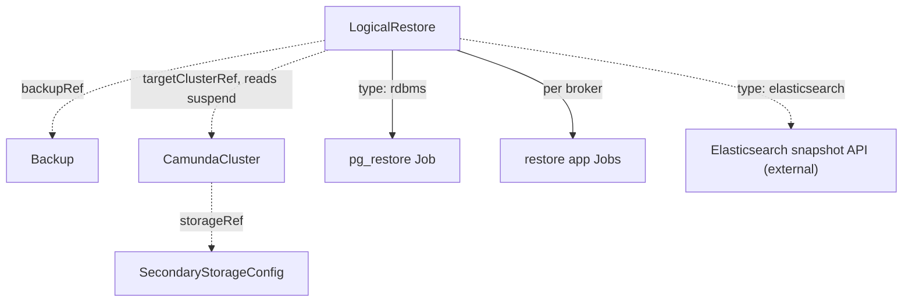

# LogicalRestore

A LogicalRestore restores a completed Backup into a suspended target orchestration cluster.

## Purpose

A LogicalRestore rebuilds a `CamundaCluster`'s secondary storage and Zeebe partitions from a Backup, either on the same cluster or on a different one — for example to recover from data loss or to clone an environment.
You create it, or a composition layer above creates it as part of a managed recovery flow.
It works for both secondary storage types; for timestamp-precise in-place recovery of an RDBMS-backed cluster, use [PointInTimeRestore](pointintimerestore.md) instead.

## How it works

The operator drives the restore through the phases in `status.phase`; each phase must complete before the next starts.

1. Validate that the target cluster is suspended (`spec.suspend: true` and the `Suspended` condition reported on the `CamundaCluster`). The restore controller only ever reads the suspend field — it never writes it. The `suspend` field is owned by you or by the composition layer above, which is responsible for suspending the cluster before creating the LogicalRestore and for unsuspending it after completion. A running target keeps the restore in `Pending` with `Ready: ClusterNotSuspended`.
2. Validate that the referenced Backup exists and has `status.phase: Completed`; anything else keeps the restore in `Pending` with `Ready: InvalidReference`.
3. Enter `ValidatingCompatibility`: read the backup's source storage type and backup ID, resolve the target cluster's `storageRef`, and check compatibility. The secondary storage types must match, the target's Zeebe partition count must equal the partition count in the backup, and the Camunda versions must satisfy the storage-type-specific rule below. Incompatibility moves the restore to `Failed` with `Ready: IncompatibleTarget`.
4. Enter `RestoringSecondaryStorage`:
    - Elasticsearch: delete the existing Camunda indices in the target's Elasticsearch — excluding the `camunda-optimize*` indices when the backup contains no Optimize snapshots; when it does, the Optimize indices are deleted and restored like the rest — then restore every snapshot of the backup (the web-application parts, the Zeebe record snapshot, and the Optimize snapshots when present) directly through the Elasticsearch snapshot API. Camunda exposes no restore endpoint, so the operator talks to Elasticsearch itself using the credentials from the target's `SecondaryStorageConfig`. The index and component templates survive because they were seeded when the target cluster first started.
    - RDBMS: create a Job that downloads the dump from the backup bucket and runs `pg_restore` with `--clean --if-exists` against the target's logical database — replacing any existing schema and data in the target logical database — resolved via the target's `storageRef` → `SecondaryStorageConfig` → `DatabaseConfig` and authenticated with its `backupCredentialsSecretRef`. All Jobs this controller creates are applied with Server-Side Apply (SSA) under the field manager `camunda-operator/logicalrestore`.
5. Enter `RestoringPrimaryStorage`: ensure the target's Zeebe data volumes are empty — the operator deletes and recreates the Zeebe PVCs, because Camunda's restore application refuses a non-empty data directory — then run the restore application (`bin/restore`, the Camunda distribution's one-shot Spring Boot app) once per broker as a Job with the same broker configuration (node ID, cluster size, replication factor, partition count) the broker will use. On the Elasticsearch path it runs with `--backupId=<status.backupId of the Backup>`; on the RDBMS path it runs without arguments and aligns itself by reading the exporter position from the restored database, restoring the newest matching checkpoint from the primary-storage backup store.
6. Report `Completed`. You or the composition layer unsuspend the target cluster; on start, an RDBMS-backed cluster re-exports any events between the database's position and the restored checkpoint, bringing secondary storage up to date.

**Version compatibility rule.** Elasticsearch-backed backups must be restored with the exact Camunda version they were taken with — the version is embedded in every snapshot name. RDBMS-backed backups may be restored with the same version or up to one minor newer (a backup taken with 8.9.x restores with 8.9.x or 8.10.x). Camunda's `--allow-version-mismatch` escape hatch is deliberately not exposed in this API.

**Cross-cluster restores.** The target cluster's `backupStorageRef` must point at a bucket containing the source backup's artifacts — for a cross-cluster restore this means the source cluster's backup bucket, or a replica of it. The operator resolves all restore inputs from the backup's recorded location, never from the source cluster, so the source cluster may no longer exist.



!!! note "Deviation from the original proposal"
    The proposal said the Elasticsearch path "restores from ES snapshots via Camunda's snapshot APIs". Verified against Camunda 8.9: no Camunda component exposes a restore endpoint — snapshot restore is performed directly against Elasticsearch, and Zeebe partitions are restored by Camunda's standalone restore application run against empty data directories, not through a management API. The version and partition-count compatibility rules above come from the verified 8.9 restore documentation and were not spelled out in the proposal.

## API reference

```yaml
apiVersion: core.camunda.io/v1
kind: LogicalRestore
metadata:
  name: my-cluster-restore
  namespace: my-cluster-ns
spec:
  # object. Required. Reference to the completed Backup to restore from.
  backupRef:
    # string. Required. Name of the Backup.
    name: my-cluster-backup-001
    # string. Optional, default: this CR's namespace. Namespace of the Backup.
    namespace: my-cluster-ns
  # object. Required. Cluster to restore into; may differ from the backup's source cluster.
  targetClusterRef:
    # string. Required. Name of the target CamundaCluster.
    name: my-cluster-restored
    # string. Optional, default: this CR's namespace. Namespace of the target CamundaCluster.
    namespace: my-cluster-ns
```

## Status

| Type | Reason | Meaning |
| --- | --- | --- |
| `Ready` | `Completed` | The restore finished; the target can be unsuspended. |
| `Ready` | `Progressing` | A restore phase is running. |
| `Ready` | `ClusterNotSuspended` | The target cluster is not suspended; the restore waits in `Pending`. |
| `Ready` | `InvalidReference` | The Backup or target cluster does not exist, or the Backup is not completed. |
| `Ready` | `IncompatibleTarget` | Storage type, partition count, or version compatibility failed. |
| `Ready` | `Failed` | A restore phase failed; the message names the failing step. |

`status.phase` tracks the long-running operation: `Pending | ValidatingCompatibility | RestoringSecondaryStorage | RestoringPrimaryStorage | Completed | Failed`.

The operator records the last reconciled generation in `status.observedGeneration`.

## Validation

- `spec` is immutable after creation: a restore is a one-shot operation, retried by creating a new CR.
- Suspension, backup completeness, and target compatibility are validated at reconcile time (steps 1–3 above) because they depend on live cluster state.

## Relationships

- Backup — referenced via `backupRef`; provides the artifacts and the backup ID.
- [PointInTimeRestore](pointintimerestore.md) — the in-place, timestamp-precise alternative for PITR-enabled RDBMS clusters.
- [CamundaCluster](camundacluster.md) — referenced via `targetClusterRef`; must be suspended by its owner for the duration of the restore.
- [SecondaryStorageConfig](secondarystorageconfig.md) — resolved via the target's `storageRef` for storage type and credentials.
- [DatabaseConfig](databaseconfig.md) — resolved on the RDBMS path for the target logical database and backup credentials.
- [ObjectStorageConfig](objectstorageconfig.md) — resolved via the target's `backupStorageRef`; must contain the backup's artifacts.
- [CamundaOptimize](camundaoptimize.md) — when the backup contains Optimize snapshots, the target's Optimize indices are deleted and restored along with the rest of the set; otherwise they are left untouched.

## Examples

A minimal manifest:

```yaml
apiVersion: core.camunda.io/v1
kind: LogicalRestore
metadata:
  name: my-cluster-restore
  namespace: my-cluster-ns
spec:
  backupRef:
    name: my-cluster-backup-001
  targetClusterRef:
    name: my-cluster
```

A realistic manifest, restoring a backup of `my-cluster` into a freshly created replacement cluster:

```yaml
apiVersion: core.camunda.io/v1
kind: LogicalRestore
metadata:
  name: my-cluster-restore-2026-07-31
  namespace: my-cluster-ns
  labels:
    camunda.io/cluster: my-cluster-restored
spec:
  backupRef:
    name: my-cluster-backup-001
    namespace: my-cluster-ns
  targetClusterRef:
    name: my-cluster-restored
    namespace: my-cluster-ns
```
