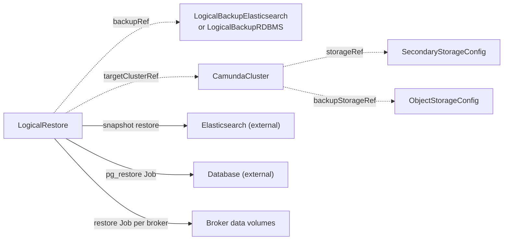

# LogicalRestore

`LogicalRestore` restores one completed logical backup into a suspended `CamundaCluster`. You create it, or a recovery flow above the operator creates it for you.

The target can be the cluster the backup came from, or another cluster that reads the same backup bucket. This is how you recover from data loss and how you clone an environment. For a relational cluster that you roll back in place to a point in time, use [PointInTimeRestore](pointintimerestore.md) instead.

One resource is one restore. The spec is immutable, and the restore runs once. To retry a failed restore, create a new resource. `kubectl get lr` lists the restores with their phase, backup, and target.

Before you create a restore, make sure that:

- The referenced backup is `Completed`.
- The target `CamundaCluster` has `spec.suspend: true` and reports the `Suspended` condition.
- The target `spec.backupStorageRef` names the same `ObjectStorageConfig` the backup wrote to.
- The backup and the target cluster live in the namespace of the restore.

The smallest restore names the backup and the target:

```yaml
apiVersion: core.camunda.io/v1
kind: LogicalRestore
metadata:
  name: my-cluster-restore
  namespace: my-cluster-ns
spec:
  backupRef:
    kind: LogicalBackupElasticsearch
    name: my-cluster-backup
  targetClusterRef:
    name: my-cluster
```



## Suspend

The operator only reads `spec.suspend` of the target. It never writes it. You suspend the cluster before you create the restore, and you unsuspend it after the restore is `Completed`. A running target holds the restore in `Pending` with reason `ClusterNotSuspended`, and the operator touches no data.

## Phases

`status.phase` is the resume marker. A restore that re-enters after an operator restart continues at the recorded phase.

| Phase | What happens |
| --- | --- |
| `Pending` | The restore waits. The target still runs, or the backup is not `Completed`. |
| `ValidatingCompatibility` | The operator compares the backup against the target. |
| `RestoringSecondaryStorage` | The operator writes the backup into the target's secondary storage. |
| `RestoringPrimaryStorage` | The operator recreates the broker data volumes and runs the restore application on them. |
| `Completed` | The restore finished. You can unsuspend the target. |
| `Failed` | A phase failed. `status.failureMessage` names it. |

## Compatibility

The restore fails with reason `IncompatibleTarget` when the target cannot hold the backup:

- The secondary storage type of the target differs from the type of the backup.
- The Zeebe partition count of the target differs from `status.partitionsCount` of the backup.
- The `spec.backupStorageRef` of the target names another bucket than the one the backup wrote to. The restore reads the bucket that the backup wrote to, with the credentials that the operator copies into the namespace of the cluster. It copies them for the bucket of the target alone, so a backup in another bucket has no credentials to read it with.
- The Camunda versions break the version rule below.

**Version rule.** An Elasticsearch backup restores only with the exact Camunda version it was taken with, because that version is part of every snapshot name. A relational backup restores with the same version, or with one minor version newer. A backup taken with 8.9.x restores with 8.9.x or 8.10.x. The backup records its version in `status.version`, and a backup that recorded none cannot restore.

## Secondary storage

On the Elasticsearch path the operator deletes the Camunda indices of the target and restores every snapshot of the backup through the Elasticsearch snapshot API. Camunda exposes no restore endpoint, so the operator talks to Elasticsearch itself with the credentials of the target's `SecondaryStorageConfig`. It registers a snapshot repository on the Elasticsearch of the target, derived from the bucket the backup pinned and the repository prefix the backup recorded. This is what makes a restore into a second cluster work.

The operator registers that repository only when the Elasticsearch of the target holds none under the name. A repository that is already there is used as it is, because the operator does not own every registration it finds: the Elasticsearch of a target can be a cluster that somebody else administers. A restore into a cluster that already holds a repository of the same name over another prefix therefore fails on a snapshot that is missing, and the message names the repository. Register the repository yourself before the restore, or give the source cluster another name, when you meet that case. The index and component templates survive, because the target cluster created them when it first started.

The operator deletes the Optimize indices only when the backup holds Optimize snapshots. A backup without them cannot put them back.

On the relational path the operator runs one Job that downloads the dump from the backup bucket and runs `pg_restore --clean --if-exists` against the logical database of the target. This replaces the schema and the data of that database. The Job reads the database with the backup user of the target, and it takes its pod settings from `spec.backup.dump` of the target cluster: the resources, the scratch volume, the scheduling, and the postgres image. A restore carries no pod block of its own.

## Primary storage

The Camunda restore application refuses a non-empty data directory, so the operator deletes the broker data volumes of the target and creates them again. The new volume takes the effective restore size that the backup recorded in `status.storageSizes.zeebe`. When the backup recorded none, it takes the size of the claim template of the broker StatefulSet. Everything else comes from that claim template: the storage class, the access modes, and the labels.

The volumes belong to the broker StatefulSet, not to the restore. Deleting the restore never deletes a broker volume.

The operator then runs the Camunda restore application once per broker, as a Job. The Jobs copy their configuration from the live broker StatefulSet of the target, so the restore application always runs with the configuration the brokers run with. A cluster whose broker StatefulSet was deleted cannot restore until its own controller applies it again.

## Deletion

When you delete the restore, the operator deletes the Jobs it created. It writes nothing to an external store, so it needs no finalizer and leaves no artifact behind. A backup that a restore read stays untouched.

Do not delete a backup while its restore runs. The restore reads the backup again in every phase, for the snapshots and the key of the dump, and a backup that goes away holds the restore and then fails it. The restore pins the backup ID and the storage type in its status when it starts, so a backup that you delete after the restore finished changes nothing.

## Status

| Type | Reason | Meaning | What to do |
| --- | --- | --- | --- |
| `Ready` | `Progressing` | A restore phase runs. | Wait. The message names the phase. |
| `Ready` | `Completed` | The restore finished. `Ready` is `True`. | Unsuspend the target cluster. |
| `Ready` | `ClusterNotSuspended` | The target cluster runs. | Set `spec.suspend: true` on the cluster. |
| `Ready` | `InvalidReference` | The backup or the target does not exist, the backup is not `Completed`, or the broker StatefulSet is gone. | Correct the reference that the message names. |
| `Ready` | `IncompatibleTarget` | The target cannot hold this backup. | Read the message. Restore into a cluster that matches. |
| `Ready` | `MissingSecret` | A credentials Secret of the target is missing or lacks a key. | Create the Secret that the message names. |
| `Ready` | `MissingCredentials` | The backup bucket uses static credentials and their copy in the namespace of the cluster does not resolve. | Wait for the cluster to copy them, or correct the Secret that the bucket names. |
| `Ready` | `ConnectionFailed` | Elasticsearch or the database rejects the operator. | Correct the endpoint or the credentials. |
| `Ready` | `Failed` | A phase failed. | Read `status.failureMessage`. Correct the cause and create a new restore. |

A started restore always reaches `Completed` or `Failed`. A dependency that stops resolving, for example an Elasticsearch that stops answering, holds it for ten minutes with the reason above. After that the restore fails, and you create a new one.

The status also records what the restore pinned and what it did:

- `status.backupId` and `status.storageType` are the backup the restore reads. They are pinned when the restore starts.
- `status.targetClusterUID` pins the identity of the target cluster.
- `status.brokers` is the broker count that the operator read off the broker StatefulSet.
- `status.repository` and `status.restoredSnapshots` record the Elasticsearch restore.
- `status.secondaryJobName` names the `pg_restore` Job while it exists.
- `status.primaryJobNames` names the per-broker restore Jobs, in broker order.
- `status.recreatedClaims` names the broker data volumes that the operator deleted and created again.
- `status.terminalReason` is the reason of the `Ready` condition of a restore that finished, and `status.failureMessage` is why it failed.
- `status.completionTime` is when the restore reached `Completed` or `Failed`.
- `status.observedGeneration` is the last generation the operator reconciled.

## Spec reference

Every field, with its type and whether it is required:

```yaml
apiVersion: core.camunda.io/v1
kind: LogicalRestore
metadata:
  name: my-cluster-restore
  namespace: my-cluster-ns
spec:
  # object. Required. The completed backup to restore from.
  backupRef:
    # string. Required. Kind of the backup: LogicalBackupElasticsearch or
    # LogicalBackupRDBMS.
    kind: LogicalBackupElasticsearch
    # string. Required. Name of the backup, in this namespace.
    name: my-cluster-backup
  # object. Required. The cluster to restore into.
  targetClusterRef:
    # string. Required. Name of the CamundaCluster, in this namespace.
    name: my-cluster
```

### Validation rules

- `spec` is immutable. A restore runs once, and you retry it with a new resource.
- `spec.backupRef.kind` is `LogicalBackupElasticsearch` or `LogicalBackupRDBMS`.
- Both references name resources in the namespace of the restore. Neither crosses a namespace. The operator reads the Secrets of the target and runs Jobs in that namespace, so both references stay inside the RBAC boundary of the restore.
- The suspend state, the state of the backup, and the compatibility of the target depend on live cluster state. The operator checks them at reconcile time.

### Restore into a replacement cluster

```yaml
apiVersion: core.camunda.io/v1
kind: LogicalRestore
metadata:
  name: my-cluster-restore-2026-07-31
  namespace: my-cluster-ns
  labels:
    camunda.io/cluster: my-cluster-restored
spec:
  backupRef:
    kind: LogicalBackupElasticsearch
    name: my-cluster-backup
  targetClusterRef:
    name: my-cluster-restored
```

The replacement cluster must run the same Camunda version, hold the same partition count, and point `spec.backupStorageRef` at the bucket that holds the artifacts of the backup.

## Related

- [LogicalBackupElasticsearch](logicalbackupelasticsearch.md) and [LogicalBackupRDBMS](logicalbackuprdbms.md): referenced through `backupRef`. The backup holds the artifacts, the backup ID, and the Camunda version.
- [PointInTimeRestore](pointintimerestore.md): the in-place alternative for a relational cluster that you roll back to a point in time.
- [CamundaCluster](camundacluster.md): referenced through `targetClusterRef`. You suspend it for the whole restore.
- [SecondaryStorageConfig](secondarystorageconfig.md): resolved through the `storageRef` of the target, for the storage type and the credentials.
- [DatabaseConfig](databaseconfig.md): resolved on the relational path, for the logical database and the backup credentials.
- [ObjectStorageConfig](objectstorageconfig.md): resolved through the `backupStorageRef` of the target. It must hold the artifacts of the backup.
- [CamundaOptimize](camundaoptimize.md): the Optimize indices of the target are restored only when the backup holds Optimize snapshots.
