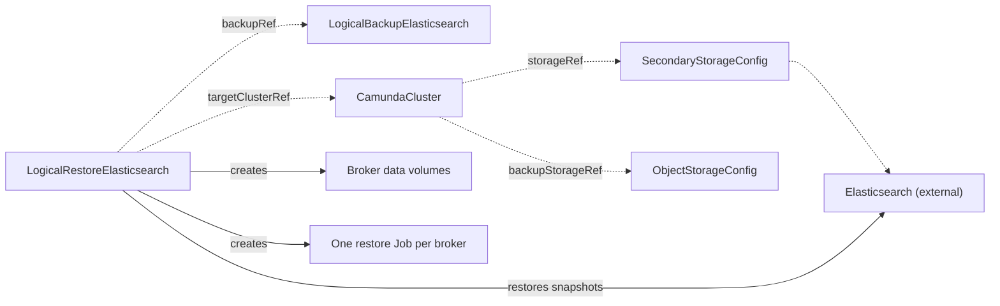

# LogicalRestoreElasticsearch

`LogicalRestoreElasticsearch` restores one completed [LogicalBackupElasticsearch](logicalbackupelasticsearch.md) into one `CamundaCluster`. You create it, or a recovery flow above the operator creates it for you.

The target is the cluster the backup was taken from. The operator rebuilds both halves of the cluster state: it puts the web-application indices and the Zeebe record indices back into the Elasticsearch of the target, and it gives the brokers new data volumes that the Camunda restore application fills from the partition backup.

One resource is one restore. The spec is immutable, and the restore runs once. To retry, create a new resource. `kubectl get lres` lists the restores with their phase, backup, and target.

One thing must be true before you create the resource: the backup reports `status.phase: Completed`.

You do not suspend the target first, and you do not change its Camunda version first. The restore does both. Read "The restore prepares the target" below.

The smallest restore names the backup and the target:

```yaml
apiVersion: core.camunda.io/v1
kind: LogicalRestoreElasticsearch
metadata:
  name: my-cluster-lres
  namespace: my-cluster-ns
spec:
  backupRef:
    name: my-cluster-backup
  targetClusterRef:
    name: my-cluster
```



## Phases

`status.phase` is the resume marker of the restore. The operator records it before the work it names, so a restore that re-enters after a restart continues where it stopped.

| Phase | What happens |
| --- | --- |
| `Pending` | The restore waits. A reference does not resolve, the backup is not completed, another operation holds the cluster, or the operator is still preparing the target. Nothing of the target is erased here. Preparation does write `spec.suspend` and `spec.version` on the target, which [The restore prepares the target](#the-restore-prepares-the-target) describes. |
| `ValidatingCompatibility` | The operator compares the backup against the target. |
| `RestoringSecondaryStorage` | The operator deletes the Camunda indices of the target and restores every snapshot of the backup. |
| `RestoringPrimaryStorage` | The operator deletes and creates the broker data volumes, and runs the Camunda restore application once per broker. |
| `Completed` | The restore finished. The restore unsuspended the target, unless you suspended it yourself. |
| `Failed` | The restore ended. `status.failureMessage` says why. |

`Completed` and `Failed` are terminal.

## Compatibility

Before the operator deletes anything, it compares the backup against the target. A breach fails the restore with the reason `IncompatibleTarget`, and the message names both values. Five rules apply:

- The target stores its data in Elasticsearch. Use a `LogicalRestoreRDBMS` for a relational cluster.
- The target is the cluster that the backup was taken from, which the backup names in `spec.clusterRef`. The restore application reads the partition backup under the prefix of the cluster it runs as. No other cluster reads that prefix.
- The partition count of the target is the partition count that the backup recorded in `status.partitionsCount`.
- The `spec.backupStorageRef` of the target names the same `ObjectStorageConfig` that the backup wrote to. The operator reads the artifacts through the bucket of the target, and the `CamundaCluster` controller copies the credentials of that bucket alone into the namespace.
- The target runs the exact Camunda version that the backup recorded in `status.version`. An Elasticsearch backup carries that version in the name of every snapshot, so a target one patch release newer cannot read it. The restore moves the target to that version before this rule runs, so a version that differs is a wait and not a failure. Only a backup that recorded no version, or that recorded a value which is not of the form `x.y.z`, fails this rule: the operator cannot write such a value.

## The restore prepares the target

The operator brings the target to the state that the restore needs. You do not suspend the cluster by hand, and you do not set its Camunda version by hand.

The restore suspends the target. It also sets `spec.version` to the Camunda version that the backup recorded in `status.version`. It sets that version every time, even when the compatibility rule of this kind accepts the target as it is.

The restore stays in `Pending` while it does this, and nothing bounds the wait. It erases nothing before it leaves that phase. `Ready` reports `Progressing`, and its message names what the operator waits for.

The operator writes nothing else on the target. It writes no credential, and no reference to one.

### What the operator writes, and what it keeps

Each write is a server-side apply of one field, under a field manager of its own:

| Field | Field manager | What happens at the end |
| --- | --- | --- |
| `spec.suspend` | `camunda-operator/restore-suspend` | The restore withdraws it when it reaches `Completed`. |
| `spec.version` | `camunda-operator/restore-version` | The restore keeps it. |

These names are published. A GitOps tool reads them, and so does a layer above this operator, for example a `CloudCamundaCluster` of `camunda-cloud-operator`. The names tell a write of a restore from a write of a user.

The restore keeps `spec.version` on purpose. The cluster runs the version of the backup from then on, which is the point of writing it.

To move the cluster off that version, declare the version you want:

- A client-side `kubectl apply` that sets `spec.version` takes the field back. It writes the field, and the API server gives ownership to the manager that wrote it.
- A server-side apply, which is what Argo CD and Flux use, reports a conflict on the field. Force the conflict, and the tool owns `spec.version` again.

CAUTION: A manifest that omits `spec.version` does not take the field back. Server-side apply removes a field only from the manager that declared it, and `camunda-operator/restore-version` still declares this one. Watch for this on a cluster that took its version from a preset: an explicit `spec.version` always wins over the preset, so the value the restore wrote governs the cluster until somebody removes the field. Remove it by hand to give the preset control again:

```bash
kubectl patch camundacluster my-cluster -n my-cluster-ns \
  --type=json -p '[{"op":"remove","path":"/spec/version"}]'
```

### Why the downgrade is safe here

Camunda does not support a downgrade of a running cluster. A restore is not that. Nothing runs while the version changes, and the broker volumes are erased before any broker of the older version starts.

CAUTION: A downgrade that you do by hand on a running cluster, outside a restore, is still unsupported. The operator accepts the change to `spec.version`, and the brokers then report themselves unhealthy.

### When the restore unsuspends the target

The restore withdraws its suspension when it reaches `Completed`, and only when `status.clusterSuspended` is `true`.

- **A target that you suspended yourself stays suspended.** The restore recorded no suspension of its own, so it withdraws none.
- **A failed restore leaves the target suspended.** Its broker volumes can be empty or half written. Brokers that start over such volumes are worse than a cluster that is down. Read `status.failureMessage`, correct the cause, and create a new restore.
- **A restore that you delete while it runs leaves the target suspended.** The restore needs no finalizer, and it gets none for this. A finalizer that unsuspends the target on delete starts brokers over volumes that the restore already erased. Suspended is the safe state to be left in. Unsuspend the cluster yourself once you know what its volumes hold.

### A GitOps tool that owns the CamundaCluster

The operator uses its own field managers, the same way [CamundaOptimize](camundaoptimize.md) does for `spec.zeebe.extraEnv`. A tool that manages the `CamundaCluster` with server-side apply keeps every field that it declares. The operator keeps the fields that it declares.

A tool that also declares one of these fields fights the operator for it. Argo CD or Flux reverts the write of the restore, the restore writes it again, and the restore stalls in `Pending`. If you drive the `CamundaCluster` from Git:

- Remove `spec.suspend` and `spec.version` from the manifest for the time of the restore, or mark both fields as an ignored difference.
- Put `spec.version` back after the restore, with the version that you want the cluster to run.

## One operation at a time

The operator lets one backup or one restore of a cluster run at a time. A restore whose target another operation holds waits in `Pending` with the reason `ClusterClaimed`, and the message names the holder. Nothing bounds this wait. The restore starts on its own when the holder reaches a terminal phase. No watch wakes this hold. The controller wakes it on its retry timer alone, so the restore can start up to one retry interval after the holder finished. A restore takes the cluster for itself before it writes anything on that cluster and before every phase that deletes something. It therefore holds the cluster while it prepares it, which it reports as `Pending`.

## The snapshot repository

The restore reads the snapshots from the repository that the backup recorded in `status.repository`, on the Elasticsearch of the target. If that repository is absent, the operator registers it over the bucket that the backup pinned and the prefix that the source cluster wrote under. The snapshots lie under that prefix, whichever Elasticsearch server the target reads through.

If the repository is already registered, the operator uses it as it is. It never points an existing registration at another bucket or another prefix. The Elasticsearch of a target can be a cluster that this operator does not manage, where an administrator registered the repository by hand. A registration that points elsewhere makes the restore fail on a snapshot that is missing, and the message names the repository.

## Secondary storage

The operator deletes the Camunda indices of the target first, then asks Elasticsearch to restore every snapshot of the backup. It names the Optimize indices only when the backup holds an Optimize snapshot. A backup without one cannot put those indices back, so the operator keeps them.

The restore of a snapshot is asynchronous. The operator waits until the restored indices exist and no shard recovers any more, then it moves on.

`status.restoredSnapshots` is the resume marker of this phase. A look that finds it never deletes an index again.

CAUTION: A failure between the delete and the restore leaves the secondary storage of the target empty. The backup itself stays whole. The next look deletes what is there and asks for the restore again, so a retry converges. Do not delete the backup while the restore runs.

### An Optimize attached to the target

A [CamundaOptimize](camundaoptimize.md) whose `clusterRef` names the target follows `spec.suspend` of that cluster, so its webapp and its importer are already at zero when this phase deletes the indices. You do not have to stop the import by hand.

This matters because the Optimize importer reads Elasticsearch directly, not through the orchestration cluster. An importer that kept running would read indices that are half restored, write analytics from them, and hold an import position that disagrees with the restored data. Both workloads start again when you unsuspend the cluster, and the importer reads the restored indices.

## Primary storage

The operator deletes the data volume of every broker and creates it again, then runs the Camunda restore application once per broker with `--backupId=<status.backupId>`.

The volumes belong to the `StatefulSet` of the cluster, not to the restore. They carry no owner reference to the restore, so deleting the restore leaves the brokers with their data. Each volume keeps the storage class, the access modes, and the labels of the claim template of the `StatefulSet`. Its size is the size that the backup recorded in `status.storageSizes.zeebe`, and the request of the claim template when the backup recorded none.

The restore Jobs copy the broker configuration from the live broker `StatefulSet`, so the restore application reads the same storage with the same credentials as the brokers. A cluster whose broker `StatefulSet` was deleted cannot restore until its controller applies the workload again. Suspending a cluster keeps the `StatefulSet` in place.

Every Job carries the labels `camunda.io/component: restore`, `camunda.io/logical-restore-elasticsearch: <restore name>`, and `camunda.io/cluster: <target name>`. Each Job has a controller reference to the restore, so deleting the restore removes its Jobs.

## Time limits

A restore that has started waits 10 minutes on a dependency that stops resolving, then it fails. The 10 minutes run from the first outage. Once an index or a volume is gone, a dependency that resolves again starts no second wait. The wait covers an Elasticsearch that does not answer, a reference that breaks, a pod that cannot start, and a target that somebody unsuspends mid-run. A restore that already deleted an index or a volume must reach a terminal phase, so that whoever owns the cluster learns that it has to act.

A restore in `Pending` waits without a bound, because it deleted nothing yet.

## Identity

The restore pins the backup ID and the identity of the target when it starts. A backup that somebody deletes and creates again under the same name holds other artifacts, and a cluster that somebody deletes and creates again under the same name is another cluster. Both end the restore. Create a new restore for the resources as they are now.

## The restore Jobs

The restore runs the Camunda restore application once per broker, as a Job. Each Job pod mounts the data volume of its broker. A pod that finished still counts as a user of that volume, so the volume cannot terminate while the pod exists.

| Terminal phase | What happens to the Jobs |
| --- | --- |
| `Completed` | The operator deletes them, together with their pods. Kubernetes removes the pods first and the Job last, so the delete takes a moment. The broker data volumes are free once the last pod is gone. |
| `Failed` | The operator keeps them. The logs of a failed Job name the cause, and only the pod keeps them readable. |

**A restore that failed after it started the restore application holds the broker data volumes.** `status.primaryJobNames` tells you which case you are in. A restore that failed in an earlier phase names no Job there and holds nothing.

When it does name Jobs, you read their logs, and then you delete the restore. The delete takes the Jobs and their pods with it, and the volumes are free once the last pod is gone. Until you do that, a second restore of the cluster and the deletion of the cluster both wait on a volume that never terminates. The waiting restore reports the pod that holds the volume and names the resource that runs it.

```bash
# The Jobs that the restore still holds. status.primaryJobNames lists the same names.
kubectl get job -n my-cluster-ns -l camunda.io/logical-restore-elasticsearch=my-cluster-restore

# The log of the Job of broker 0, named the way the command above lists it.
kubectl logs -n my-cluster-ns job/my-cluster-restore-lres-0
```

## Deletion

Deleting the restore removes its Jobs. A restore that completed already removed them. A restore that failed still has them, and this is how you remove them. The recreated broker volumes stay, and so does everything the restore wrote into Elasticsearch. The operator writes nothing outside the cluster, so the restore needs no finalizer.

A target that the restore suspended stays suspended. That is deliberate. Unsuspending it here would start brokers over volumes that the restore already erased. Unsuspend the cluster yourself once you know what its volumes hold.

## Status

| Type | Reason | Meaning | What to do |
| --- | --- | --- | --- |
| `Ready` | `Progressing` | A phase of the restore runs. | Wait. The message names the work. |
| `Ready` | `Completed` | The restore finished, and it gives back the suspension it applied, so the target starts again a moment later. `Ready` is `True`. | Nothing. Unsuspend the target yourself only when you suspended it yourself. |
| `Ready` | `Failed` | The restore ended. | Read `status.failureMessage`. Correct the cause and create a new restore. |
| `Ready` | `ClusterNotSuspended` | The target started running again while the restore ran. | Suspend the cluster again. A restore that already erased something fails 10 minutes after the first outage. |
| `Ready` | `ClusterClaimed` | Another backup or restore holds the cluster. | Wait. The restore starts when the holder reaches a terminal phase. |
| `Ready` | `IncompatibleTarget` | The target cannot hold the backup. The message names both values. | Read "Compatibility" above. A backup restores into the cluster it was taken from alone. |
| `Ready` | `InvalidReference` | A referenced resource does not exist, or the backup is not completed. | Read the message. Create the resource, or wait for the backup. |
| `Ready` | `ConnectionFailed` | The Elasticsearch of the target does not answer, or it refuses the credentials. | Make sure that the endpoint answers and that the credentials of the `SecondaryStorageConfig` are valid. |
| `Ready` | `MissingSecret` | A pod of a restore Job cannot start, because a Secret it mounts does not exist. | Create the Secret that the message names. |

These status fields report what the restore did:

- `status.backupId` is the backup that the restore reads.
- `status.repository` is the snapshot repository on the Elasticsearch of the target.
- `status.restoredSnapshots` names every snapshot that the operator asked Elasticsearch to restore.
- `status.clusterSuspended` records that this restore suspended the target. The restore withdraws that suspension when it completes.
- `status.brokers` is the broker count that the restore recorded before it deleted a volume.
- `status.recreatedClaims` names the broker data volumes that the restore deleted and created again.
- `status.primaryJobNames` names the restore Job of every broker, in broker order.
- `status.failureMessage` says why a failed restore ended.
- `status.completionTime` is when the restore reached a terminal phase.
- `status.observedGeneration` is the last generation that the operator reconciled.

## Spec reference

Every field, with its type, whether it is required, and its default:

```yaml
apiVersion: core.camunda.io/v1
kind: LogicalRestoreElasticsearch
metadata:
  name: my-cluster-lres
  namespace: my-cluster-ns
spec:
  # object. Required. The completed LogicalBackupElasticsearch to restore.
  backupRef:
    # string. Required. Name of the backup, in the namespace of this resource.
    name: my-cluster-backup
  # object. Required. The CamundaCluster to restore into.
  targetClusterRef:
    # string. Required. Name of the cluster, in the namespace of this resource.
    name: my-cluster
```

### Validation rules

- The whole `spec` is immutable. To retry, create a new resource.
- `spec.backupRef.name` and `spec.targetClusterRef.name` are required and must not be empty.
- Neither reference crosses a namespace. The backup and the cluster live in the namespace of the restore.
- The suspend state of the target, the state of the backup, and the compatibility rules all depend on live state. The operator checks them at reconcile time.

## Related

- [LogicalBackupElasticsearch](logicalbackupelasticsearch.md): the backup that this restore reads.
- [CamundaCluster](camundacluster.md): referenced through `targetClusterRef`. You suspend it for the whole restore.
- [SecondaryStorageConfig](secondarystorageconfig.md): resolved through the `storageRef` of the target. It must be `type: elasticsearch`, and it carries the endpoint and the credentials.
- [ObjectStorageConfig](objectstorageconfig.md): resolved through the `backupStorageRef` of the target. It holds the snapshots and the partition backup.
- [CamundaOptimize](camundaoptimize.md): an Optimize attached to the target suspends with it, so its import stops for the whole restore.
- [PointInTimeRestore](pointintimerestore.md): the restore kind for a relational cluster that a database administrator already restored to a point in time.
- [Backup guide](../guides/backup.md): how to set up backup storage and take a backup.
