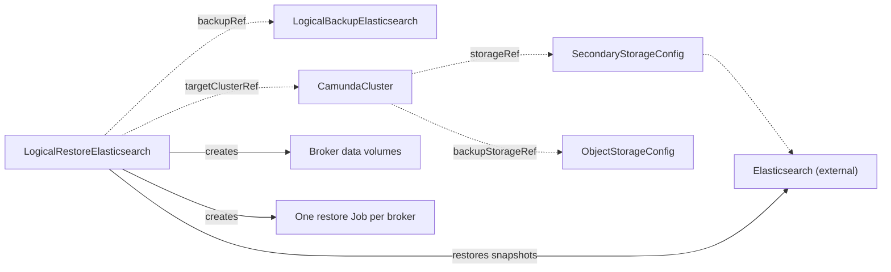

# LogicalRestoreElasticsearch

`LogicalRestoreElasticsearch` restores one completed [LogicalBackupElasticsearch](logicalbackupelasticsearch.md) into the `CamundaCluster` that the backup was taken from. It puts the Camunda indices back into the Elasticsearch of the cluster. It also gives the brokers new data volumes, which the Camunda restore application fills from the partition backup.

One resource is one restore. The spec is immutable, and the restore runs once. To retry, create a new resource. `kubectl get lres` lists the restores with their phase, backup, and target.

Before you create the resource, make sure that the backup reports `status.phase: Completed`. You do not suspend the target, and you do not change its Camunda version. The restore does both, as [Operations: Restore a cluster](../guides/operations.md#restore-a-cluster) describes. That section also holds what every restore kind shares: when the cluster starts again, one operation at a time, failed restores, and GitOps.

The smallest restore names the backup and the target:

```yaml
apiVersion: core.camunda.io/v1
kind: LogicalRestoreElasticsearch
metadata:
  name: my-cluster-lres
  namespace: my-cluster-ns
spec:
  backupRef:
    name: my-cluster-backup
  targetClusterRef:
    name: my-cluster
```


```mermaid
graph LR
    LR[LogicalRestoreElasticsearch] -.->|backupRef| LB[LogicalBackupElasticsearch]
    LR -.->|targetClusterRef| CC[CamundaCluster]
    CC -.->|storageRef| SSC[SecondaryStorageConfig]
    CC -.->|backupStorageRef| OSC[ObjectStorageConfig]
    SSC -.-> ES["Elasticsearch (external)"]
    LR -->|restores snapshots| ES
    LR -->|creates| PVC["Broker data volumes"]
    LR -->|creates| JOB["One restore Job per broker"]
```

## Phases

`status.phase` records how far the restore got. A restore continues at that phase after the operator restarts.

| Phase | What happens |
| --- | --- |
| `Pending` | The restore waits: a reference does not resolve, the backup is not completed, another operation holds the target, or the target is not prepared yet. The restore suspends the target and sets its version here. It erases nothing. |
| `ValidatingCompatibility` | The operator compares the backup against the target. |
| `RestoringSecondaryStorage` | The operator deletes the Camunda indices of the target and restores every snapshot of the backup. |
| `RestoringPrimaryStorage` | The operator deletes and creates the broker data volumes, and runs the Camunda restore application once per broker with `--backupId=<status.backupId>`. |
| `Completed` | The restore finished. The target starts again, unless you suspended it yourself or another hold remains. |
| `Failed` | The restore ended. `status.failureMessage` says why. |

## Compatibility

Before it deletes anything, the operator compares the backup against the target. A breach fails the restore with the reason `IncompatibleTarget`, and the message names both values. Create a new restore against a target that fits. The rules:

- The target is the cluster that the backup names in `spec.clusterRef`. The restore application reads the partition backup under the prefix of the cluster it runs as.
- The target stores its data in Elasticsearch. For a relational cluster, use a [LogicalRestoreRDBMS](logicalrestorerdbms.md).
- The partition count of the target is the count that the backup recorded in `status.partitionsCount`.
- The `spec.backupStorageRef` of the target names the `ObjectStorageConfig` that the backup wrote to.
- The target runs the exact Camunda version that the backup recorded in `status.version`, because that version is part of every snapshot name. The restore sets this version on the target in `Pending`. So this rule fails only when the backup recorded no version, or a value that is not of the form `x.y.z`.

### Why the downgrade is safe here

The restore can set a version below the one the brokers run. Camunda does not support a downgrade of a running cluster, but a restore is not one. No broker runs while the version changes, and the restore erases the broker volumes before a broker of the older version starts. Outside a restore, the cluster refuses a downgrade with `VersionDowngradeRefused`, see [CamundaCluster: Downgrade on purpose](camundacluster.md#downgrade-on-purpose). What stays on the cluster after the restore is in [The version after a logical restore](../guides/operations.md#the-version-after-a-logical-restore).

## The backend

The backend is the Elasticsearch that the `SecondaryStorageConfig` of the target resolves to. When the restore leaves `Pending`, it records the backend in `status.backend`, in the form `elasticsearch|<scheme>://<host>:<port>`.

From then until `Completed` or `Failed`, no other `CamundaCluster` starts on that backend. The next cluster reports `WaitingForHandover`, and the message names this restore. [CamundaCluster: Secondary storage](camundacluster.md#secondary-storage) describes that wait. A restore that fails or that you delete keeps the backend while Elasticsearch recovers its snapshots, see [After a failure or a delete](#after-a-failure-or-a-delete).

The restore writes the backend only while the target holds it. Until then it waits:

| Reason | Meaning |
| --- | --- |
| `StorageAlreadyAttached` | Another cluster holds the backend. The message names it. |
| `WaitingForHandover` | The target does not hold the backend yet, or pods still write it. The message names the target and the backend, or the pods. A pod of the Optimize importer of the target is one such pod. |
| `InvalidReference` | A Lease claims the backend and names no `CamundaCluster`. Delete the Lease if nothing uses it. |

In `Pending` this wait has no limit. After `Pending`, these reasons hold the restore for 10 minutes, and then it fails. A target that now resolves to another backend than `status.backend` holds it with `InvalidReference` for the same time.

### After a failure or a delete

Elasticsearch recovers the snapshots that it accepted, even when the restore fails or you delete it. The restore keeps the backend until each shard of the indices that it replaces is on a node and recovered. An unassigned replica does not count, and neither does a primary shard that Elasticsearch cannot place on any node. Until then, `status.recoveryHeld` is `true`:

```yaml
status:
  phase: Failed
  recoveryHeld: true
```

While the hold lasts:

- No other cluster starts on the backend.
- The target stays suspended, and no other backup or restore of it starts.
- A restore that you deleted stays.

The event `RecoveryHeld` marks the start of the hold. The event `RecoveryEnded` marks its end. If the restore cannot read the recovery for 10 minutes, it gives the backend back and records the Warning event `RecoveryUnknown`. That happens when Elasticsearch does not answer, when the target is gone, or when the target points at another Elasticsearch. `status.recoveryUnknownSince` shows since when it cannot read the recovery. After a `RecoveryUnknown` event, make sure that no index recovery is active before you start another cluster on this Elasticsearch.

## The snapshot repository

The restore reads the snapshots from the repository that the backup recorded in `status.repository`, on the Elasticsearch of the target.

- If the repository is registered, the operator uses it as it is. It never points an existing registration at another bucket or prefix. A registration that points elsewhere fails the restore on a missing snapshot, and the message names the repository.
- If the repository is absent and has the name that an [ElasticsearchCluster](elasticsearchcluster.md) gives it, `<namespace>.<name>`, the operator registers it. It uses the bucket that the backup recorded, under the prefix that the repository name gives.
- If the repository is absent and has another name, `Ready` reports `InvalidReference`, and the message names the repository and the bucket. Register the repository on the Elasticsearch of the target, over the prefix that holds the snapshots. The restore then continues.

The operator reads that prefix under the `basePath` that the `ObjectStorageConfig` carries now. Keep `basePath` unchanged for as long as you keep backups.

## Secondary storage

The operator deletes the Camunda indices on the Elasticsearch of the target, then restores every snapshot of the backup. It deletes the Optimize indices only when the backup holds an Optimize snapshot. Give one Elasticsearch to one cluster: a second cluster on the same Elasticsearch loses its Camunda indices too.

`status.restoredSnapshots` names every snapshot that the restore asked for. The phase ends when the restored indices exist and each of their shards is on a node and recovered. An unassigned replica does not count.

If Elasticsearch cannot place a primary shard of a restored index on any node, the restore does not wait for it. The restore still reaches `Completed`, and that index stays red. After the restore, make sure that no restored index is red with `GET _cluster/health?level=indices`. For a red index, `GET _cluster/allocation/explain` tells you why its shard has no node. Correct the cause that it names.

CAUTION: Do not delete the backup while the restore runs. A failure after the delete of the indices leaves the secondary storage of the target empty until the restore finishes or you restore again.

A [CamundaOptimize](camundaoptimize.md) attached to the target suspends with it. The restore waits until its importer pod is gone, so no import reads half-restored indices. The importer starts again when the target starts.

## Primary storage

The operator deletes the data volume of every broker, creates it again, and runs the restore application once per broker. The new volume takes the size that the backup recorded in `status.storageSizes.zeebe`. If the backup recorded none, it takes the size of the claim template of the broker StatefulSet. The storage class, the access modes, and the labels come from the claim template.

The volumes belong to the broker StatefulSet, not to the restore. Deleting the restore leaves them in place.

Every Job carries the labels `camunda.io/component: restore`, `camunda.io/logical-restore-elasticsearch: <restore name>`, and `camunda.io/cluster: <target name>`. Its name is `<restore name>-lres-<broker>`, for example `my-cluster-lres-lres-0`. A failed restore keeps its Jobs, see [A failed restore holds the broker volumes](../guides/operations.md#a-failed-restore-holds-the-broker-volumes).

## Deletion

Deleting the restore removes its Jobs and their pods. The broker volumes stay, and so does everything that the restore wrote into Elasticsearch. The restore removes its suspension hold from the target when the last Job pod is gone, and `spec.suspend` stays. While `status.recoveryHeld` is `true`, the restore stays until that hold ends.

## Status

| Type | Reason | Meaning | What to do |
| --- | --- | --- | --- |
| `Ready` | `Progressing` | A phase of the restore runs, or the restore prepares the target. | Wait. The message names the work. |
| `Ready` | `Completed` | The restore finished. `Ready` is `True`. The target starts again, unless you suspended it yourself or another hold remains. | Nothing. |
| `Ready` | `Failed` | The restore ended. | Read `status.failureMessage`. Correct the cause. Delete the failed restore, then create a new one. |
| `Ready` | `ClusterNotSuspended` | Somebody removed the suspension hold of the restore and cleared `spec.suspend`, after `Pending`. | Suspend the target again. The restore fails 10 minutes after the first outage. |
| `Ready` | `ClusterClaimed` | Another backup or restore holds the cluster, or a claim Lease that no backup or restore holds. The message names it. | Wait. The restore starts when the holder gives the cluster back. If the message names a claim Lease to delete, delete it. |
| `Ready` | `StorageAlreadyAttached` | Another cluster holds the Elasticsearch of the target. | Read [The backend](#the-backend). |
| `Ready` | `WaitingForHandover` | The target does not hold its Elasticsearch yet, or pods still write it. | Wait. The message names what the restore waits for. |
| `Ready` | `IncompatibleTarget` | The target cannot hold the backup, or its version moved after `Pending`. The message names both values. | Read [Compatibility](#compatibility). Create a new restore against a target that fits. |
| `Ready` | `InvalidReference` | A referenced resource does not exist, the backup is not completed, or the snapshot repository has a name the operator cannot place. | Read the message. Create the resource, wait for the backup, or register the repository. |
| `Ready` | `ConnectionFailed` | The Elasticsearch of the target does not answer, or it refuses the credentials. | Make sure that the endpoint answers and that the credentials of the `SecondaryStorageConfig` are valid. |
| `Ready` | `MissingSecret` | A pod of a restore Job cannot start, because a Secret it needs does not exist. | Create the Secret that the message names. |

After `Pending`, a restore that loses a dependency waits 10 minutes, then fails with the reason `Failed`. Once the restore has deleted an index or a volume, the 10 minutes count from the first outage. A dependency that comes back in between does not reset them. This covers an Elasticsearch that does not answer, a reference that breaks, a pod that cannot start, and a target that somebody starts.

Other status fields:

- `status.backupId` is the backup that the restore reads. The restore pins it when it starts. A backup that somebody deletes and creates again under the same name ends the restore.
- `status.targetClusterUID` pins the target. A cluster that somebody deletes and creates again under the same name ends the restore.
- `status.backend` is the Elasticsearch that the restore writes.
- `status.repository` is the snapshot repository on the Elasticsearch of the target.
- `status.restoredSnapshots` names every snapshot that the restore asked for.
- `status.recoveryHeld` is `true` while a failed or deleted restore keeps the backend for the recovery of its snapshots.
- `status.recoveryUnknownSince` is the time since which a held restore cannot read that recovery.
- `status.clusterSuspended` is `true` when this restore suspended the target.
- `status.brokers` is the broker count that the restore recorded before it deleted a volume.
- `status.recreatedClaims` names the broker data volumes that the restore deleted and created again.
- `status.primaryJobNames` names the restore Job of every broker, in broker order.
- `status.terminalReason` is the `Ready` reason of the terminal phase.
- `status.failureMessage` says why a failed restore ended.
- `status.completionTime` is when the restore reached a terminal phase.
- `status.observedGeneration` is the last generation that the operator processed.

## Spec reference

Every field, with its type, whether it is required, and its default:

```yaml
apiVersion: core.camunda.io/v1
kind: LogicalRestoreElasticsearch
metadata:
  name: my-cluster-lres
  namespace: my-cluster-ns
spec:
  # object. Required. The completed LogicalBackupElasticsearch to restore.
  backupRef:
    # string. Required. Name of the backup, in the namespace of this resource.
    name: my-cluster-backup
  # object. Required. The CamundaCluster to restore into. It is the cluster
  # the backup was taken from.
  targetClusterRef:
    # string. Required. Name of the cluster, in the namespace of this resource.
    name: my-cluster
```

### Validation rules

- The whole `spec` is immutable.
- `spec.backupRef.name` and `spec.targetClusterRef.name` must not be empty.
- Neither reference crosses a namespace.
- The API server accepts a restore that breaks a rule of live state: the state of the backup and the compatibility rules. The restore reports the breach on `Ready`.

## Related

- [Operations: Restore a cluster](../guides/operations.md#restore-a-cluster): what every restore kind does to the cluster, and how to act on a failed restore.
- [LogicalBackupElasticsearch](logicalbackupelasticsearch.md): the backup that this restore reads.
- [CamundaCluster](camundacluster.md): referenced through `targetClusterRef`. The restore suspends it and sets its version.
- [SecondaryStorageConfig](secondarystorageconfig.md): resolved through the `storageRef` of the target. It must be `type: elasticsearch`.
- [ObjectStorageConfig](objectstorageconfig.md): resolved through the `backupStorageRef` of the target. It holds the snapshots and the partition backup.
- [CamundaOptimize](camundaoptimize.md): an Optimize attached to the target suspends with it.
- [Backup guide](../guides/backup.md): how to set up backup storage and take a backup.
