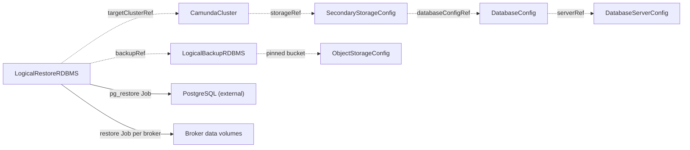

# LogicalRestoreRDBMS

`LogicalRestoreRDBMS` restores one completed [LogicalBackupRDBMS](logicalbackuprdbms.md) into one suspended [CamundaCluster](camundacluster.md). You create it, or a recovery flow above the operator creates it for you.

The backup and the target both store their data in a relational database. The target must be the cluster the backup came from. A restore names a `CamundaCluster` with the same name, in the same namespace as the backup. Use this kind to undo a destructive operation, or to rebuild the cluster on new infrastructure under its own name.

One resource is one restore. The spec is immutable, and the restore runs once. `kubectl get lrrdbms` lists the restores with their phase, backup, and target.

One thing must be true before you create the resource: the backup reports `Completed`.

You do not suspend the target first, and you do not change its Camunda version first. The restore does both. Read "The restore prepares the target" below.

The smallest restore names the backup and the target:

```yaml
apiVersion: core.camunda.io/v1
kind: LogicalRestoreRDBMS
metadata:
  name: my-cluster-restore
  namespace: my-cluster-ns
spec:
  backupRef:
    name: my-cluster-1748937221000
  targetClusterRef:
    name: my-cluster
```



## The restore prepares the target

The operator carries the target to the state that the restore needs. You do not suspend the cluster by hand, and you do not change its Camunda version by hand.

When the restore is admitted, the operator does this, in this order:

1. It takes the cluster claim, so that no other backup or restore of that cluster runs.
2. It records in `status.clusterSuspended` that it is about to suspend the target.
3. It applies `spec.suspend: true` on the target.
4. It waits until the broker `StatefulSet` reports zero replicas. `spec.suspend` says what was asked for. The `StatefulSet` says what happened.
5. It applies `spec.version` with the Camunda version that the backup recorded in `status.version`. It does this every time, even when the version rule of this kind would already accept the target.
6. It waits until the tag of the broker image is that version.

The restore stays in `Pending` for all of it. It erased nothing yet, so nothing bounds this wait. `Ready` reports `Progressing`, and the message says what the operator waits for.

The operator writes nothing else on the target. It writes no credential, and no reference to one.

### What the operator writes, and what it keeps

Each write is a server-side apply of one field, under a field manager of its own:

| Field | Field manager | What happens at the end |
| --- | --- | --- |
| `spec.suspend` | `camunda-operator/restore-suspend` | The restore withdraws it when it reaches `Completed`. |
| `spec.version` | `camunda-operator/restore-version` | The restore keeps it. |

The restore keeps `spec.version` on purpose. The cluster runs the version of the backup from then on, which is the point of writing it. Your next `kubectl apply` or GitOps sync of the `CamundaCluster` takes the field back, and that is correct: it is your declaration of the version again.

### Why the downgrade is safe here

Camunda does not support a running cluster that moves to an older version. A broker compares the version in its data directory against its own binary at startup, reports a downgrade, and applies no migration.

No broker does that comparison here. The order above is what makes it safe: nothing runs while the version changes, and the broker volumes are erased before a broker of the older version starts. The first broker that starts again finds the state of the backup at the version of the backup.

CAUTION: A downgrade that you do by hand on a running cluster, outside a restore, is still unsupported. The operator accepts the change to `spec.version`, and the brokers then report themselves unhealthy.

### When the restore unsuspends the target

The restore withdraws its suspension when it reaches `Completed`, and only when `status.clusterSuspended` is `true`.

- **A target that you suspended yourself stays suspended.** The restore recorded no suspension of its own, so it withdraws none.
- **A failed restore leaves the target suspended.** Its broker volumes can be empty or half written. Brokers that start over such volumes are worse than a cluster that is down. Read `status.failureMessage`, correct the cause, and create a new restore.
- **A restore that you delete while it runs leaves the target suspended.** The restore writes nothing outside the cluster, so it needs no finalizer, and it gets none for this either. A finalizer that unsuspended the target on delete would start brokers over volumes that the restore already erased. Suspended is the safe state to be left in. Unsuspend the cluster yourself once you know what its volumes hold.

The withdrawal is a server-side apply of an object without `spec.suspend`. Kubernetes removes the field that `camunda-operator/restore-suspend` owns, and it leaves the value of every other field manager in place.

### A GitOps tool that owns the CamundaCluster

The operator uses its own field managers, the same way [CamundaOptimize](camundaoptimize.md) does for `spec.zeebe.extraEnv`. A tool that manages the `CamundaCluster` with server-side apply keeps every field that it declares, and the operator keeps the fields that it declares.

A tool that also declares one of these fields fights the operator for it. Argo CD or Flux reverts the write of the restore, the restore reads the old value on its next look and writes again, and the restore stalls in `Pending`. If you drive the `CamundaCluster` from Git:

- Remove `spec.suspend` and `spec.version` from the manifest for the time of the restore, or mark `spec.suspend` and `spec.version` as an ignored difference.
- Put `spec.version` back after the restore, with the version that you want the cluster to run.

### The layer above

This operator is the bottom layer of a stack. A layer above it, for example a `CloudCamundaCluster` of `camunda-cloud-operator`, can consider itself the author of the fields above. While a restore runs, it is not. That layer keys on the field manager names above to tell a write of a restore from a write of a user.

Suspension is a standing condition, not a gate that admission passes once. A cluster that somebody unsuspends while the restore runs holds the restore in its current phase and fails it after ten minutes, with reason `ClusterNotSuspended`. Every phase after admission erases something of the target.

## One operation at a time

A cluster holds one backup or one restore at a time. The operator records the holder in a Lease next to the cluster. A restore takes that Lease before it writes anything on the target and before every phase that erases something, and it gives the Lease back when it reaches `Completed` or `Failed`. It therefore holds the target while it prepares it, which it reports as `Pending`.

A cluster that another backup or another restore holds keeps this restore in `Pending` with reason `ClusterClaimed`. The message names the holder. Nothing bounds this wait, and you change nothing: the restore starts on its own when the holder reaches a terminal phase. No watch wakes this hold. The controller wakes it on its retry timer alone, so the restore can start up to one retry interval after the holder finished.

## Phases

`status.phase` is the resume marker. A restore that re-enters after an operator restart continues at the recorded phase.

| Phase | What happens |
| --- | --- |
| `Pending` | The restore waits. The backup does not exist or is not completed, the target does not exist, another backup or restore holds the target, or the operator is still preparing the target. Nothing of the target is erased here. Preparation does write `spec.suspend` and `spec.version` on the target, which the section above describes. |
| `ValidatingCompatibility` | The operator compares the backup against the target. |
| `RestoringSecondaryStorage` | One Job downloads the dump from the backup bucket and runs `pg_restore` against the logical database of the target. |
| `RestoringPrimaryStorage` | The operator recreates the broker data volumes and runs the Camunda restore application on them. |
| `Completed` | The restore finished. The restore unsuspended the target, unless you suspended it yourself. |
| `Failed` | A phase failed. `status.failureMessage` names it. |

## Compatibility

The operator compares the backup against the target before the first destructive step. A breach fails the restore with reason `IncompatibleTarget`. No change to the restore resource resolves it, so you create a new restore against a target that fits.

| Rule | Why |
| --- | --- |
| The target is the cluster the backup came from. | The restore application reads the primary-storage backup under the prefix of the cluster it runs as. A different name points it at a prefix that holds no backup of this cluster. |
| The target stores its data in a relational database. | The dump holds relational data. An Elasticsearch target has nothing to read it with. |
| The target backs up through the same `ObjectStorageConfig` as the backup. | The `pg_restore` Job reads the bucket of the backup with the credentials that the `CamundaCluster` controller copies into the namespace, and it copies them for the bucket of the target alone. |
| The target runs the same Camunda minor as the backup, or one minor newer. | Camunda migrates its own schema one minor at a time. The patch level is free. The restore moves the target to the version of the backup before this rule runs, so it holds by construction. |

The brokers write the backup prefix of their own cluster into their configuration. The restore Jobs copy that configuration from the live broker StatefulSet, so the restore always reads the prefix of the target.

The backup must record the Camunda version it was taken with, in `status.version`. A backup that recorded none fails the restore: nothing then proves that the target can read it. A backup whose recorded version is not of the form `x.y.z` fails it too, because the operator cannot write such a value on the target.

CAUTION: The restore sets `spec.version` to the version of the backup every time, and this rule accepts a target one minor newer. A target that this rule would already accept is therefore moved back one minor. The cluster comes back at the version of the backup, and you upgrade it forward again after the restore.

The rules compare no partition count. A relational backup records none, and it needs none. The restore application reads the exporter position from the restored database and aligns the partitions itself.

The target facts come from the live broker StatefulSet, not from `status.management` of the cluster. A suspended cluster has no management binding.

## Secondary storage

The operator applies one Job that rebuilds the logical database of the target. An init container streams the dump from the backup bucket into a scratch volume through the `download` subcommand of `camunda-operator-cli`. The main container then runs `pg_restore --clean --if-exists --no-owner` from that file.

**The Job connects as the application role of the target**, the role that `DatabaseConfig.spec.credentialsSecretRef` names. `pg_restore --clean` drops each object before it recreates it, and PostgreSQL lets only the owner of an object drop it. The application role owns the database and every object in it. The backup role that wrote the dump owns nothing: it holds USAGE and CREATE on the schema and DML on the tables. A restore that connected as the backup role would fail every DROP with "must be owner of table" and would restore no data.

A credentials Secret outside the namespace of the target is read through the local copy that the `CamundaCluster` controller maintains. A Secret that is missing or lacks a key holds the restore with reason `MissingSecret` for the database credentials, or `MissingCredentials` for the bucket credentials.

The Job takes its pod settings and its postgres image from `spec.backup.dump` of the target cluster, through its preset when it names one. The Job runs under the ServiceAccount of the cluster, so the pod shape and the executable stay the choice of whoever owns the cluster. The restore resource carries no pod block of its own.

The `DatabaseServerConfig` of the target must publish `status.serverVersion`, which its controller writes once it reached the server as declared. The Job runs client tools of that major version. A server that was not probed for its current spec holds the restore with reason `InvalidReference`.

The operator records the Job in `status.secondaryJobName` and follows it to its end:

- A completed Job moves the restore to `RestoringPrimaryStorage`.
- A failed Job fails the restore, and the message names the Job. The logical database then holds a partial restore that only a new attempt repairs.
- A Job that disappears before it completes fails the restore, for the same reason.
- A Job under that name that carries the UID of another restore fails the restore. Its completion would let this restore continue without a restore of its own database.

## Primary storage

The Camunda restore application refuses a non-empty data directory, so the operator deletes the broker data volumes of the target and creates them again. The new volume takes the size that the backup recorded in `status.storageSizes.zeebe`, or the size of the claim template of the broker StatefulSet when the backup recorded none. The storage class, the access modes, and the labels always come from the claim template.

**The volumes belong to the broker StatefulSet, not to the restore.** They carry no owner reference to the restore resource, so deleting the restore never deletes a broker volume.

The operator refuses a Job that carries the name of one of its Jobs but no owner reference of this restore. Such a Job belongs to an earlier restore of the same name, and its result says nothing about this one. The restore fails, and the message names the Job.

The operator then runs the Camunda restore application once per broker, as a Job with **no arguments**. The continuous primary-storage backup of Zeebe carries the checkpoint, and the restore application reads the exporter position from the restored database and picks the backups itself.

The Jobs copy their configuration from the live broker StatefulSet, so the restore application always runs with the configuration the brokers run with, and the two cannot drift. A cluster whose broker StatefulSet was deleted cannot restore until its own controller applies it again.

## The restore Jobs

The restore runs the Camunda restore application once per broker, as a Job. Each Job pod mounts the data volume of its broker. A pod that finished still counts as a user of that volume, so the volume cannot terminate while the pod exists.

| Terminal phase | What happens to the Jobs |
| --- | --- |
| `Completed` | The operator deletes them, together with their pods. The broker data volumes are free for the next operation. |
| `Failed` | The operator keeps them. The logs of a failed Job name the cause, and only the pod keeps them readable. |

**A failed restore holds the broker data volumes.** You read the logs of its Jobs, and then you delete the restore. The delete takes the Jobs and their pods with it, and the volumes are free again. Until you do that, a second restore of the cluster and the deletion of the cluster both wait on a volume that never terminates. The waiting restore reports the pod that holds the volume and names the resource that runs it.

```bash
# The Jobs that the restore still holds. status.primaryJobNames lists the same names.
kubectl get job -n my-cluster-ns -l camunda.io/logical-restore-rdbms=my-cluster-restore

# The log of the Job of one broker.
kubectl logs -n my-cluster-ns job/<job name>
```

## Deletion

When you delete the restore, the operator deletes the Jobs it created. A restore that completed already removed its per-broker Jobs. A restore that failed still has them, and this is how you remove them. It writes nothing to an external store, so it needs no finalizer and leaves no artifact behind. The recreated broker volumes stay.

A target that the restore suspended stays suspended. That is deliberate. Unsuspending it here would start brokers over volumes that the restore already erased. Unsuspend the cluster yourself once you know what its volumes hold.

## Status

| Type | Reason | Meaning | What to do |
| --- | --- | --- | --- |
| `Ready` | `Progressing` | A restore phase runs. | Wait. The message names the phase. |
| `Ready` | `Completed` | The restore finished, and it withdrew the suspension it applied. `Ready` is `True`. | Nothing. Unsuspend the target yourself only when you suspended it yourself. |
| `Ready` | `ClusterNotSuspended` | The target started running again while the restore ran. | Suspend the target again. A restore that already erased something fails ten minutes after the first outage. |
| `Ready` | `ClusterClaimed` | Another backup or restore holds the target. The message names it. | Wait. The restore starts when that operation finishes. |
| `Ready` | `IncompatibleTarget` | The target cannot hold the backup. See "Compatibility". | Create a new restore against a target that fits. |
| `Ready` | `InvalidReference` | The backup or the target does not exist, the backup is not `Completed`, a link in the storage chain is gone, or the database server was not probed. | Correct the reference that the message names. |
| `Ready` | `MissingSecret` | The database credentials Secret is missing or lacks a key. | Create the Secret that the message names. |
| `Ready` | `MissingCredentials` | The bucket credentials Secret is missing or lacks a key. | Create the Secret that the message names. |
| `Ready` | `Failed` | A phase failed. | Read `status.failureMessage`. Correct the cause and create a new restore. |

A restore that already started keeps a broken dependency for ten minutes. After that it fails, because a restore that rewrote a database or recreated a volume must not wait without an end. A restore that still waits in `Pending` has no such limit: it erased nothing.

The status also records what the restore pinned and what it did:

- `status.backupId` pins the backup id. A backup that is deleted and created again under one name carries another id, and the restore fails.
- `status.targetClusterUID` pins the identity of the target. A cluster that is deleted and created again under one name fails the restore.
- `status.secondaryJobName` is the `pg_restore` Job, while it exists.
- `status.clusterSuspended` records that this restore suspended the target. The restore withdraws that suspension when it completes.
- `status.brokers` is the broker count that the operator read off the broker StatefulSet.
- `status.recreatedClaims` names the broker data volumes that the operator deleted and created again.
- `status.primaryJobNames` names the per-broker restore Jobs, in broker order.
- `status.terminalReason` is the `Ready` reason of the terminal phase. The operator stages the condition again from it, so a write conflict cannot lose the reason.
- `status.completionTime` is when the restore reached `Completed` or `Failed`.
- `status.observedGeneration` is the last generation the operator reconciled.

## Spec reference

Every field, with its type and whether it is required:

```yaml
apiVersion: core.camunda.io/v1
kind: LogicalRestoreRDBMS
metadata:
  name: my-cluster-restore
  namespace: my-cluster-ns
spec:
  # object. Required. The backup to restore.
  backupRef:
    # string. Required. Name of the LogicalBackupRDBMS, in this namespace.
    name: my-cluster-1748937221000
  # object. Required. The cluster to restore into. It is the cluster the
  # backup came from.
  targetClusterRef:
    # string. Required. Name of the CamundaCluster, in this namespace.
    name: my-cluster
```

### Validation rules

- `spec` is immutable. A restore runs once, and you retry it with a new resource.
- `backupRef` and `targetClusterRef` name resources in the namespace of the restore. Neither crosses a namespace. The operator reads the Secrets of the target and runs Jobs in that namespace, so both references stay inside the RBAC boundary of the restore.
- `backupRef` carries a name alone. The kind of the restore says which backup kind it reads.
- The suspend state, the phase of the backup, and the compatibility rules depend on live state. The operator checks them at reconcile time.

## Related

- [LogicalBackupRDBMS](logicalbackuprdbms.md): referenced through `backupRef`. It must report `Completed`, and it records the bucket, the dump key, the Camunda version, and the broker volume size that this restore reads.
- [CamundaCluster](camundacluster.md): referenced through `targetClusterRef`. The restore suspends it and sets its `spec.version`, and its `spec.backup.dump` shapes the `pg_restore` Job.
- [SecondaryStorageConfig](secondarystorageconfig.md): resolved through the `storageRef` of the target. It must be `type: rdbms`.
- [DatabaseConfig](databaseconfig.md): resolved for the logical database. Its `credentialsSecretRef` holds the application role that `pg_restore` connects as.
- [DatabaseServerConfig](databaseserverconfig.md): resolved for the endpoint and the probed major version of the server.
- [ObjectStorageConfig](objectstorageconfig.md): the bucket that the backup wrote its dump to. The target must back up through the same one.
- [PointInTimeRestore](pointintimerestore.md): the alternative without a backup resource, for a database that you already restored to a point in time.
