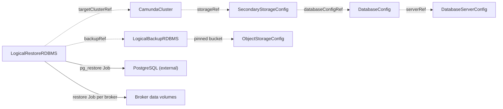

# LogicalRestoreRDBMS

`LogicalRestoreRDBMS` restores one completed [LogicalBackupRDBMS](logicalbackuprdbms.md) into the [CamundaCluster](camundacluster.md) that the backup was taken from. It writes the dump back into the logical database of the cluster with `pg_restore`. It also gives the brokers new data volumes, which the Camunda restore application fills. Use it to undo a destructive operation, or to rebuild a cluster on new infrastructure under its own name.

One resource is one restore. The spec is immutable, and the restore runs once. To retry, create a new resource. `kubectl get lrrdbms` lists the restores with their phase, backup, and target.

Before you create the resource, make sure that the backup reports `status.phase: Completed`. You do not suspend the target, and you do not change its Camunda version. The restore does both, as [Operations: Restore a cluster](../guides/operations.md#restore-a-cluster) describes. That section also holds what every restore kind shares: when the cluster starts again, one operation at a time, failed restores, and GitOps.

The smallest restore names the backup and the target:

```yaml
apiVersion: core.camunda.io/v1
kind: LogicalRestoreRDBMS
metadata:
  name: my-cluster-restore
  namespace: my-cluster-ns
spec:
  backupRef:
    name: my-cluster-1748937221000
  targetClusterRef:
    name: my-cluster
```


```mermaid
graph LR
    LRR[LogicalRestoreRDBMS] -.->|backupRef| LBR[LogicalBackupRDBMS]
    LRR -.->|targetClusterRef| CC[CamundaCluster]
    CC -.->|storageRef| SSC[SecondaryStorageConfig]
    SSC -.->|databaseConfigRef| DBC[DatabaseConfig]
    DBC -.->|serverRef| DBS[DatabaseServerConfig]
    LBR -.->|"pinned bucket"| OSC[ObjectStorageConfig]
    LRR -->|pg_restore Job| PG["PostgreSQL (external)"]
    LRR -->|restore Job per broker| PVC[Broker data volumes]
```

## Phases

`status.phase` records how far the restore got. A restore continues at that phase after the operator restarts.

| Phase | What happens |
| --- | --- |
| `Pending` | The restore waits. The backup or the target does not exist, the backup is not completed, another operation holds the target, or the target is not prepared. The restore suspends the target and sets its version here. It erases nothing. |
| `ValidatingCompatibility` | The operator compares the backup against the target. |
| `RestoringSecondaryStorage` | One Job downloads the dump from the backup bucket and runs `pg_restore` against the logical database of the target. |
| `RestoringPrimaryStorage` | The operator deletes and creates the broker data volumes, and runs the Camunda restore application once per broker. |
| `Completed` | The restore finished, and the target starts again. |
| `Failed` | The restore ended. `status.failureMessage` says why. |

## Compatibility

Before it erases anything, the operator compares the backup against the target. A breach fails the restore with the reason `IncompatibleTarget`. Create a new restore against a target that fits. The rules:

- The target is the cluster that the backup was taken from. The restore application reads the primary-storage backup under the prefix of the cluster it runs as.
- The target stores its data in a relational database. For an Elasticsearch cluster, use a [LogicalRestoreElasticsearch](logicalrestoreelasticsearch.md).
- The `spec.backupStorageRef` of the target names the `ObjectStorageConfig` that the backup wrote to.
- The target runs the Camunda minor of the backup, or one minor newer. Camunda migrates its schema one minor at a time, see [Version compatibility checks](https://docs.camunda.io/docs/self-managed/components/orchestration-cluster/core-settings/concepts/version-compatibility/).
- The backup recorded its Camunda version in `status.version`, in the form `x.y.z`.

The restore sets the version of the backup on the target in `Pending`, even when the target runs one minor newer. So a target that ran a newer minor comes back on the minor of the backup. Upgrade it forward again after the restore. The rules compare no partition count, because a relational backup records none.

### Why the downgrade is safe here

The restore can set a version below the one the brokers run. Camunda does not support a downgrade of a running cluster, but a restore is not one. No broker runs while the version changes, and the restore erases the broker volumes before a broker of the older version starts. Outside a restore, the cluster refuses a downgrade with `VersionDowngradeRefused`, see [CamundaCluster: Downgrade on purpose](camundacluster.md#downgrade-on-purpose). What stays on the cluster after the restore is in [The version after a logical restore](../guides/operations.md#the-version-after-a-logical-restore).

## The backend

The backend is the logical database that the `SecondaryStorageConfig` of the target resolves to. When the restore leaves `Pending`, it records the backend in `status.backend`, in the form `rdbms|<host>:<port>/<database>`.

From then until `Completed` or `Failed`, no other `CamundaCluster` starts on that backend. The next cluster reports `WaitingForHandover`, and the message names this restore. [CamundaCluster: Secondary storage](camundacluster.md#secondary-storage) describes that wait. A restore that you delete keeps the backend until its Jobs and their pods are gone. The pod of the `pg_restore` Job carries the label `camunda.io/storage-claim` of the database. So when the restore fails while that pod runs, the next cluster also waits for the pod.

The restore writes the backend only while the target holds it. Until then it waits:

| Reason | Meaning |
| --- | --- |
| `StorageAlreadyAttached` | Another cluster holds the backend. The message names it. |
| `WaitingForHandover` | The target does not hold the backend yet, or pods still write it. The message names the target and the backend, or the pods. A pod of the Optimize importer of the target is one such pod. |
| `InvalidReference` | A Lease claims the backend and names no `CamundaCluster`. Delete the Lease if nothing uses it. |

In `Pending` this wait has no limit. After `Pending`, these reasons hold the restore for 10 minutes, and then it fails. A target that now resolves to another backend than `status.backend` holds it with `InvalidReference` for the same time.

## Secondary storage

One Job downloads the dump from the backup bucket and runs `pg_restore --clean --if-exists --no-owner` on it. `status.secondaryJobName` names the Job while it exists.

**The Job connects as the application role of the target**, the role in `DatabaseConfig.spec.credentialsSecretRef`. `pg_restore --clean` drops each object before it creates it again, and only the owner of an object can drop it. The application role owns the database and its objects, and the backup role owns nothing.

The Job takes its pod settings and its `postgres` image from `spec.backup.dump` of the target, through its preset when it names one. It runs under the ServiceAccount of the cluster. The restore resource carries no pod settings of its own.

The Job needs these, and holds the restore until they exist:

- The Secret of the database credentials in the namespace of the target. If it is missing or lacks a key, the reason is `MissingSecret`.
- The Secret of the bucket credentials in the namespace of the target. If it is missing or lacks a key, the reason is `MissingCredentials`.
- `status.serverVersion` on the `DatabaseServerConfig`, for its current spec. The Job runs the client tools of that PostgreSQL major. If it is not there, the reason is `InvalidReference`.

A failed Job fails the restore, and the message names the Job. So does a Job that disappears before it completes, and a Job of that name that belongs to another restore. The logical database then holds a partial restore, which only a new restore repairs.

## Primary storage

The operator deletes the data volume of every broker, creates it again, and runs the restore application once per broker, with no arguments. The restore application reads the exporter position from the restored database and selects the backups itself.

The new volume takes the size that the backup recorded in `status.storageSizes.zeebe`. If the backup recorded none, it takes the size of the claim template of the broker StatefulSet. The storage class, the access modes, and the labels come from the claim template. The volumes belong to the broker StatefulSet, not to the restore. Deleting the restore leaves them in place.

Every Job carries the labels `camunda.io/component: restore`, `camunda.io/logical-restore-rdbms: <restore name>`, and `camunda.io/cluster: <target name>`. Its name is `<restore name>-lrrdbms-<broker>`, for example `my-cluster-restore-lrrdbms-0`. A Job of that name from an earlier restore of the same name fails this restore, and the message names the Job. A failed restore keeps its Jobs, see [A failed restore holds the broker volumes](../guides/operations.md#a-failed-restore-holds-the-broker-volumes).

## Deletion

Deleting the restore removes its Jobs and their pods. The broker volumes stay, and so does the restored database. The restore wrote nothing to the backup bucket. The restore removes its suspension hold from the target when the last Job pod is gone, and `spec.suspend` stays.

## Status

| Type | Reason | Meaning | What to do |
| --- | --- | --- | --- |
| `Ready` | `Progressing` | A phase of the restore runs, or the restore prepares the target. | Wait. The message names the work. |
| `Ready` | `Completed` | The restore finished. `Ready` is `True`. The target starts again, unless you suspended it yourself or another hold remains. | Nothing. |
| `Ready` | `Failed` | The restore ended. | Read `status.failureMessage`. Correct the cause. Delete the failed restore, then create a new one. |
| `Ready` | `ClusterNotSuspended` | Somebody removed the suspension hold of the restore and cleared `spec.suspend`, after `Pending`. | Suspend the target again. The restore fails 10 minutes after the first outage. |
| `Ready` | `ClusterClaimed` | Another backup or restore holds the target. The message names it. | Wait. The restore starts when the holder ends. |
| `Ready` | `StorageAlreadyAttached` | Another cluster holds the logical database of the target. | Read [The backend](#the-backend). |
| `Ready` | `WaitingForHandover` | The target does not hold its logical database yet, or pods still write it. | Wait. The message names what the restore waits for. |
| `Ready` | `IncompatibleTarget` | The target cannot hold the backup, or its version moved after `Pending`. | Read [Compatibility](#compatibility). Create a new restore against a target that fits. |
| `Ready` | `InvalidReference` | A referenced resource does not exist, or the backup is not `Completed`. Or the database server has no `status.serverVersion`. | Correct what the message names. |
| `Ready` | `MissingSecret` | The Secret of the database credentials is missing or lacks a key. | Create the Secret that the message names. |
| `Ready` | `MissingCredentials` | The Secret of the bucket credentials is missing or lacks a key. | Create the Secret that the message names. |

After `Pending`, a restore that loses a dependency waits 10 minutes, then fails with the reason `Failed`. Once the restore has deleted a broker volume, the 10 minutes count from the first outage. A dependency that comes back in between does not reset them.

Other status fields:

- `status.backupId` is the backup that the restore reads. The restore pins it when it starts. A backup that somebody deletes and creates again under the same name ends the restore.
- `status.targetClusterUID` pins the target. A cluster that somebody deletes and creates again under the same name ends the restore.
- `status.backend` is the logical database that the restore writes.
- `status.secondaryJobName` is the `pg_restore` Job, while it exists.
- `status.clusterSuspended` is `true` when this restore suspended the target.
- `status.brokers` is the broker count that the restore recorded before it deleted a volume.
- `status.recreatedClaims` names the broker data volumes that the restore deleted and created again.
- `status.primaryJobNames` names the restore Job of every broker, in broker order.
- `status.terminalReason` is the `Ready` reason of the terminal phase.
- `status.failureMessage` says why a failed restore ended.
- `status.completionTime` is when the restore reached a terminal phase.
- `status.observedGeneration` is the last generation that the operator processed.

## Spec reference

Every field, with its type and whether it is required:

```yaml
apiVersion: core.camunda.io/v1
kind: LogicalRestoreRDBMS
metadata:
  name: my-cluster-restore
  namespace: my-cluster-ns
spec:
  # object. Required. The completed LogicalBackupRDBMS to restore.
  backupRef:
    # string. Required. Name of the backup, in the namespace of this resource.
    name: my-cluster-1748937221000
  # object. Required. The CamundaCluster to restore into. It is the cluster
  # the backup was taken from.
  targetClusterRef:
    # string. Required. Name of the cluster, in the namespace of this resource.
    name: my-cluster
```

### Validation rules

- The whole `spec` is immutable.
- `spec.backupRef.name` and `spec.targetClusterRef.name` must not be empty.
- Neither reference crosses a namespace.
- The API server accepts a restore that breaks a rule of live state: the phase of the backup and the compatibility rules. The restore reports the breach on `Ready`.

## Related

- [Operations: Restore a cluster](../guides/operations.md#restore-a-cluster): what every restore kind does to the cluster, and how to act on a failed restore.
- [LogicalBackupRDBMS](logicalbackuprdbms.md): the backup that this restore reads.
- [CamundaCluster](camundacluster.md): referenced through `targetClusterRef`. The restore suspends it and sets its version. Its `spec.backup.dump` shapes the `pg_restore` Job.
- [SecondaryStorageConfig](secondarystorageconfig.md): resolved through the `storageRef` of the target. It must be `type: rdbms`.
- [DatabaseConfig](databaseconfig.md): its `credentialsSecretRef` holds the application role that `pg_restore` connects as.
- [DatabaseServerConfig](databaseserverconfig.md): the endpoint and the PostgreSQL major of the server.
- [ObjectStorageConfig](objectstorageconfig.md): the bucket that the backup wrote its dump to.
- [PointInTimeRestore](pointintimerestore.md): rolls a relational cluster back to a point in time, without a backup resource.
