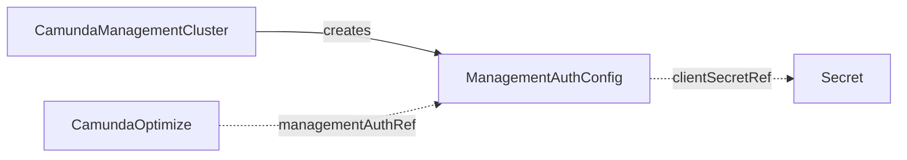

# ManagementAuthConfig

`ManagementAuthConfig` is the contract CRD that carries the Management Identity OIDC configuration — endpoints, client credentials, and audience — for components that live outside the orchestration cluster.

## Purpose

Components outside the orchestration cluster — Optimize, Console, Web Modeler — authenticate against Management Identity, which is a separate auth system from the orchestration cluster's own identity.
This cluster-scoped contract CRD carries the OIDC endpoints and default machine-to-machine client credentials those components need to validate tokens and call each other within the management plane, decoupling the management plane's producer from its consumers, as described in the [architecture](../architecture.md).

| Role | Who |
| --- | --- |
| Producers | `CamundaManagementCluster` (as output of reconciling the management plane), a composition layer above (for example a SaaS control plane shipping it directly per environment, without a management cluster), or you, by hand |
| Consumers | `CamundaOptimize` (via `managementAuthRef`) |

!!! note "Deviation from the original proposal"
    `authUrl` was added: the Camunda 8.9 Management Identity OIDC surface includes the authorization endpoint, which consumers need for browser login redirects.

## How it works

The contract has a lightweight validation-only controller: it never provisions anything.

1. The operator watches every `ManagementAuthConfig` and the Secret it references, and re-runs validation whenever either changes.
2. It checks that the Secret named by `clientSecretRef` exists and contains the configured `key`.
3. It sets the `Ready` condition: `Healthy` when the check passes, `MissingSecret` otherwise.

Consumers read the contract by name and never care who produced it: a `CamundaManagementCluster` refreshing its output and a manifest shipped by a composition layer above look identical to a consuming controller.
Consumers use the OIDC endpoints to validate tokens and acquire machine-to-machine credentials for inter-component communication within the management plane.



## API reference

```yaml
apiVersion: core.camunda.io/v1
kind: ManagementAuthConfig
# Cluster-scoped: metadata has no namespace.
metadata:
  name: management-auth
spec:
  # string. Required. Base URL of the Management Identity service.
  baseUrl: "https://identity.camunda.example.com"
  # string. Required. OIDC issuer URL used to validate tokens.
  issuerUrl: "https://identity.camunda.example.com/auth/realms/camunda-platform"
  # string. Optional, default: issuerUrl. Issuer URL for in-cluster container-to-container communication.
  issuerBackendUrl: "http://identity.camunda-management.svc.cluster.local/auth/realms/camunda-platform"
  # string. Required. OIDC authorization endpoint used for browser login redirects.
  authUrl: "https://identity.camunda.example.com/auth/realms/camunda-platform/protocol/openid-connect/auth"
  # string. Required. OIDC token endpoint used to acquire machine-to-machine tokens.
  tokenUrl: "https://identity.camunda.example.com/auth/realms/camunda-platform/protocol/openid-connect/token"
  # string. Required. JWKS endpoint used to fetch token signing keys.
  jwksUrl: "https://identity.camunda.example.com/auth/realms/camunda-platform/protocol/openid-connect/certs"
  # string. Required. Default machine-to-machine client ID.
  clientId: camunda-management
  # string. Required. Audience expected in access tokens issued for this client.
  audience: camunda-management
  # object. Required. Client secret for the machine-to-machine client.
  clientSecretRef:
    # string. Required. Name of the Secret holding the client secret.
    name: management-auth-secret
    # string. Required. Namespace of the Secret (this CR is cluster-scoped, so there is no default).
    namespace: camunda-system
    # string. Required. Key in the Secret holding the client secret value.
    key: client-secret
```

## Status

| Type | Reason | Meaning |
| --- | --- | --- |
| `Ready` | `Healthy` | The client secret exists and has the required key. |
| `Ready` | `MissingSecret` | The Secret named by `clientSecretRef` is missing or lacks the configured key. |

The operator records the last reconciled generation in `status.observedGeneration`.

## Validation

- `spec.baseUrl`, `spec.issuerUrl`, `spec.issuerBackendUrl`, `spec.authUrl`, `spec.tokenUrl`, and `spec.jwksUrl` must be valid `http` or `https` URLs.

## Relationships

- `CamundaManagementCluster` — creates this contract as output of reconciling the management plane.
- `CamundaOptimize` — consumes this contract via `managementAuthRef` to authenticate against Management Identity.
- A composition layer above may ship this CR directly per environment; external actors are not documented here.

See the [CRD overview](index.md) for where this contract sits in the reconciler dependency graph.

## Examples

A minimal manifest:

```yaml
apiVersion: core.camunda.io/v1
kind: ManagementAuthConfig
metadata:
  name: management-auth
spec:
  baseUrl: "https://identity.camunda.example.com"
  issuerUrl: "https://identity.camunda.example.com/auth/realms/camunda-platform"
  authUrl: "https://identity.camunda.example.com/auth/realms/camunda-platform/protocol/openid-connect/auth"
  tokenUrl: "https://identity.camunda.example.com/auth/realms/camunda-platform/protocol/openid-connect/token"
  jwksUrl: "https://identity.camunda.example.com/auth/realms/camunda-platform/protocol/openid-connect/certs"
  clientId: camunda-management
  audience: camunda-management
  clientSecretRef:
    name: management-auth-secret
    namespace: camunda-system
    key: client-secret
```

A realistic manifest with a separate in-cluster issuer URL for backend traffic:

```yaml
apiVersion: core.camunda.io/v1
kind: ManagementAuthConfig
metadata:
  name: management-auth
spec:
  baseUrl: "https://identity.camunda.example.com"
  issuerUrl: "https://identity.camunda.example.com/auth/realms/camunda-platform"
  issuerBackendUrl: "http://identity.camunda-management.svc.cluster.local/auth/realms/camunda-platform"
  authUrl: "https://identity.camunda.example.com/auth/realms/camunda-platform/protocol/openid-connect/auth"
  tokenUrl: "https://identity.camunda.example.com/auth/realms/camunda-platform/protocol/openid-connect/token"
  jwksUrl: "https://identity.camunda.example.com/auth/realms/camunda-platform/protocol/openid-connect/certs"
  clientId: camunda-management
  audience: camunda-management
  clientSecretRef:
    name: management-auth-secret
    namespace: camunda-system
    key: client-secret
```
