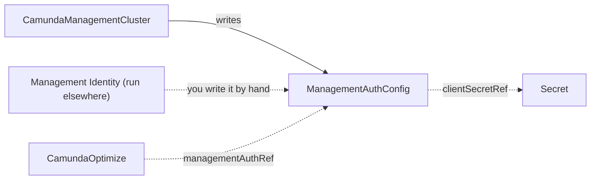

# ManagementAuthConfig

`ManagementAuthConfig` is a cluster-scoped contract kind that carries the OIDC configuration of Management Identity: endpoints, a machine-to-machine client, and an audience. A [CamundaManagementCluster](camundamanagementcluster.md) writes it for you, or you create it by hand.

Components outside the orchestration cluster authenticate against Management Identity, which is a separate identity system from the one inside the orchestration cluster. This kind carries the OIDC endpoints and the default machine-to-machine client those components need. The thing that runs Management Identity and the thing that uses it do not need to know each other.

[CamundaOptimize](camundaoptimize.md) consumes this contract. The operator validates it and never provisions anything from it.

| Role | Who |
| --- | --- |
| Producers | A [CamundaManagementCluster](camundamanagementcluster.md), you by hand, or another tool that runs Management Identity |
| Consumers | [CamundaOptimize](camundaoptimize.md) |

The smallest contract names the endpoints, the client, the audience, and the client secret:

```yaml
apiVersion: core.camunda.io/v1
kind: ManagementAuthConfig
metadata:
  name: my-management-auth
spec:
  baseUrl: "https://identity.camunda.example.com"
  issuerUrl: "https://identity.camunda.example.com/auth/realms/camunda-platform"
  authUrl: "https://identity.camunda.example.com/auth/realms/camunda-platform/protocol/openid-connect/auth"
  tokenUrl: "https://identity.camunda.example.com/auth/realms/camunda-platform/protocol/openid-connect/token"
  jwksUrl: "https://identity.camunda.example.com/auth/realms/camunda-platform/protocol/openid-connect/certs"
  clientId: camunda-management
  audience: camunda-management
  clientSecretRef:
    name: my-management-auth-secret
    namespace: my-cluster-ns
    key: client-secret
```



## Who wrote this contract

A contract that a [CamundaManagementCluster](camundamanagementcluster.md) wrote carries two labels that name its owner:

| Label | Value |
| --- | --- |
| `camunda.io/management-cluster` | the name of the `CamundaManagementCluster` |
| `camunda.io/management-cluster-namespace` | its namespace |

Read them with `kubectl get managementauthconfig my-management-auth --show-labels`. A contract without them is one that you or another tool wrote.

The owner keeps every field of a contract it wrote up to date. An edit of your own to such a contract goes back to the value the management plane computes.

This kind is cluster-scoped, so two management planes in two namespaces can ask for one name. The first one there keeps it. The second reports `Ready=False` with reason `Conflict`, and its message names the holder:

```yaml
status:
  conditions:
    - type: Ready
      status: "False"
      reason: Conflict
      message: ManagementAuthConfig "my-management-auth" exists and belongs to CamundaManagementCluster my-management-ns/my-management; set spec.managementAuthConfigName to a free name, or remove the object
```

A contract that you wrote by hand carries no owner labels. A management plane that asks for its name reports `Conflict` against "another writer" and leaves the object alone.

## Validation checks

The operator creates no resources from this kind. It validates the contract and writes the result to `status`.

- The operator makes sure that the Secret in `clientSecretRef` exists and holds the configured `key`.

If the Secret or the key is missing, `Ready` is `False` with reason `MissingSecret`. The message names the Secret and the key.

When you edit the contract or the referenced Secret, the operator validates the contract again.

> **Note:** A Secret reference can name any namespace, and the status message says whether it exists. Grant write access to this kind with care.

## Status

| Type | Reason | Meaning | What to do |
| --- | --- | --- | --- |
| `Ready` | `Healthy` | The Secret exists and holds the configured key. | Nothing. |
| `Ready` | `MissingSecret` | The Secret named by `clientSecretRef` is missing, or it lacks the configured key. | Create the Secret, or add the key. The message names the Secret and the key. |

`status.observedGeneration` is the last generation of the contract that the operator validated.

## Spec reference

Every field, with its type, whether it is required, and its default:

```yaml
apiVersion: core.camunda.io/v1
kind: ManagementAuthConfig
# Cluster-scoped: metadata has no namespace.
metadata:
  name: my-management-auth
spec:
  # string. Required. Base URL of the Management Identity service.
  baseUrl: "https://identity.camunda.example.com"
  # string. Required. OIDC issuer URL that consumers use to validate tokens.
  issuerUrl: "https://identity.camunda.example.com/auth/realms/camunda-platform"
  # string. Optional, default: the value of issuerUrl. Issuer URL for traffic inside the Kubernetes cluster.
  issuerBackendUrl: "http://identity.camunda-management.svc.cluster.local/auth/realms/camunda-platform"
  # string. Required. OIDC authorization endpoint for browser login redirects.
  authUrl: "https://identity.camunda.example.com/auth/realms/camunda-platform/protocol/openid-connect/auth"
  # string. Required. OIDC token endpoint for machine-to-machine tokens.
  tokenUrl: "https://identity.camunda.example.com/auth/realms/camunda-platform/protocol/openid-connect/token"
  # string. Required. JWKS endpoint that serves the token signing keys.
  jwksUrl: "https://identity.camunda.example.com/auth/realms/camunda-platform/protocol/openid-connect/certs"
  # string. Required. Default machine-to-machine client ID.
  clientId: camunda-management
  # string. Required. Audience expected in access tokens issued for this client.
  audience: camunda-management
  # object. Required. Client secret of the machine-to-machine client.
  clientSecretRef:
    # string. Required. Name of the Secret that holds the client secret.
    name: my-management-auth-secret
    # string. Required. Namespace of the Secret. This kind is cluster-scoped, so there is no default.
    namespace: my-cluster-ns
    # string. Required. Key in the Secret that holds the client secret.
    key: client-secret
```

### Validation rules

- `spec.baseUrl`, `spec.issuerUrl`, `spec.issuerBackendUrl`, `spec.authUrl`, `spec.tokenUrl`, and `spec.jwksUrl` must be valid `http` or `https` URLs.
- `spec.clientId`, `spec.audience`, and every field of `spec.clientSecretRef` must not be empty.
- No field is immutable.

### A production-shaped example

A contract with a separate issuer URL for traffic inside the Kubernetes cluster:

```yaml
apiVersion: core.camunda.io/v1
kind: ManagementAuthConfig
metadata:
  name: my-management-auth
spec:
  baseUrl: "https://identity.camunda.example.com"
  issuerUrl: "https://identity.camunda.example.com/auth/realms/camunda-platform"
  issuerBackendUrl: "http://identity.camunda-management.svc.cluster.local/auth/realms/camunda-platform"
  authUrl: "https://identity.camunda.example.com/auth/realms/camunda-platform/protocol/openid-connect/auth"
  tokenUrl: "https://identity.camunda.example.com/auth/realms/camunda-platform/protocol/openid-connect/token"
  jwksUrl: "https://identity.camunda.example.com/auth/realms/camunda-platform/protocol/openid-connect/certs"
  clientId: camunda-management
  audience: camunda-management
  clientSecretRef:
    name: my-management-auth-secret
    namespace: my-cluster-ns
    key: client-secret
```

## Related

- [CamundaManagementCluster](camundamanagementcluster.md): writes this contract and keeps it up to date.
- [CamundaOptimize](camundaoptimize.md): reads this contract through `managementAuthRef`.
- [Management plane guide](../guides/management-plane.md): where this contract fits in the order of creation.
- [Authentication guide](../guides/authentication.md): how authentication works in the operator.
- [CamundaPlatformConfig](camundaplatformconfig.md): the contract that carries the identity configuration of an orchestration cluster.
