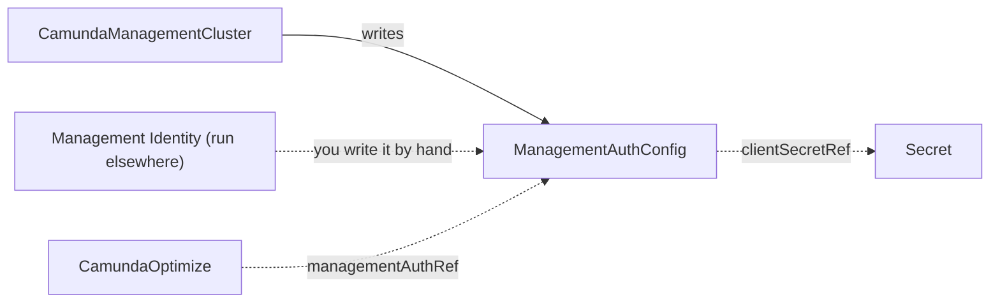

# ManagementAuthConfig

`ManagementAuthConfig` is a cluster-scoped contract that tells Optimize how to sign in through Management Identity. It holds the endpoints of the identity provider, the address of Management Identity, and the client that Optimize uses. A [CamundaManagementCluster](camundamanagementcluster.md) writes it for you. If you run Management Identity another way, you write it by hand.

A [CamundaOptimize](camundaoptimize.md) reads the contract through `managementAuthRef`. The operator checks the contract and creates nothing from it.

The smallest contract names the endpoints, the client, the audience, and the client secret:

```yaml
apiVersion: core.camunda.io/v1
kind: ManagementAuthConfig
metadata:
  name: my-management-auth
spec:
  baseUrl: "https://identity.camunda.example.com"
  issuerUrl: "https://camunda.example.com/auth/realms/camunda-platform"
  authUrl: "https://camunda.example.com/auth/realms/camunda-platform/protocol/openid-connect/auth"
  tokenUrl: "https://camunda.example.com/auth/realms/camunda-platform/protocol/openid-connect/token"
  jwksUrl: "https://camunda.example.com/auth/realms/camunda-platform/protocol/openid-connect/certs"
  clientId: optimize
  audience: optimize-api
  clientSecretRef:
    name: my-optimize-client
    namespace: my-management-ns
    key: client-secret
```


```mermaid
graph LR
    MC[CamundaManagementCluster] -->|writes| MAC[ManagementAuthConfig]
    EXT["Management Identity (run elsewhere)"] -.->|"you write it by hand"| MAC
    MAC -.->|clientSecretRef| SEC[Secret]
    OPT[CamundaOptimize] -.->|managementAuthRef| MAC
```

## Who wrote this contract

A contract that a [CamundaManagementCluster](camundamanagementcluster.md) wrote carries two labels that name its owner:

| Label | Value |
| --- | --- |
| `camunda.io/management-cluster` | the name of the `CamundaManagementCluster`, shortened when it is long |
| `camunda.io/management-cluster-namespace` | its namespace |

Read them with `kubectl get managementauthconfig my-management-auth --show-labels`. A contract without them is one that you or another tool wrote.

The management plane keeps every field of its contract up to date. If you edit such a contract, the field goes back to the value of the management plane.

This kind is cluster-scoped, so two management planes in two namespaces can ask for one name. The first one keeps it. The second one reports `Ready=False` with reason `Conflict`, and its message names the holder:

```yaml
status:
  conditions:
    - type: Ready
      status: "False"
      reason: Conflict
      message: ManagementAuthConfig "my-management-auth" exists and belongs to CamundaManagementCluster my-management-ns/my-management; set spec.managementAuthConfigName to a free name, or remove the object
```

A management plane that asks for the name of a contract that you wrote reports `Conflict` against "another writer" and does not change the contract.

## Client secret

The operator makes sure that the Secret in `clientSecretRef` exists and holds the configured `key`. If the Secret or the key is missing, `Ready` is `False` with reason `MissingSecret`, and the message names both. The operator checks again when you edit the contract or the Secret.

> **Note:** `clientSecretRef` can name a Secret in any namespace, and the status message says whether that Secret exists. Give write access to this kind only to platform administrators.

## Status

`kubectl get managementauthconfig` shows `Ready`, its reason, and the age.

| Type | Reason | Meaning | What to do |
| --- | --- | --- | --- |
| `Ready` | `Healthy` | The Secret exists and holds the configured key. | Nothing. |
| `Ready` | `MissingSecret` | The Secret named by `clientSecretRef` is missing, or it lacks the configured key. | Create the Secret, or add the key. The message names the Secret and the key. |

`status.observedGeneration` is the last generation of the contract that the operator checked.

## Spec reference

Every field, with its type, whether it is required, and its default:

```yaml
apiVersion: core.camunda.io/v1
kind: ManagementAuthConfig
# Cluster-scoped: metadata has no namespace.
metadata:
  name: my-management-auth
spec:
  # string. Required. Base URL of Management Identity.
  baseUrl: "https://identity.camunda.example.com"
  # string. Required. OIDC issuer URL that Optimize uses to validate tokens.
  issuerUrl: "https://camunda.example.com/auth/realms/camunda-platform"
  # string. Optional, default: the value of issuerUrl. Issuer URL for traffic inside the Kubernetes cluster.
  issuerBackendUrl: "http://my-management-keycloak-service.my-management-ns.svc:8080/auth/realms/camunda-platform"
  # string. Required. OIDC authorization endpoint for browser login redirects.
  authUrl: "https://camunda.example.com/auth/realms/camunda-platform/protocol/openid-connect/auth"
  # string. Required. OIDC token endpoint for machine-to-machine tokens.
  tokenUrl: "https://camunda.example.com/auth/realms/camunda-platform/protocol/openid-connect/token"
  # string. Required. JWKS endpoint that serves the token signing keys.
  jwksUrl: "https://camunda.example.com/auth/realms/camunda-platform/protocol/openid-connect/certs"
  # string. Required. ID of the client that Optimize signs in with.
  clientId: optimize
  # string. Required. Audience expected in access tokens issued for this client.
  audience: optimize-api
  # object. Required. Client secret of that client.
  clientSecretRef:
    # string. Required. Name of the Secret that holds the client secret.
    name: my-optimize-client
    # string. Required. Namespace of the Secret. This kind is cluster-scoped, so there is no default.
    namespace: my-management-ns
    # string. Required. Key in the Secret that holds the client secret.
    key: client-secret
```

### Validation rules

- `spec.baseUrl`, `spec.issuerUrl`, `spec.issuerBackendUrl`, `spec.authUrl`, `spec.tokenUrl`, and `spec.jwksUrl` must be valid `http` or `https` URLs.
- `spec.clientId`, `spec.audience`, and every field of `spec.clientSecretRef` must not be empty.
- No field is immutable.

### A production-shaped example

A contract with a separate issuer URL for traffic inside the Kubernetes cluster:

```yaml
apiVersion: core.camunda.io/v1
kind: ManagementAuthConfig
metadata:
  name: my-management-auth
spec:
  baseUrl: "https://identity.camunda.example.com"
  issuerUrl: "https://camunda.example.com/auth/realms/camunda-platform"
  issuerBackendUrl: "http://my-management-keycloak-service.my-management-ns.svc:8080/auth/realms/camunda-platform"
  authUrl: "https://camunda.example.com/auth/realms/camunda-platform/protocol/openid-connect/auth"
  tokenUrl: "http://my-management-keycloak-service.my-management-ns.svc:8080/auth/realms/camunda-platform/protocol/openid-connect/token"
  jwksUrl: "http://my-management-keycloak-service.my-management-ns.svc:8080/auth/realms/camunda-platform/protocol/openid-connect/certs"
  clientId: optimize
  audience: optimize-api
  clientSecretRef:
    name: my-optimize-client
    namespace: my-management-ns
    key: client-secret
```

## Related

- [CamundaManagementCluster](camundamanagementcluster.md): writes this contract and keeps it up to date.
- [CamundaOptimize](camundaoptimize.md): reads this contract through `managementAuthRef`.
- [Management plane guide](../guides/management-plane.md): where this contract fits in the order of creation.
- [CamundaPlatformConfig](camundaplatformconfig.md): the contract that carries the identity configuration of an orchestration cluster.
