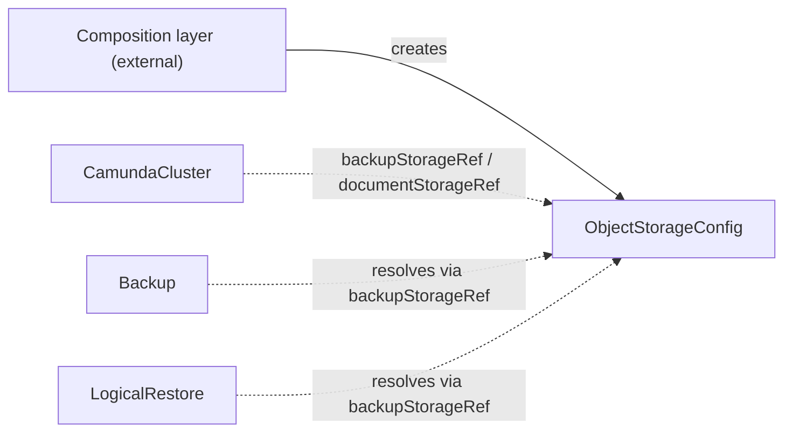

# ObjectStorageConfig

`ObjectStorageConfig` is the contract CRD that describes a cloud bucket — for backups or document storage — and the workload identity trusted to access it.

## Purpose

Orchestration clusters write backup data and documents to bucket storage, but this operator never creates cloud infrastructure.
This cluster-scoped contract CRD carries the bucket's identity, location, and the workload identity it trusts, so the bucket can be provisioned by anything — a composition layer above, a Crossplane composite, or you clicking through a cloud console — without the consuming controllers knowing the difference, as described in the [architecture](../architecture.md).

| Role | Who |
| --- | --- |
| Producers | A composition layer above (for example a cloud operator that provisions the bucket), or you, by hand |
| Consumers | [CamundaCluster](camundacluster.md) (via `backupStorageRef` and `documentStorageRef`), and the backup and restore controllers (Backup, [LogicalRestore](logicalrestore.md)), which resolve the bucket through the cluster's `backupStorageRef` |

## How it works

The contract has a lightweight validation-only controller: it never provisions anything.

1. The operator watches every `ObjectStorageConfig` and re-runs validation whenever it changes.
2. The contract references no Secrets or CRs — access is granted through workload identity, not stored credentials — so validation is limited to the cross-field rules listed under Validation.
3. It sets the `Ready` condition to `Healthy` when the contract is well-formed.

Consumers read the contract by name and never care who produced it.
Workloads authenticate to the bucket via the workload identity named in `accountId`; the consuming `CamundaCluster` exposes the matching identity through its `serviceAccount` annotations, so no bucket credentials ever pass through Kubernetes Secrets.
`accountId` is informational for the composition layer and consumers — the binding always happens on the workload side, and for Elasticsearch snapshot access specifically the identity must be granted to the Elasticsearch pods via `serviceAccount.annotations` on the [ElasticsearchCluster](elasticsearchcluster.md).



## API reference

```yaml
apiVersion: core.camunda.io/v1
kind: ObjectStorageConfig
# Cluster-scoped: metadata has no namespace.
metadata:
  name: my-backup-config
spec:
  # string enum: aws | gcp | azure. Required. Cloud provider hosting the bucket; determines the workload-identity mechanism.
  provider: aws
  # string enum: S3 | GCS | AzureBlob. Required. Storage API of the bucket; must match the provider.
  type: S3
  # string. Required. Provider-specific unique identifier of the bucket (for example an ARN on AWS).
  bucketId: "arn:aws:s3:::my-cluster-backup-bucket"
  # string. Required. Bucket name as used by storage client SDKs.
  bucketName: my-cluster-backup-bucket
  # string. Optional, default: "" (bucket root). Key prefix under which consumers write objects.
  basePath: backups
  # string. Required. Workload identity the bucket trusts: an IAM role ARN (aws), a service account email (gcp), or a managed identity client ID (azure).
  accountId: "arn:aws:iam::123456789012:role/my-cluster-workload-role"
```

## Status

| Type | Reason | Meaning |
| --- | --- | --- |
| `Ready` | `Healthy` | The contract is well-formed and ready to be consumed. |

The operator records the last reconciled generation in `status.observedGeneration`.

## Validation

- `spec.type` must match `spec.provider`: `aws` pairs with `S3`, `gcp` with `GCS`, and `azure` with `AzureBlob`.
- There are no cross-resource rules: the contract references no other CRs or Secrets.

## Relationships

- [CamundaCluster](camundacluster.md) — consumes this contract via `backupStorageRef` (backup data) and `documentStorageRef` (document storage).
- Backup and [LogicalRestore](logicalrestore.md) — resolve the backup bucket through the target cluster's `backupStorageRef`.
- A composition layer above may create this CR alongside the bucket it provisions; external actors are not documented here.

See the [CRD overview](index.md) for where this contract sits in the reconciler dependency graph.

## Examples

A minimal manifest:

```yaml
apiVersion: core.camunda.io/v1
kind: ObjectStorageConfig
metadata:
  name: my-backup-config
spec:
  provider: aws
  type: S3
  bucketId: "arn:aws:s3:::my-cluster-backup-bucket"
  bucketName: my-cluster-backup-bucket
  accountId: "arn:aws:iam::123456789012:role/my-cluster-workload-role"
```

A realistic manifest for a document-storage bucket on GCP, scoped to a key prefix:

```yaml
apiVersion: core.camunda.io/v1
kind: ObjectStorageConfig
metadata:
  name: my-document-config
spec:
  provider: gcp
  type: GCS
  bucketId: "my-cluster-documents"
  bucketName: my-cluster-documents
  basePath: documents
  accountId: "my-cluster-workload@my-project.iam.gserviceaccount.com"
```
