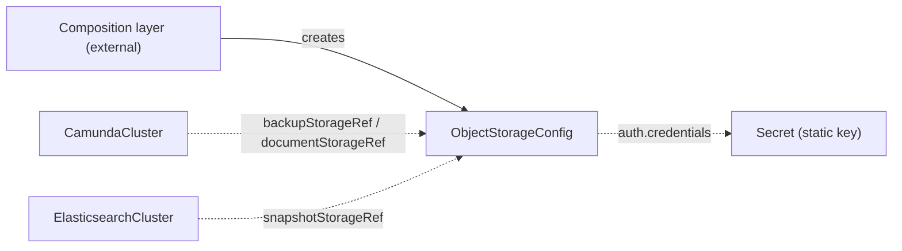

# ObjectStorageConfig

`ObjectStorageConfig` is the contract CRD that describes one bucket — for backups or document storage — and how consumers authenticate to it.

## Purpose

Orchestration clusters write backup data and documents to bucket storage, but this operator never creates cloud infrastructure.
This cluster-scoped contract CRD carries the location of the bucket and its authentication choice, so the bucket can be provisioned by anything — a composition layer above, a Crossplane composite, or you clicking through a cloud console — without the consuming controllers knowing the difference, as described in the [architecture](../architecture.md).

| Role | Who |
| --- | --- |
| Producers | A composition layer above (for example a cloud operator that provisions the bucket), or you, by hand |
| Consumers | [CamundaCluster](camundacluster.md) (via `backupStorageRef` and `documentStorageRef`), [ElasticsearchCluster](elasticsearchcluster.md) (via `snapshotStorageRef`), and the backup and restore controllers, which resolve the bucket through the cluster |

## How it works

The contract has a validation-only controller: it never provisions anything.

1. The operator watches every `ObjectStorageConfig` and re-runs validation whenever it changes.
2. It reads the Secret of `auth.credentials` when the contract names one, and reports `MissingSecret` if the Secret or the key does not exist.
3. It sets the `Ready` condition to `Healthy` when the contract is well-formed.

The spec is keyed by storage type.
`spec.type` selects the API of the bucket, and exactly the block with the same name carries its fields: `s3`, `gcs`, or `azureBlob`.
Each block holds its own `auth` block, because the three storage types authenticate differently.

Consumers read the contract by name and never care who produced it.

### Authentication

`auth.type` is the choice between two mechanisms.

**`workloadIdentity`** is the default and the recommended mechanism.
No credentials pass through Kubernetes.
The cloud binds a principal to the ServiceAccount of the consuming pods, and each pod gets a token from its runtime.
The optional `workloadIdentity` block names that principal.
When it is set, the consuming controller writes the matching annotation on the ServiceAccount it renders:

| Storage type | Field | Annotation on the ServiceAccount |
| --- | --- | --- |
| `S3` | `roleArn` | `eks.amazonaws.com/role-arn` |
| `GCS` | `serviceAccountEmail` | `iam.gke.io/gcp-service-account` |
| `AzureBlob` | `clientId` | `azure.workload.identity/client-id` |

An empty or absent `workloadIdentity` block means "trust the ServiceAccount chain, add nothing".
Use it for mechanisms that need no annotation, such as EKS Pod Identity and GKE Workload Identity Federation.
There the binding lives on the cloud side and names the ServiceAccount itself.
The principal to bind is `system:serviceaccount:<namespace>:<serviceAccount.name>` of the consuming resource, and that name defaults to `<cluster-name>-camunda` on a [CamundaCluster](camundacluster.md).

**`credentials`** names a Secret that holds a static key.
Use it for S3-compatible storage such as MinIO or Ceph, and for a cloud bucket that your organization accesses with keys.
The shape of the Secret differs per storage type: an access key pair for `S3`, a service-account JSON key for `GCS`, and an account key for `AzureBlob`.



## API reference

```yaml
apiVersion: core.camunda.io/v1
kind: ObjectStorageConfig
# Cluster-scoped: metadata has no namespace.
metadata:
  name: my-backup-config
spec:
  # string enum: S3 | GCS | AzureBlob. Required. Storage API of the bucket. Exactly the block of the same name must be set.
  type: S3

  # object. Required when type is S3, forbidden otherwise.
  s3:
    # string. Required. Bucket name as used by storage client SDKs.
    bucketName: my-cluster-backup-bucket
    # string. Optional, default: "" (bucket root). Key prefix under which consumers write objects, without leading or trailing slashes.
    basePath: backups
    # string. Required unless endpoint is set. Region of the bucket.
    region: eu-west-1
    # string. Optional. URL of an S3-compatible store. Empty means AWS S3, addressed through region.
    endpoint: "http://minio.minio.svc:9000"
    # boolean. Optional, default: false. Forces path-style bucket addressing, which S3-compatible stores often need.
    forcePathStyle: true
    # object. Optional, default: {type: workloadIdentity}.
    auth:
      # string enum: workloadIdentity | credentials. Optional, default: workloadIdentity.
      type: workloadIdentity
      # object. Optional, only valid with type workloadIdentity. Absent means "trust the ServiceAccount chain".
      workloadIdentity:
        # string. Optional. IAM role the bucket trusts. It becomes the IRSA annotation on the consumer's ServiceAccount.
        roleArn: "arn:aws:iam::123456789012:role/my-cluster-workload-role"
      # object. Required with type credentials, forbidden otherwise.
      credentials:
        secretRef:
          # string. Required. Name of the Secret holding the key pair.
          name: minio-credentials
          # string. Required. Namespace of the Secret.
          namespace: camunda
          # string. Required. Key in the Secret holding the access key ID.
          accessKeyIdKey: accessKeyId
          # string. Required. Key in the Secret holding the secret access key.
          secretAccessKeyKey: secretAccessKey

  # object. Required when type is GCS, forbidden otherwise.
  gcs:
    # string. Required. Bucket name as used by storage client SDKs.
    bucketName: my-cluster-documents
    # string. Optional, default: "" (bucket root). Key prefix under which consumers write objects, without leading or trailing slashes.
    basePath: documents
    # object. Optional, default: {type: workloadIdentity}.
    auth:
      type: workloadIdentity
      workloadIdentity:
        # string. Optional. Service account the bucket trusts. It becomes the Workload Identity annotation.
        serviceAccountEmail: "my-cluster-workload@my-project.iam.gserviceaccount.com"
      credentials:
        secretRef:
          # string. Required. Name of the Secret holding the service-account JSON key.
          name: gcs-key
          # string. Required. Namespace of the Secret.
          namespace: camunda
          # string. Required. Key in the Secret holding the JSON key.
          key: key.json

  # object. Required when type is AzureBlob, forbidden otherwise.
  azureBlob:
    # string. Required. Storage account that holds the container.
    accountName: camundabackups
    # string. Required. Blob container that consumers write to.
    container: backups
    # string. Optional, default: "" (container root). Blob prefix under which consumers write objects, without leading or trailing slashes.
    basePath: clusters
    # string. Optional. URL of the blob service. Empty means the public Azure endpoint of the account. Set it for Azurite and sovereign clouds.
    endpoint: "https://camundabackups.blob.core.windows.net"
    # object. Optional, default: {type: workloadIdentity}.
    auth:
      type: workloadIdentity
      workloadIdentity:
        # string. Optional. Managed identity the container trusts. It becomes the Azure Workload Identity annotation.
        clientId: "11111111-2222-3333-4444-555555555555"
      credentials:
        secretRef:
          # string. Required. Name of the Secret holding the storage account key.
          name: azure-key
          # string. Required. Namespace of the Secret.
          namespace: camunda
          # string. Required. Key in the Secret holding the account key.
          key: accountKey
```

## Status

| Type | Reason | Meaning |
| --- | --- | --- |
| `Ready` | `Healthy` | The contract is well-formed and ready to be consumed. |
| `Ready` | `MissingSecret` | The Secret of `auth.credentials` is missing, or it does not hold the configured key. |

The operator records the last reconciled generation in `status.observedGeneration`.

## Validation

- Exactly the block that matches `spec.type` must be set: `S3` pairs with `s3`, `GCS` with `gcs`, and `AzureBlob` with `azureBlob`.
- In every `auth` block, `credentials` is required when `auth.type` is `credentials`, and forbidden otherwise.
- In every `auth` block, `workloadIdentity` is only valid when `auth.type` is `workloadIdentity`.
- `s3.region` is required unless `s3.endpoint` is set.
- `s3.endpoint` and `azureBlob.endpoint` must be valid `http` or `https` URLs.
- Every `basePath` is a plain prefix without leading or trailing slashes. The prefix defines one bucket layout that the snapshot repository and every backup object key share, and a stray slash would split it in two.
- The Secret of `auth.credentials` is checked at reconcile time, not at admission, because a Secret can be created after the contract.

## Relationships

- [CamundaCluster](camundacluster.md) — consumes this contract via `backupStorageRef` (backup data) and `documentStorageRef` (document storage).
- [ElasticsearchCluster](elasticsearchcluster.md) — consumes this contract via `snapshotStorageRef` for its snapshot repository.
- The backup and restore controllers resolve the backup bucket through the `backupStorageRef` of the target cluster.
- A composition layer above may create this CR alongside the bucket it provisions; external actors are not documented here.

See the [CRD overview](index.md) for where this contract sits in the reconciler dependency graph.

## Examples

A minimal manifest for an AWS bucket, accessed through IRSA:

```yaml
apiVersion: core.camunda.io/v1
kind: ObjectStorageConfig
metadata:
  name: my-backup-config
spec:
  type: S3
  s3:
    bucketName: my-cluster-backup-bucket
    region: eu-west-1
    auth:
      type: workloadIdentity
      workloadIdentity:
        roleArn: "arn:aws:iam::123456789012:role/my-cluster-workload-role"
```

A bucket bound through EKS Pod Identity, which needs no annotation.
Bind the principal `system:serviceaccount:my-cluster-ns:my-cluster-camunda` on the cloud side:

```yaml
apiVersion: core.camunda.io/v1
kind: ObjectStorageConfig
metadata:
  name: my-backup-config
spec:
  type: S3
  s3:
    bucketName: my-cluster-backup-bucket
    region: eu-west-1
    auth:
      type: workloadIdentity
```

S3-compatible storage with static keys, the shape that MinIO and Ceph need:

```yaml
apiVersion: core.camunda.io/v1
kind: ObjectStorageConfig
metadata:
  name: my-minio-config
spec:
  type: S3
  s3:
    bucketName: camunda-backups
    basePath: clusters
    endpoint: "http://minio.minio.svc:9000"
    forcePathStyle: true
    auth:
      type: credentials
      credentials:
        secretRef:
          name: minio-credentials
          namespace: camunda
          accessKeyIdKey: accessKeyId
          secretAccessKeyKey: secretAccessKey
```

A document-storage bucket on Google Cloud, scoped to a key prefix:

```yaml
apiVersion: core.camunda.io/v1
kind: ObjectStorageConfig
metadata:
  name: my-document-config
spec:
  type: GCS
  gcs:
    bucketName: my-cluster-documents
    basePath: documents
    auth:
      type: workloadIdentity
      workloadIdentity:
        serviceAccountEmail: "my-cluster-workload@my-project.iam.gserviceaccount.com"
```
