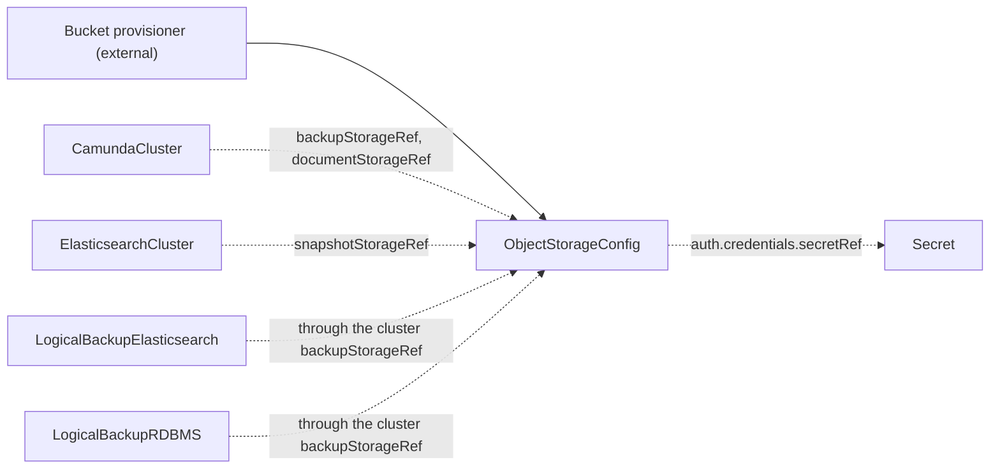

# ObjectStorageConfig

`ObjectStorageConfig` is a cluster-scoped contract kind that describes one bucket, for backups or for document storage, and how consumers authenticate to it. You create it, or another tool creates it for you.

## Purpose

Orchestration clusters write backups and documents to a bucket, but the operator never creates cloud infrastructure. This kind carries the location of the bucket and the authentication choice. The thing that provisions the bucket and the thing that writes to it do not need to know each other. The operator only validates the contract and reports the result on `Ready`. It never provisions anything from it.

| Role | Who |
| --- | --- |
| Producers | You, by hand, or another tool that provisions the bucket and creates the contract for you |
| Consumers | [CamundaCluster](camundacluster.md) (through `backupStorageRef` and `documentStorageRef`), [ElasticsearchCluster](elasticsearchcluster.md) (through `snapshotStorageRef`), [LogicalBackupElasticsearch](logicalbackupelasticsearch.md) and [LogicalBackupRDBMS](logicalbackuprdbms.md) (through the `backupStorageRef` of the cluster they back up) |

## What it does

The operator creates no resources from this kind. It validates the contract and writes the result to `status`.

- If the active `auth` block has `type: credentials`, the operator makes sure that the Secret exists and holds the configured keys.
- If the active `auth` block has `type: workloadIdentity`, there is nothing to check, and `Ready` is `True`.

`spec.type` selects the storage API of the bucket. Exactly the block with the same name carries its fields: `s3`, `gcs`, or `azureBlob`. Each block has its own `auth` block, because the three storage types authenticate in different ways.



**Authentication.** `auth.type` selects one of two mechanisms. `workloadIdentity` is the default. No credentials pass through Kubernetes. The cloud binds a principal to the ServiceAccount of the consuming pods, and each pod gets a token from its runtime. The optional `workloadIdentity` block names that principal. When you set it, the consumer writes the matching annotation on the ServiceAccount of its pods:

| Storage type | Field | Annotation on the ServiceAccount |
| --- | --- | --- |
| `S3` | `roleArn` | `eks.amazonaws.com/role-arn` |
| `GCS` | `serviceAccountEmail` | `iam.gke.io/gcp-service-account` |
| `AzureBlob` | `clientId` | `azure.workload.identity/client-id` |

On `AzureBlob` with `workloadIdentity`, the consumer also puts the label `azure.workload.identity/use: "true"` on its pods. The Azure webhook injects nothing into a pod without that label.

An empty or absent `workloadIdentity` block means "trust the ServiceAccount chain, add nothing". Use it for mechanisms that need no annotation, for example EKS Pod Identity and GKE Workload Identity Federation. There the binding lives on the cloud side and names the ServiceAccount. The principal to bind is `system:serviceaccount:<namespace>:<serviceAccount name>` of the consuming resource. On a `CamundaCluster`, that ServiceAccount is named `<cluster-name>-camunda` by default.

`credentials` names a Secret that holds a static key. Use it for S3-compatible storage such as MinIO or Ceph, and for a cloud bucket that you access with keys. The shape of the Secret differs per storage type. `S3` takes an access key pair, `GCS` a service-account JSON key, and `AzureBlob` an account key.

**Missing references.** If the Secret of `auth.credentials` or one of its keys is missing, `Ready` is `False` with reason `MissingSecret`. The message names the Secret and the key.

**Changes.** When you edit the contract or the referenced Secret, the operator validates the contract again. Consumers read the contract by name and do not care who produced it.

> **Note:** A Secret reference can name any namespace, and the status message says whether it exists. Grant write access to this kind with care.

## Spec

```yaml
apiVersion: core.camunda.io/v1
kind: ObjectStorageConfig
# Cluster-scoped: metadata has no namespace.
metadata:
  name: my-backup-bucket
spec:
  # string enum: S3 | GCS | AzureBlob. Required. Storage API of the bucket. Exactly the block of the same name must be set.
  type: S3

  # object. Required when type is S3, forbidden otherwise. An S3 or S3-compatible bucket.
  s3:
    # string. Required. Bucket name as the storage client SDK uses it.
    bucketName: my-cluster-backup-bucket
    # string. Optional, default: "" (bucket root). Key prefix under which consumers write objects, without leading or trailing slashes.
    basePath: backups
    # string. Required unless endpoint is set. Region of the bucket. With an endpoint and no region, consumers send the placeholder region us-east-1.
    region: eu-west-1
    # string. Optional. URL of an S3-compatible store. Empty means AWS S3, addressed through region.
    endpoint: "http://minio.minio.svc:9000"
    # boolean. Optional, default: false. Forces path-style bucket addressing, which S3-compatible stores often need.
    forcePathStyle: true
    # object. Optional, default: {type: workloadIdentity}. How consumers authenticate.
    auth:
      # string enum: workloadIdentity | credentials. Optional, default: workloadIdentity.
      type: workloadIdentity
      # object. Optional, only valid with type workloadIdentity. Absent means "trust the ServiceAccount chain".
      workloadIdentity:
        # string. Optional. IAM role that the bucket trusts. It becomes the eks.amazonaws.com/role-arn annotation on the ServiceAccount of the consumer.
        roleArn: "arn:aws:iam::123456789012:role/my-cluster-workload-role"
      # object. Required with type credentials, forbidden otherwise. A static access key pair.
      credentials:
        secretRef:
          # string. Required. Name of the Secret that holds the key pair.
          name: minio-credentials
          # string. Required. Namespace of the Secret.
          namespace: my-cluster-ns
          # string. Required. Key in the Secret that holds the access key ID.
          accessKeyIdKey: accessKeyId
          # string. Required. Key in the Secret that holds the secret access key.
          secretAccessKeyKey: secretAccessKey

  # object. Required when type is GCS, forbidden otherwise. A Google Cloud Storage bucket.
  gcs:
    # string. Required. Bucket name as the storage client SDK uses it.
    bucketName: my-cluster-documents
    # string. Optional, default: "" (bucket root). Key prefix under which consumers write objects, without leading or trailing slashes.
    basePath: documents
    # object. Optional, default: {type: workloadIdentity}. How consumers authenticate.
    auth:
      # string enum: workloadIdentity | credentials. Optional, default: workloadIdentity.
      type: workloadIdentity
      # object. Optional, only valid with type workloadIdentity. Absent means "trust the ServiceAccount chain".
      workloadIdentity:
        # string. Optional. Google service account that the bucket trusts. It becomes the iam.gke.io/gcp-service-account annotation.
        serviceAccountEmail: "my-cluster-workload@my-project.iam.gserviceaccount.com"
      # object. Required with type credentials, forbidden otherwise. A static service-account JSON key.
      credentials:
        secretRef:
          # string. Required. Name of the Secret that holds the JSON key.
          name: gcs-key
          # string. Required. Namespace of the Secret.
          namespace: my-cluster-ns
          # string. Required. Key in the Secret that holds the JSON key.
          key: key.json

  # object. Required when type is AzureBlob, forbidden otherwise. An Azure Blob Storage container.
  azureBlob:
    # string. Required. Storage account that holds the container.
    accountName: camundabackups
    # string. Required. Blob container that consumers write to.
    container: backups
    # string. Optional, default: "" (container root). Blob prefix under which consumers write objects, without leading or trailing slashes.
    basePath: clusters
    # string. Optional. URL of the blob service. Empty means the public Azure endpoint of the account. Set it for Azurite and sovereign clouds.
    endpoint: "https://camundabackups.blob.core.windows.net"
    # object. Optional, default: {type: workloadIdentity}. How consumers authenticate.
    auth:
      # string enum: workloadIdentity | credentials. Optional, default: workloadIdentity.
      type: workloadIdentity
      # object. Optional, only valid with type workloadIdentity. Absent means "trust the ServiceAccount chain".
      workloadIdentity:
        # string. Optional. Managed identity that the container trusts. It becomes the azure.workload.identity/client-id annotation.
        clientId: "11111111-2222-3333-4444-555555555555"
      # object. Required with type credentials, forbidden otherwise. A static storage account key.
      credentials:
        secretRef:
          # string. Required. Name of the Secret that holds the account key.
          name: azure-key
          # string. Required. Namespace of the Secret.
          namespace: my-cluster-ns
          # string. Required. Key in the Secret that holds the account key.
          key: accountKey
```

## Status

| Type | Reason | Meaning | What to do |
| --- | --- | --- | --- |
| `Ready` | `Healthy` | The contract is valid. A Secret in `auth.credentials`, if any, exists and holds the configured keys. | Nothing. |
| `Ready` | `MissingSecret` | The Secret of `auth.credentials` is missing, or it lacks a configured key. | Create the Secret, or add the key. The message names the Secret and the key. |

`status.observedGeneration` is the last generation of the contract that the operator validated.

## Validation

- Exactly the block that matches `spec.type` must be set: `S3` with `s3`, `GCS` with `gcs`, and `AzureBlob` with `azureBlob`.
- In every `auth` block, `credentials` is required when `auth.type` is `credentials`, and forbidden otherwise.
- In every `auth` block, `workloadIdentity` is only valid when `auth.type` is `workloadIdentity`.
- `s3.region` is required unless `s3.endpoint` is set. With an endpoint and no region, every consumer sends the placeholder region `us-east-1`. An S3-compatible store ignores it. If your store does not ignore it, set `region`.
- `s3.endpoint` and `azureBlob.endpoint` must be valid `http` or `https` URLs.
- Every `basePath` must match `^[^/]+(/[^/]+)*$`. That is a plain prefix without leading or trailing slashes.
- `bucketName`, `accountName`, `container`, and every Secret reference field must not be empty.
- The Secret of `auth.credentials` is checked at reconcile time, not at admission, because you can create the Secret after the contract.
- No field is immutable.

## Related

- [CamundaCluster](camundacluster.md): consumes this contract through `backupStorageRef` for backups and `documentStorageRef` for document storage.
- [ElasticsearchCluster](elasticsearchcluster.md): consumes this contract through `snapshotStorageRef` for its snapshot repository.
- [LogicalBackupElasticsearch](logicalbackupelasticsearch.md) and [LogicalBackupRDBMS](logicalbackuprdbms.md): write to the bucket that the `backupStorageRef` of the cluster names.
- [Backup guide](../guides/backup.md): how to set up a backup bucket and take a backup.
- [Getting started](../getting-started.md): the order in which you create the resources.

## Examples

A minimal manifest for an AWS bucket, accessed through IRSA:

```yaml
apiVersion: core.camunda.io/v1
kind: ObjectStorageConfig
metadata:
  name: my-backup-bucket
spec:
  type: S3
  s3:
    bucketName: my-cluster-backup-bucket
    region: eu-west-1
    auth:
      type: workloadIdentity
      workloadIdentity:
        roleArn: "arn:aws:iam::123456789012:role/my-cluster-workload-role"
```

A bucket bound through EKS Pod Identity, which needs no annotation. Bind the principal `system:serviceaccount:my-cluster-ns:my-cluster-camunda` on the cloud side:

```yaml
apiVersion: core.camunda.io/v1
kind: ObjectStorageConfig
metadata:
  name: my-backup-bucket
spec:
  type: S3
  s3:
    bucketName: my-cluster-backup-bucket
    region: eu-west-1
    auth:
      type: workloadIdentity
```

S3-compatible storage with static keys, the shape that MinIO and Ceph need:

```yaml
apiVersion: core.camunda.io/v1
kind: ObjectStorageConfig
metadata:
  name: my-backup-bucket
spec:
  type: S3
  s3:
    bucketName: camunda-backups
    basePath: clusters
    endpoint: "http://minio.minio.svc:9000"
    forcePathStyle: true
    auth:
      type: credentials
      credentials:
        secretRef:
          name: minio-credentials
          namespace: my-cluster-ns
          accessKeyIdKey: accessKeyId
          secretAccessKeyKey: secretAccessKey
```

A document storage bucket on Google Cloud, scoped to a key prefix:

```yaml
apiVersion: core.camunda.io/v1
kind: ObjectStorageConfig
metadata:
  name: my-document-bucket
spec:
  type: GCS
  gcs:
    bucketName: my-cluster-documents
    basePath: documents
    auth:
      type: workloadIdentity
      workloadIdentity:
        serviceAccountEmail: "my-cluster-workload@my-project.iam.gserviceaccount.com"
```
