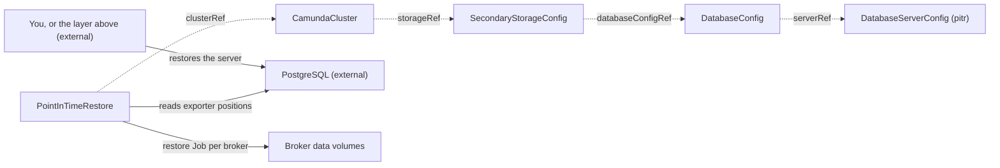

# PointInTimeRestore

`PointInTimeRestore` aligns the Zeebe primary storage of a `CamundaCluster` with a database that you already restored to a point in time. You create it, or a recovery flow above the operator creates it for you.

The cluster must store its data in a relational database. You use this kind to undo a destructive operation without a [LogicalBackupRDBMS](logicalbackuprdbms.md). It relies on two continuous mechanisms instead of discrete backups: point-in-time recovery on the database server, which happens outside this operator, and the continuous primary-storage backups of Zeebe, which this operator aligns.

The operator never restores the database server. PostgreSQL point-in-time recovery needs host-level access to base backups and to the write-ahead log archive. A managed service exposes it only through a provider API. Both belong to the layer above this operator. For an Elasticsearch cluster, or to restore into another cluster, use [LogicalRestore](logicalrestore.md) instead.

One resource is one restore. The spec is immutable, and the restore runs once. `kubectl get pitr` lists the restores with their phase, cluster, and timestamp.

Two things must be true before you create the resource:

- The cluster has `spec.suspend: true`, so no workload writes to primary or secondary storage.
- The database already holds the state of the requested timestamp. On a self-hosted server the database administrator runs standard PostgreSQL point-in-time recovery. On a managed service you use the point-in-time restore of the provider. Some providers, for example Amazon RDS, create a **new** instance for the restore. Then you update `host` on the `DatabaseServerConfig` before you create this resource.

The smallest restore names the cluster and the point:

```yaml
apiVersion: core.camunda.io/v1
kind: PointInTimeRestore
metadata:
  name: my-cluster-pitr
  namespace: my-cluster-ns
spec:
  clusterRef:
    name: my-cluster
  timestamp: "2026-07-30T14:30:00Z"
```



## Suspend

The operator only reads `spec.suspend` of the cluster. It never writes it. You suspend the cluster before you create the restore, and you unsuspend it after the restore is `Completed`. A running cluster holds the restore in `Pending` with reason `ClusterNotSuspended`, and the operator touches no data.

## Phases

`status.phase` is the resume marker. A restore that re-enters after an operator restart continues at the recorded phase.

| Phase | What happens |
| --- | --- |
| `Pending` | The restore waits. The cluster runs, the storage chain does not resolve, a rule of the server does not hold, or the database is ahead of the requested point. The operator touches nothing here. |
| `ValidatingDatabaseState` | The operator reads the exporter position of every partition from the restored database. |
| `RestoringPrimaryStorage` | The operator recreates the broker data volumes and runs the restore application on them. |
| `Completed` | The restore finished. You can unsuspend the cluster. |
| `Failed` | A phase failed. `status.failureMessage` names it. |

## The storage chain

The operator resolves the cluster's `storageRef` to a `SecondaryStorageConfig`, which must be `type: rdbms`, then its `DatabaseConfig`, then its `serverRef` to a `DatabaseServerConfig`. A cluster on Elasticsearch is rejected with reason `InvalidReference`. Point-in-time restore does not exist for it.

The cluster must also name a `backupStorageRef`. Without it, Zeebe writes no primary-storage backup, so no restore point exists. Such a cluster holds the restore with reason `InvalidReference`.

The `DatabaseServerConfig` must declare `pitr.enabled: true`, and `spec.timestamp` must lie within the retention period it declares. Otherwise the restore holds with reason `PitrUnavailable`. The role of the `DatabaseServerConfig` here is the capability declaration only. This operator never uses its `adminCredentialsSecretRef`.

Exactly one `Database` can reference that `DatabaseServerConfig`. Point-in-time recovery on the engine rolls back the whole server, not one logical database. A shared server therefore rolls back unrelated databases too, and it holds the restore with reason `SharedServer`.

Every rule of this section holds the restore in `Pending`. Nothing is deleted while a rule does not hold, so you correct the cause and the same resource continues. You do not create a new one.

## The database-state check

Before it touches a volume, the operator connects to the logical database with the application credentials of the cluster, resolved through `storageRef` to `SecondaryStorageConfig` to `DatabaseConfig.credentialsSecretRef`. It reads `LAST_UPDATED` for every partition from the `EXPORTER_POSITION` table and records what it saw in `status.observedPositions`.

The operator reads the table under the name that Camunda creates it with, and it reads no table prefix. A cluster that sets `camunda.data.secondary-storage.rdbms.prefix` is outside this check. A database that carries no such table holds the restore with reason `DatabaseNotRestored` too: an empty database is the state that this check exists for.

The restore holds in `Pending` with reason `DatabaseNotRestored` when a partition row is missing, or when any `LAST_UPDATED` is later than `spec.timestamp` plus one minute of slack. The slack exists because the clock of the database and the source of your timestamp are not the same clock.

**Limits of this check.** The check proves that the database is not ahead of the requested point. It cannot prove that the database holds exactly that point. A database that was restored to an earlier point passes the check, and that is safe: Zeebe re-exports the difference after the restore. The check of the restore application stays the authoritative gate. This check only moves the common error before the volume deletion.

## Primary storage

The Camunda restore application refuses a non-empty data directory, so the operator deletes the broker data volumes of the cluster and creates them again. The new volume takes the size of the claim template of the broker StatefulSet, together with its storage class, access modes, and labels. The volumes belong to that StatefulSet, not to the restore. Deleting the restore never deletes a broker volume.

The operator then runs the Camunda restore application once per broker, as a Job with `--to=<spec.timestamp>`. The Jobs copy their configuration from the live broker StatefulSet, so the restore application always runs with the configuration the brokers run with. A cluster whose broker StatefulSet was deleted cannot restore until its own controller applies it again.

The restore application does the alignment itself. It reads the exporter position of each partition from the restored database with the same credentials the brokers use, and it restores the newest checkpoint at or before that position from the continuous primary-storage backups. The restored Zeebe state is therefore never behind the database.

## What the cluster must provide

Point-in-time restore is possible only when primary-storage restore points exist for the requested timestamp. The `CamundaCluster` controller enables the continuous primary-storage backups of Zeebe for every relational cluster with a `backupStorageRef`. The checkpoint interval bounds how precise the restore can be: Zeebe restores to the nearest checkpoint at or before the requested point, while the database holds the exact point.

## Deletion

When you delete the restore, the operator deletes the Jobs it created. It writes nothing to an external store, so it needs no finalizer and leaves no artifact behind.

## Status

| Type | Reason | Meaning | What to do |
| --- | --- | --- | --- |
| `Ready` | `Progressing` | A restore phase runs. | Wait. The message names the phase. |
| `Ready` | `Completed` | The restore finished. `Ready` is `True`. | Unsuspend the cluster. |
| `Ready` | `ClusterNotSuspended` | The cluster runs. | Set `spec.suspend: true` on the cluster. |
| `Ready` | `InvalidReference` | The cluster or a link in its storage chain does not exist, the storage is not relational, the cluster names no backup storage, or the broker StatefulSet is gone. | Correct the reference that the message names. |
| `Ready` | `PitrUnavailable` | The server does not declare point-in-time recovery, `spec.timestamp` lies outside its retention period, or `spec.timestamp` lies in the future. | Enable `pitr` on the server, or restore to a point within retention. |
| `Ready` | `SharedServer` | More than one `Database` references the server. | Move the cluster to a dedicated server. |
| `Ready` | `DatabaseNotRestored` | The database is ahead of `spec.timestamp`, or it reports no position for a partition. The operator touched no volume. | Restore the database to the requested point, then wait. |
| `Ready` | `MissingSecret` | A credentials Secret of the cluster is missing or lacks a key. | Create the Secret that the message names. |
| `Ready` | `ConnectionFailed` | The database rejects the operator. | Correct the endpoint or the credentials. |
| `Ready` | `Failed` | A phase failed. | Read `status.failureMessage`. Correct the cause and create a new restore. |

A restore that already started keeps a broken dependency for ten minutes. After that it fails, because a restore that recreated a volume must not wait without an end. A restore that still waits in `Pending` has no such limit: it deleted nothing.

The status also records what the restore pinned and what it did:

- `status.clusterUID` pins the identity of the cluster.
- `status.brokers` is the broker count that the operator read off the broker StatefulSet.
- `status.observedPositions` holds the `LAST_UPDATED` value that the check read for each partition.
- `status.primaryJobNames` names the per-broker restore Jobs, in broker order.
- `status.recreatedClaims` names the broker data volumes that the operator deleted and created again.
- `status.completionTime` is when the restore reached `Completed` or `Failed`.
- `status.observedGeneration` is the last generation the operator reconciled.

## Spec reference

Every field, with its type and whether it is required:

```yaml
apiVersion: core.camunda.io/v1
kind: PointInTimeRestore
metadata:
  name: my-cluster-pitr
  namespace: my-cluster-ns
spec:
  # object. Required. The cluster to align in place.
  clusterRef:
    # string. Required. Name of the CamundaCluster, in this namespace.
    name: my-cluster
  # string. Required. RFC 3339 timestamp that the database already holds. It
  # must lie within the retention period of the server, and not in the future.
  timestamp: "2026-07-30T14:30:00Z"
```

### Validation rules

- `spec` is immutable. A restore runs once, and you retry it with a new resource.
- `spec.timestamp` is an RFC 3339 timestamp. The rule that it must not lie in the future needs a clock, which a CEL rule does not have, so the operator checks it at reconcile time and reports `PitrUnavailable`.
- `clusterRef` names a cluster in the namespace of the restore. It never crosses a namespace. The operator reads the Secrets of the cluster and runs Jobs in that namespace, so the reference stays inside the RBAC boundary of the restore.
- The suspend state, the storage chain, the dedicated-server rule, and the state of the database depend on live cluster state. The operator checks them at reconcile time.
- Whether the database really holds `spec.timestamp` is not provable by the operator. See "Limits of this check" above.

### Roll back to just before a bad deployment

```yaml
apiVersion: core.camunda.io/v1
kind: PointInTimeRestore
metadata:
  name: my-cluster-pitr-pre-release
  namespace: my-cluster-ns
  labels:
    camunda.io/cluster: my-cluster
spec:
  clusterRef:
    name: my-cluster
  # One minute before the faulty process deployment was applied. The database
  # server was already restored to this point, and the cluster suspended,
  # before this resource was created.
  timestamp: "2026-07-30T14:29:00Z"
```

## Related

- [LogicalRestore](logicalrestore.md): the backup-based alternative. It works for both storage types and across clusters.
- [CamundaCluster](camundacluster.md): referenced through `clusterRef`. You suspend it for the whole restore, and its controller enables the continuous primary-storage backups.
- [SecondaryStorageConfig](secondarystorageconfig.md): resolved through the `storageRef` of the cluster. It must be `type: rdbms`.
- [DatabaseConfig](databaseconfig.md): resolved for the logical database and its `serverRef`. Its `credentialsSecretRef` holds the credentials that read `EXPORTER_POSITION`.
- [DatabaseServerConfig](databaseserverconfig.md): declares the `pitr` capability and the retention period, and carries the dedicated-server rule. This operator never uses its admin credentials.
- [ObjectStorageConfig](objectstorageconfig.md): resolved through the `backupStorageRef` of the cluster. It holds the continuous primary-storage backups.
