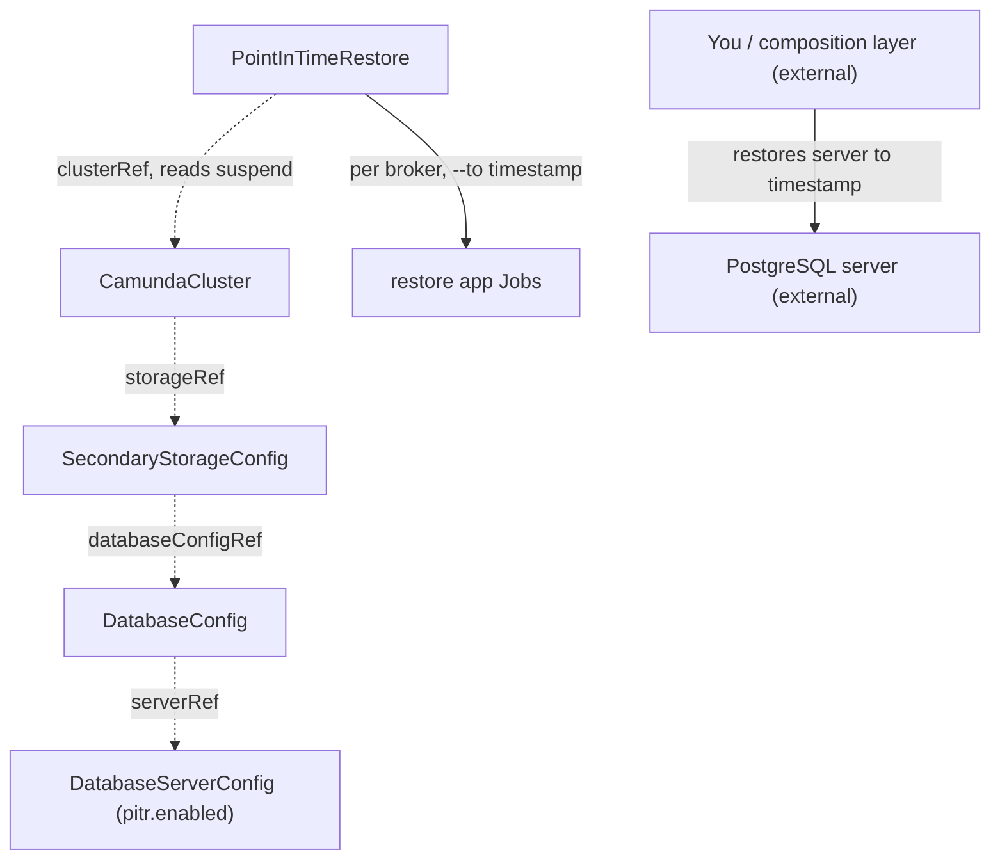

# PointInTimeRestore

A PointInTimeRestore aligns an RDBMS-backed orchestration cluster's Zeebe primary storage with a database that has already been restored to a timestamp, in place.

!!! warning "Not implemented yet"
    The operator does not implement this kind yet. This page describes the planned design.

## Purpose

A PointInTimeRestore recovers a `CamundaCluster` whose secondary storage is an RDBMS to an arbitrary point in time — for example to undo a destructive operation — without needing a [LogicalBackupRDBMS](logicalbackuprdbms.md).
It relies on two continuous mechanisms instead of discrete backups: WAL-based point-in-time recovery on the database server, performed outside this operator, and Zeebe's continuous primary-storage backups, aligned by this controller.
The operator never restores the database server itself: PostgreSQL PITR requires host-level access to base backups and the WAL archive, and managed database services expose it only through provider APIs that belong to the cloud operator or composition layer above — this controller aligns primary storage only.
You create it, or a composition layer above creates it as part of a managed recovery flow.
For Elasticsearch-backed clusters, or for restoring into a different cluster, use [LogicalRestore](logicalrestore.md) instead.

## How it works

**Prerequisites.** Two things must already be true before this CR is created, both owned by you or the composition layer above:

- The cluster is suspended (`spec.suspend: true` on the `CamundaCluster`), so no workload writes to primary or secondary storage during the restore.
- The database has already been restored to the target timestamp: on a self-hosted server the database administrator performs standard PostgreSQL point-in-time recovery (base backup plus WAL replay to `recovery_target_time`); on a managed service you use the provider's point-in-time restore. Note that some providers (for example Amazon RDS) materialize the restore as a **new** database instance — in that case the `DatabaseServerConfig`'s `host` must be updated to the new endpoint before this CR is created.

The operator then drives the restore through the phases in `status.phase`; each phase must complete before the next starts.

1. Validate that the cluster is suspended (`spec.suspend: true` and the `Suspended` condition reported on the `CamundaCluster`). The restore controller only ever reads the suspend field — it never writes it. The `suspend` field is owned by you or by the composition layer above, which suspends the cluster before creating the PointInTimeRestore and unsuspends it after completion. A running cluster keeps the restore in `Pending` with `Ready: ClusterNotSuspended`.
2. Resolve the storage chain: the cluster's `storageRef` → `SecondaryStorageConfig` (must be `type: rdbms`) → `DatabaseConfig` → `serverRef` → `DatabaseServerConfig`.
3. Validate that the `DatabaseServerConfig` has `pitr.enabled: true` and that `spec.timestamp` lies within the server's PITR retention period; otherwise fail with `Ready: PitrUnavailable`. The `DatabaseServerConfig`'s role here is capability declaration only — this controller never uses its `adminCredentialsSecretRef`.
4. Validate the dedicated-server rule: the `DatabaseServerConfig` must be referenced by exactly one `Database`. Engine-level PITR rolls back the entire server instance, not one logical database, so a shared server would silently roll back unrelated databases.
5. Enter `RestoringPrimaryStorage`: ensure the cluster's Zeebe data volumes are empty — the operator deletes and recreates the Zeebe PVCs, because Camunda's restore application refuses a non-empty data directory — then run the restore application (`bin/restore`, the Camunda distribution's one-shot Spring Boot app) once per broker as a Job with the broker's own configuration and `--to=<spec.timestamp>`, applied with Server-Side Apply (SSA) under the field manager `camunda-operator/pointintimerestore`. The restore application does the alignment itself: it reads the per-partition exporter position from the restored database's `EXPORTER_POSITION` table — using the cluster's application credentials, resolved via `storageRef` → `SecondaryStorageConfig` → `DatabaseConfig.credentialsSecretRef`, the same credentials the brokers use — and restores the newest checkpoint at or before that position from the continuous primary-storage backups, so the restored Zeebe state is never behind the database.
6. Report `Completed`. You or the composition layer unsuspend the cluster; on start, Zeebe re-exports any events between the database's position and the restored checkpoint, and the two storages converge.

**The safety net.** The operator cannot verify that the database was actually restored to `spec.timestamp` — it has no view into the server's restore history. Camunda's restore application rejects a `--to` timestamp that lies before the database's restored state, so a skipped or wrong database restore fails the Jobs loudly instead of silently assembling an inconsistent cluster.



**The CamundaCluster-side prerequisite.** Point-in-time restore is only possible if primary-storage restore points exist for the requested timestamp. The `CamundaCluster` controller enables Zeebe's continuous primary-storage backups — continuous mode plus a backup schedule and checkpoint interval, written to the store behind the cluster's `backupStorageRef` — for every RDBMS-backed cluster with a `backupStorageRef`; point-in-time restore additionally requires `pitr.enabled` on the resolved `DatabaseServerConfig`. The checkpoint interval bounds how precise the restore can be: Zeebe restores to the nearest checkpoint at or before the requested timestamp, while the database restores to the exact timestamp.

!!! note "Deviation from the original proposal"
    The proposal had the restore controller restore the database server itself — `recovery_target_time` WAL replay — and read the `exporter_position` table to restore primary storage "to match". Neither survives verification.
    Operator-driven WAL replay is not implementable over a SQL connection: PostgreSQL point-in-time recovery requires host-level access to base backups and the WAL archive, and managed services expose it only through provider restore APIs, which belong to the composition layer above. This operator therefore aligns primary storage only, against a database restored externally.
    Verified against Camunda 8.9: the standalone restore application performs the alignment natively — it accepts `--to` (and `--from`) timestamps, reads the `EXPORTER_POSITION` table when secondary storage is RDBMS, and selects the matching checkpoint from the continuous backup ranges — so the operator never parses exporter positions itself. Camunda 8.9 also constrains the restore timestamp: it must not lie before the restored state of the database, which is the safety net described above.

## API reference

```yaml
apiVersion: core.camunda.io/v1
kind: PointInTimeRestore
metadata:
  name: my-cluster-pitr
  namespace: my-cluster-ns
spec:
  # object. Required. Reference to the CamundaCluster to roll back in place.
  clusterRef:
    # string. Required. Name of the CamundaCluster.
    name: my-cluster
    # string. Optional, default: this CR's namespace. Namespace of the CamundaCluster.
    namespace: my-cluster-ns
  # string. Required. RFC 3339 timestamp the database was restored to; must lie within the server's PITR retention period.
  timestamp: "2026-07-30T14:30:00Z"
```

## Status

| Type | Reason | Meaning |
| --- | --- | --- |
| `Ready` | `Completed` | The restore finished; the cluster can be unsuspended. |
| `Ready` | `Progressing` | A restore phase is running. |
| `Ready` | `ClusterNotSuspended` | The cluster is not suspended; the restore waits in `Pending`. |
| `Ready` | `InvalidReference` | The cluster or a link in its storage chain does not exist. |
| `Ready` | `PitrUnavailable` | PITR is not enabled on the server, or the timestamp is outside retention. |
| `Ready` | `SharedServer` | The database server is referenced by more than one `Database`. |
| `Ready` | `Failed` | A restore phase failed; the message names the failing step. |

`status.phase` tracks the long-running operation: `Pending | RestoringPrimaryStorage | Completed | Failed`.

The operator records the last reconciled generation in `status.observedGeneration`.

## Validation

- `spec.timestamp` must be a valid RFC 3339 timestamp and must not lie in the future.
- `spec` is immutable after creation: a restore is a one-shot operation, retried by creating a new CR.
- A validating webhook rejects creation when the cluster's resolved `DatabaseServerConfig` is referenced by more than one `Database` — PITR requires a server dedicated to a single cluster. The controller re-checks the rule at reconcile time (step 4) because references can change after admission.
- Non-RDBMS clusters are rejected at reconcile time with `Ready: InvalidReference`: point-in-time restore does not exist for Elasticsearch-backed clusters.
- Whether the database was actually restored to `spec.timestamp` is not validatable by the operator; a mismatch surfaces as failed restore Jobs (see the safety net above).

## Relationships

- [LogicalRestore](logicalrestore.md) — the backup-based alternative that works for both storage types and across clusters.
- [CamundaCluster](camundacluster.md) — referenced via `clusterRef`; must be suspended by its owner for the duration of the restore, and its controller enables continuous primary-storage backups for every RDBMS-backed cluster with a `backupStorageRef`.
- [SecondaryStorageConfig](secondarystorageconfig.md) — resolved via the cluster's `storageRef`; must be `type: rdbms`.
- [DatabaseConfig](databaseconfig.md) — resolved for the logical database and its `serverRef`; its `credentialsSecretRef` provides the application credentials the restore-app Jobs use to read the `EXPORTER_POSITION` table.
- [DatabaseServerConfig](databaseserverconfig.md) — declares the `pitr` capability and retention period this controller validates against, and is subject to the dedicated-server rule; this controller never uses its admin credentials.
- [ObjectStorageConfig](objectstorageconfig.md) — resolved via the cluster's `backupStorageRef`; holds the continuous primary-storage backups.
- The database restore itself is performed by an external actor — you or the composition layer above — before this CR is created.

## Examples

A minimal manifest:

```yaml
apiVersion: core.camunda.io/v1
kind: PointInTimeRestore
metadata:
  name: my-cluster-pitr
  namespace: my-cluster-ns
spec:
  clusterRef:
    name: my-cluster
  timestamp: "2026-07-30T14:30:00Z"
```

A realistic manifest, rolling back to just before a bad deployment:

```yaml
apiVersion: core.camunda.io/v1
kind: PointInTimeRestore
metadata:
  name: my-cluster-pitr-pre-release
  namespace: my-cluster-ns
  labels:
    camunda.io/cluster: my-cluster
spec:
  clusterRef:
    name: my-cluster
    namespace: my-cluster-ns
  # One minute before the faulty process deployment was applied.
  # The database server was already restored to this timestamp, and the
  # cluster suspended, before this CR was created.
  timestamp: "2026-07-30T14:29:00Z"
```
