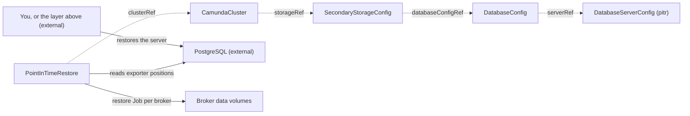

# PointInTimeRestore

`PointInTimeRestore` aligns the Zeebe primary storage of a `CamundaCluster` with a database at a point in time. You create it, or a recovery flow above the operator creates it for you.

The cluster must store its data in a relational database. You use this kind to undo a destructive operation without a [LogicalBackupRDBMS](logicalbackuprdbms.md). It relies on two continuous mechanisms instead of discrete backups: point-in-time recovery on the database server, and the continuous primary-storage backups of Zeebe, which this operator aligns.

For an Elasticsearch cluster, use a [LogicalRestoreElasticsearch](logicalrestoreelasticsearch.md) or a [LogicalRestoreRDBMS](logicalrestorerdbms.md) instead. Neither Elasticsearch nor a logical dump has point-in-time recovery.

One resource is one restore. The spec is immutable, and the restore runs once. `kubectl get pitr` lists the restores with their phase, cluster, and timestamp.

## Who rolls the database back

`spec.pitr.recovery` on the [DatabaseServerConfig](databaseserverconfig.md) of the cluster decides this, and it changes what you do before you create the restore.

| `pitr.recovery` | Who rolls the database back | What you do first |
| --- | --- | --- |
| `operator` | The producer of the contract, on request. A [DatabaseServer](databaseserver.md) publishes this. | Nothing. Create the restore, and it asks. |
| `external` (default) | You, before the restore exists. | Roll the database back to the point yourself, then create the restore. |

With `external` the database must already hold the state of the requested timestamp when you create the resource. On a self-hosted server the database administrator runs standard PostgreSQL point-in-time recovery. On a managed service you use the point-in-time restore of the provider. Some providers, for example Amazon RDS, create a **new** instance for the restore. Then you update `host` on the `DatabaseServerConfig` before you create this resource.

With `operator` the restore writes `spec.recovery` on the contract and waits in `RestoringDatabase` until `spec.pitr.lastRecovery` answers it. The request carries the uid of the restore, so the answer to an earlier restore of the same name and the same point is never read as the answer to this one.

The endpoint on the contract can change while it waits, because a rollback usually replaces the server. The restore follows the contract to the new endpoint once the contract reports `Ready` for it, and goes on. Everything else about the chain still binds: a contract that is deleted and created again under its name fails the restore, mid-rollback as much as before it.

A restore that asks for a point the server never held ends in `Failed` with reason `PitrUnavailable`. A rollback that started and did not finish ends in `Failed` with reason `Failed`. `status.failureMessage` carries the message that the server reported.

The smallest restore names the cluster and the point:

```yaml
apiVersion: core.camunda.io/v1
kind: PointInTimeRestore
metadata:
  name: my-cluster-pitr
  namespace: my-cluster-ns
spec:
  clusterRef:
    name: my-cluster
  timestamp: "2026-07-30T14:30:00Z"
```



## The restore prepares the cluster

The operator brings the cluster to the state that the restore needs. You do not suspend the cluster by hand.

The restore suspends the cluster. It stays in `Pending` while it does this, and nothing bounds the wait. It erases nothing before it leaves that phase. `Ready` reports `Progressing`, and its message names what the operator waits for.

The operator writes nothing else on the cluster. It writes no credential, and no reference to one.

### What the operator writes, and what it keeps

Each write is a server-side apply of one field, under a field manager of its own:

| Field | Field manager | What happens at the end |
| --- | --- | --- |
| `spec.suspend` | `camunda-operator/restore-suspend` | The restore withdraws it when it reaches `Completed`. |

These names are published. A GitOps tool reads them in a conflict message, and they tell a write of a restore from a write of a user.

This kind writes no version. It restores the primary storage of the cluster from the continuous backups of that same cluster. No backup therefore names a version that the cluster is not already running. It needs no sanction for a downgrade, and it sets no `camunda.io/allow-version-downgrade` annotation. [Version](camundacluster.md#version) states the rule, and what the annotation sanctions.

### When the restore unsuspends the cluster

The restore withdraws its suspension when it reaches `Completed`, and only when `status.clusterSuspended` is `true`.

- **A cluster that you suspended yourself stays suspended.** The restore recorded no suspension of its own, so it withdraws none.
- **A failed restore leaves the cluster suspended.** Its broker volumes can be empty or half written. Brokers that start over such volumes are worse than a cluster that is down. Read `status.failureMessage`, correct the cause, and create a new restore.
- **A restore that you delete while it runs leaves the cluster suspended.** A delete never unsuspends the cluster. Brokers that start over volumes the restore already erased are worse than a cluster that is down. Unsuspend the cluster yourself once you know what its volumes hold.

### A GitOps tool that owns the CamundaCluster

The operator declares `spec.suspend` under its own name, the same way [CamundaOptimize](camundaoptimize.md) does for `spec.zeebe.extraEnv`. A tool that manages the `CamundaCluster` with server-side apply keeps every field that it declares. The operator keeps the fields that it declares.

A tool that also declares one of these fields fights the operator for it. Argo CD or Flux reverts the write of the restore, the restore writes it again, and the restore stalls in `Pending`. If you drive the `CamundaCluster` from Git:

- Remove `spec.suspend` from the manifest for the time of the restore, or mark the field as an ignored difference.
- Let the tool declare `spec.suspend: false` again after the restore, if it declared the field before.

The cluster must stay suspended for the whole restore, not only at the start. A cluster that somebody unsuspends while the restore runs holds the restore in its current phase, and fails it after ten minutes with reason `ClusterNotSuspended`.

## One operation at a time

A cluster holds one backup or one restore at a time. This restore holds the cluster from the moment it starts to prepare it, which it reports as `Pending`. It gives the hold back when it reaches `Completed` or `Failed`.

A cluster that another backup or another restore holds keeps this restore in `Pending` with reason `ClusterClaimed`. The message names the holder. Nothing bounds this wait, and you change nothing. The restore starts on its own a short time after the holder reaches a terminal phase.

## Phases

`status.phase` records how far the restore got. A restore continues at that phase after the operator restarts.

| Phase | What happens |
| --- | --- |
| `Pending` | The restore waits. Another backup or restore holds the cluster, the storage chain does not resolve, a rule of the server does not hold, the database is ahead of the requested point, or the operator is still preparing the cluster. Nothing of the cluster is erased here. Preparation does write `spec.suspend` on the cluster, which [The restore prepares the cluster](#the-restore-prepares-the-cluster) describes. |
| `RestoringDatabase` | The restore asked the `DatabaseServerConfig` to roll its server back, and waits for the answer. You see this phase only when the contract declares `pitr.recovery: operator`. Nothing bounds the wait, and nothing of the cluster is erased here. |
| `ValidatingDatabaseState` | The operator reads the exporter position of every partition from the restored database. You see this phase only while the operator cannot reach the database. A check that passes moves on within the same step, and a database that is ahead sends the restore back to `Pending`. |
| `RestoringPrimaryStorage` | The operator recreates the broker data volumes and runs the restore application on them. |
| `Completed` | The restore finished. The restore unsuspended the cluster, unless you suspended it yourself. |
| `Failed` | A phase failed. `status.failureMessage` names it. |

## The storage chain

The operator resolves the cluster's `storageRef` to a `SecondaryStorageConfig`, which must be `type: rdbms`, then its `DatabaseConfig`, then its `serverRef` to a `DatabaseServerConfig` of the same namespace. A cluster on Elasticsearch is rejected with reason `InvalidReference`. Point-in-time restore does not exist for it.

The `DatabaseServerConfig` must also publish `status.systemIdentifier`. That value names the PostgreSQL instance behind its endpoint, and the rule below counts by it. A contract without it holds the restore with reason `InvalidReference`.

A rollback in `RestoringDatabase` moves the endpoint and keeps the identifier: a physical recovery restores the `pg_control` of the base backup, so the recovered instance reports the identity it recovered from. The restore records the new endpoint when the contract reports `Ready` again, and it measures the endpoint against that record from then on. An endpoint that reports another identity holds another server, and the restore ends there.

The cluster must also name a `backupStorageRef`. Without it, Zeebe writes no primary-storage backup, so no restore point exists. Such a cluster holds the restore with reason `InvalidReference`.

The `DatabaseServerConfig` must declare `pitr.enabled: true`, and `spec.timestamp` must lie within the retention period it declares. Otherwise the restore holds with reason `PitrUnavailable`. The role of the `DatabaseServerConfig` here is the capability declaration only. This operator never uses its `adminCredentialsSecretRef`.

Exactly one `Database` must use that PostgreSQL instance. Point-in-time recovery on the engine rolls back the whole server, not one logical database. A shared server therefore rolls back unrelated databases too, and it holds the restore with reason `SharedServer`.

The count runs over the `Database` resources of every namespace. It counts the logical database that each one runs now, not the server that its `serverRef` names. A `Database` that you move to another server keeps the database it runs on until it reaches the new one. Until then it counts against the old server. Two `DatabaseServerConfig` objects of two namespaces that describe one instance are one server here, so a `Database` behind either of them counts. The message names each claimant as `<namespace>/<name>`.

That one `Database` must also hold the logical database of the `DatabaseConfig`. A hand-written `DatabaseConfig` can name a database that no `Database` resource declares, and the single claimant on the instance is then somebody else's. Such a server holds the restore with reason `InvalidReference`, and the message names both database names.

A `Database` that claims no logical database holds the restore too, with reason `InvalidReference`, and the message names it. A `Database` claims the database it runs when it reaches its server. One that never reached its server claims nothing. So does one whose logical database another `Database` holds. Recovery rolls back the whole server, so a database that the operator cannot rule out is a database the restore can erase. Wait until every `Database` reports `Ready`, or delete the ones whose server no longer exists.

A server that **no** `Database` uses holds the restore too, with reason `InvalidReference`. The `Database` resources are the only evidence the operator has about the databases of a server. Without one it cannot tell whether the server holds one database or ten. A restore erases the broker volumes, so the operator does not start one on that evidence. Declare the database of the cluster as a `Database` resource on a server of its own.

The operator records the chain it validated in `status.storage`: the two contracts, the server, the logical database, the endpoint, and the system identifier behind that endpoint. It holds the restore to that record. A cluster that is repointed at another database after the check fails the restore, because the rules of the server and the state of the database were read against the first chain. Create a new restore for the database the cluster uses now.

Every rule of this section holds the restore in `Pending`. Nothing is deleted while a rule does not hold, so you correct the cause and the same resource continues. You do not create a new one.

## The database-state check

Before it touches a volume, the operator connects to the logical database with the application credentials of the cluster, resolved through `storageRef` to `SecondaryStorageConfig` to `DatabaseConfig.credentialsSecretRef`. It reads `LAST_UPDATED` for every partition from the `EXPORTER_POSITION` table and records what it saw in `status.observedPositions`.

The operator reads the table under the name that Camunda creates it with, and it reads no table prefix. A cluster that sets `camunda.data.secondary-storage.rdbms.prefix` is outside this check. A database that carries no such table holds the restore with reason `DatabaseNotRestored` too: an empty database is the state that this check exists for.

The restore holds in `Pending` with reason `DatabaseNotRestored` when a partition row is missing, or when any `LAST_UPDATED` is later than `spec.timestamp` plus one minute of slack. The slack exists because the clock of the database and the source of your timestamp are not the same clock.

A database that the operator cannot reach at all is a different hold. The restore stays in `ValidatingDatabaseState` with reason `ConnectionFailed` or `MissingSecret`, and it fails after ten minutes. It touches no volume there either.

**The clocks must match.** The operator compares the two times as UTC. The database records `LAST_UPDATED` with the wall clock of the broker and no time zone, so the two are the same clock only while the brokers run in UTC. A container runs in UTC, and the operator never changes that. A broker west of UTC records a position that reads earlier than it is. The check then lets an unrestored database through.

The operator therefore reads the environment of the broker container before it compares anything. It holds the restore with reason `PitrUnavailable` when the brokers carry a zone other than UTC in `TZ`, or `-Duser.timezone` in `JAVA_TOOL_OPTIONS`, `JDK_JAVA_OPTIONS`, `_JAVA_OPTIONS`, `JAVA_OPTS`, or `EXTRA_JVM_OPTS`. It reads them from `spec.zeebe.extraEnv` and from every ConfigMap and Secret of `spec.zeebe.extraEnvFrom`, in the order the kubelet applies them: the sources first, then `extraEnv`, which overrides a name that a source carried. A cluster that corrects the zone of a shared ConfigMap in `extraEnv` therefore runs in UTC. A source that the operator cannot read holds the restore too, because an unread source can carry the one variable that makes this check wrong. A source that the cluster marks optional and that does not exist carries nothing, and the restore continues.

**Limits of this check.** The check proves that the database is not ahead of the requested point. It cannot prove that the database holds exactly that point. A database that was restored to an earlier point passes the check, and that is safe: Zeebe re-exports the difference after the restore. The check of the restore application stays the authoritative gate. This check only moves the common error before the volume deletion.

## Primary storage

The Camunda restore application refuses a non-empty data directory, so the operator deletes the broker data volumes of the cluster and creates them again. The new volume takes the size of the claim template of the broker StatefulSet, together with its storage class, access modes, and labels. The volumes belong to that StatefulSet, not to the restore. Deleting the restore never deletes a broker volume.

A Job that already carries the name of one of these Jobs, from an earlier restore of the same name, fails this restore. Its result says nothing about this restore. The message names the Job.

The operator then runs the Camunda restore application once per broker, as a Job with `--to=<spec.timestamp>`. The Jobs run with the configuration the brokers run with. A cluster whose broker StatefulSet is gone cannot restore until the cluster brings it back.

The restore application does the alignment itself. It reads the exporter position of each partition from the restored database with the same credentials the brokers use, and it restores the newest checkpoint at or before that position from the continuous primary-storage backups. The restored Zeebe state is therefore never behind the database.

## Choosing the point to restore to

You choose one point in time, and you put it in `spec.timestamp`. The database reaches that point through [Who rolls the database back](#who-rolls-the-database-back).

The operator enables the continuous primary-storage backups of Zeebe for every relational cluster that names a `backupStorageRef`. A cluster that backs up already takes them.

The point has to sit inside the window that those backups cover. Two bounds define that window, and both come from the `CamundaCluster`:

| Bound | Field on the cluster | Default |
| --- | --- | --- |
| Zeebe took a backup after the point | `spec.backup.primaryStorage.schedule` | `PT1H` |
| Zeebe still keeps that backup | `spec.backup.primaryStorage.retention.window` | `P7D` |

**Choose a point at least one backup interval before the cluster stopped writing, and inside the retention window.** Read both values off your own cluster before you choose. With the defaults, a point between one hour and seven days before the brokers stopped is safe.

"Now" is always outside the window, and so is the moment just before you suspended the cluster. The brokers write until they stop, and the newest backup is always behind them.

To read the real window rather than infer it, ask the cluster while it still runs:

```bash
kubectl exec -n my-cluster-ns my-cluster-zeebe-0 -- \
  curl -s localhost:9600/actuator/backupRuntime/state
```

### What goes in spec.timestamp

`spec.timestamp` is the point you restored the database to. The operator holds the restore in `Pending` with reason `DatabaseNotRestored` while the database still holds state after that point. It allows one minute of slack for the two clocks.

The cluster comes back at a primary-storage checkpoint that Zeebe backed up at or after the point, not at the point itself. Work recorded between the point and that checkpoint is searchable again after the restore. `spec.backup.primaryStorage.schedule` and `spec.backup.primaryStorage.checkpointInterval` set how far apart those checkpoints are, and they default to `PT1H` and `PT15M`. Shorter values bring the cluster back closer to the point. Camunda documents the rule in [Point-in-time restore](https://docs.camunda.io/docs/self-managed/operational-guides/backup-restore/rdbms/rdbms-restore/#point-in-time-restore).

### If the point is outside the window

The operator cannot catch this before it erases the broker volumes. It compares timestamps, and the restore application compares log positions. Those positions live in the backup store, which the operator never opens.

The cost is bounded. The restore replaces those volumes from the backup in any case, and the backup itself stays whole. The outcome is "restore again" rather than lost data. Choose an earlier point, restore the database to it, and create a new restore.

You do not read a pod log to find out. The operator reads the log of the failed restore Job for you, and the restore reaches `Failed` with reason `ExporterPositionNotCovered`. `status.failureMessage` names the cause and the remedy. A restore that fails for another reason keeps that reason.

## The restore Jobs

The restore runs the Camunda restore application once per broker, as a Job. Each Job pod uses the data volume of its broker. A pod that finished still holds that volume, so the volume cannot terminate while the pod exists.

| Terminal phase | What happens to the Jobs |
| --- | --- |
| `Completed` | The operator deletes them, together with their pods. Kubernetes removes the pods first and the Job last, so the delete takes a moment. The broker data volumes are free once the last pod is gone. |
| `Failed` | The operator keeps them. The logs of a failed Job name the cause, and only the pod keeps them readable. |

**A restore that failed after it started the restore application holds the broker data volumes.** `status.primaryJobNames` tells you which case you are in. A restore that failed in an earlier phase names no Job there and holds nothing.

When it does name Jobs, you read their logs, and then you delete the restore. The delete takes the Jobs and their pods with it, and the volumes are free once the last pod is gone. Until you do that, a second restore of the cluster and the deletion of the cluster both wait on a volume that never terminates. The waiting restore reports the pod that holds the volume and names the resource that runs it.

```bash
# The Jobs that the restore still holds. status.primaryJobNames lists the same names.
kubectl get job -n my-cluster-ns -l camunda.io/point-in-time-restore=my-cluster-pitr

# The log of the Job of broker 0, named the way the command above lists it.
kubectl logs -n my-cluster-ns job/my-cluster-pitr-pitr-0
```

## Deletion

When you delete the restore, the operator deletes the Jobs it created. A restore that completed already removed them. A restore that failed still has them, and this is how you remove them. The restore wrote nothing to the backup store, so the delete leaves no artifact there.

A cluster that the restore suspended stays suspended. That is deliberate. Unsuspending it here would start brokers over volumes that the restore already erased. Unsuspend the cluster yourself once you know what its volumes hold.

## Status

| Type | Reason | Meaning | What to do |
| --- | --- | --- | --- |
| `Ready` | `Progressing` | A restore phase runs. | Wait. The message names the phase. |
| `Ready` | `Completed` | The restore finished, and it gives back the suspension it applied, so the cluster starts again a moment later. `Ready` is `True`. | Nothing. Unsuspend the cluster yourself only when you suspended it yourself. |
| `Ready` | `ClusterNotSuspended` | The cluster started running again while the restore ran. | Suspend the cluster again. A restore that already erased something fails ten minutes after the first outage. |
| `Ready` | `ClusterClaimed` | Another backup or restore holds the cluster. The message names it. | Wait. The restore starts when that operation finishes. |
| `Ready` | `InvalidReference` | The cluster or a link in its storage chain does not exist, the storage is not relational, the cluster names no backup storage, the `DatabaseServerConfig` publishes no system identifier, a `Database` claims no logical database, no `Database` uses the server, or the broker StatefulSet is gone. | Correct the reference that the message names. |
| `Ready` | `PitrUnavailable` | The server does not declare point-in-time recovery, `spec.timestamp` lies outside its retention period, `spec.timestamp` lies in the future, the server answered a rollback request with `Unavailable`, or the brokers of the cluster do not run in UTC. | Enable `pitr` on the server, choose a point the server holds, or run the brokers in UTC. |
| `Ready` | `SharedServer` | More than one `Database` uses the server, counted across all namespaces. The message names each one. | Move the cluster to a dedicated server. |
| `Ready` | `DatabaseNotRestored` | The database is ahead of `spec.timestamp`, or it reports no position for a partition. The operator touched no volume. | Restore the database to the requested point, then wait. |
| `Ready` | `ExporterPositionNotCovered` | The point you chose lies outside the window that the primary-storage backups cover. The broker volumes are already erased. | Choose an earlier point, restore the database to it, and create a new restore. See "Choosing the point to restore to". |
| `Ready` | `MissingSecret` | A credentials Secret of the cluster is missing or lacks a key. | Create the Secret that the message names. |
| `Ready` | `ConnectionFailed` | The database rejects the operator. | Correct the endpoint or the credentials. |
| `Ready` | `Failed` | A phase failed. | Read `status.failureMessage`. Correct the cause and create a new restore. |

A restore that already started keeps a broken dependency for ten minutes. After that it fails, because a restore that recreated a volume must not wait without an end. A restore that still waits in `Pending` has no such limit: it deleted nothing.

The status also records what the restore pinned and what it did:

- `status.targetClusterUID` pins the identity of the cluster from the start. A cluster that is deleted and created again under one name fails the restore.
- `status.storage` pins the storage chain that the restore validated, down to the system identifier of the server.
- `status.clusterSuspended` records that this restore suspended the cluster. The restore withdraws that suspension when it completes.
- `status.brokers` is the broker count that the operator read off the broker StatefulSet.
- `status.observedPositions` holds the `LAST_UPDATED` value that the check read for each partition.
- `status.primaryJobNames` names the per-broker restore Jobs, in broker order.
- `status.terminalReason` is the `Ready` reason of the terminal phase.
- `status.recreatedClaims` names the broker data volumes that the operator deleted and created again.
- `status.completionTime` is when the restore reached `Completed` or `Failed`.
- `status.observedGeneration` is the last generation the operator reconciled.

## Spec reference

Every field, with its type and whether it is required:

```yaml
apiVersion: core.camunda.io/v1
kind: PointInTimeRestore
metadata:
  name: my-cluster-pitr
  namespace: my-cluster-ns
spec:
  # object. Required. The cluster to align in place.
  clusterRef:
    # string. Required. Name of the CamundaCluster, in this namespace.
    name: my-cluster
  # string. Required. RFC 3339 timestamp to roll back to. It must lie within
  # the retention period of the server, and not in the future. With
  # pitr.recovery: external the database must already hold it.
  timestamp: "2026-07-30T14:30:00Z"
```

### Validation rules

- `spec` is immutable. A restore runs once, and you retry it with a new resource.
- `spec.timestamp` is an RFC 3339 timestamp. The API server accepts one in the future, because the schema has no clock. The restore reports `PitrUnavailable` for it instead.
- `clusterRef` names a cluster in the namespace of the restore. It never crosses a namespace. The operator reads the Secrets of the cluster and runs Jobs in that namespace, so the reference stays inside the RBAC boundary of the restore.
- The API server accepts a restore that breaks the rules below, because they depend on live cluster state. The restore reports the breach on `Ready` instead: the storage chain, the dedicated-server rule, and the state of the database.
- Whether the database really holds `spec.timestamp` is not provable by the operator. See "Limits of this check" above.
- Whether the primary-storage backups cover the point is not provable by the operator either. See [Choosing the point to restore to](#choosing-the-point-to-restore-to).

### Roll back to just before a bad deployment

```yaml
apiVersion: core.camunda.io/v1
kind: PointInTimeRestore
metadata:
  name: my-cluster-pitr-pre-release
  namespace: my-cluster-ns
  labels:
    camunda.io/cluster: my-cluster
spec:
  clusterRef:
    name: my-cluster
  # One minute before the faulty process deployment was applied. The database
  # server was already restored to this point, and the cluster suspended,
  # before this resource was created.
  timestamp: "2026-07-30T14:29:00Z"
```

## Related

- [LogicalRestoreElasticsearch](logicalrestoreelasticsearch.md) and [LogicalRestoreRDBMS](logicalrestorerdbms.md): the backup-based alternative. One kind serves each secondary storage type, and both restore a cluster from its own backup.
- [CamundaCluster](camundacluster.md): referenced through `clusterRef`. The restore suspends it for its whole run, and a cluster that names a `backupStorageRef` takes the continuous primary-storage backups that the restore reads.
- [SecondaryStorageConfig](secondarystorageconfig.md): resolved through the `storageRef` of the cluster. It must be `type: rdbms`.
- [DatabaseConfig](databaseconfig.md): resolved for the logical database and its `serverRef`. Its `credentialsSecretRef` holds the credentials that read `EXPORTER_POSITION`.
- [DatabaseServerConfig](databaseserverconfig.md): declares the `pitr` capability and the retention period, and carries the dedicated-server rule. This operator never uses its admin credentials.
- [ObjectStorageConfig](objectstorageconfig.md): resolved through the `backupStorageRef` of the cluster. It holds the continuous primary-storage backups.
