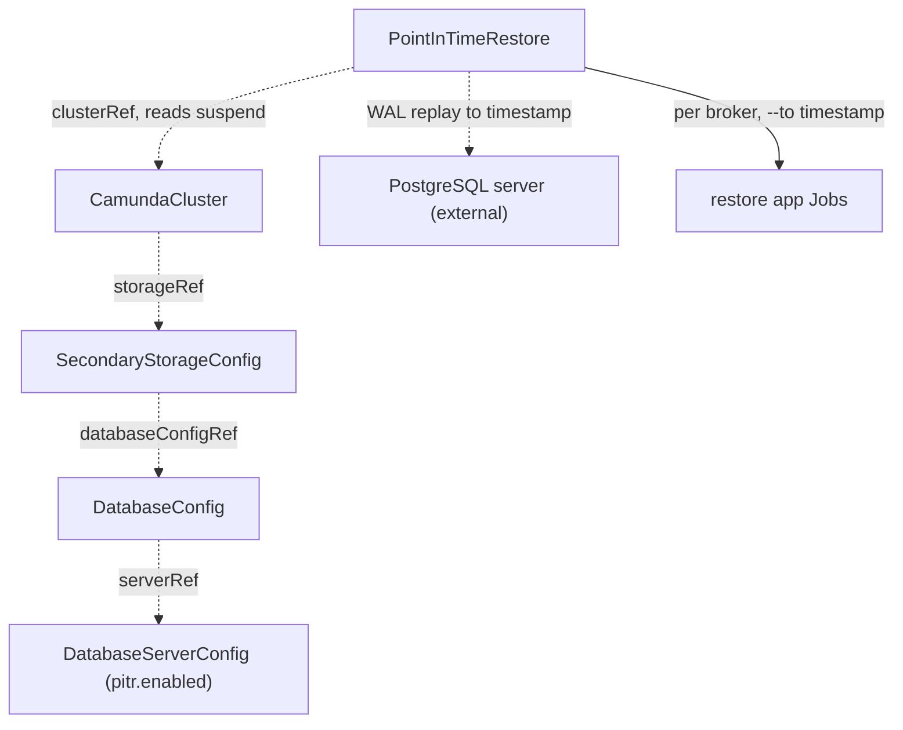

# PointInTimeRestore

A PointInTimeRestore rolls an RDBMS-backed orchestration cluster back to a timestamp, in place.

## Purpose

A PointInTimeRestore recovers a `CamundaCluster` whose secondary storage is an RDBMS to an arbitrary point in time — for example to undo a destructive operation — without needing a [Backup](backup.md) CR.
It relies on two continuous mechanisms instead of discrete backups: WAL-based point-in-time recovery on the database server, and Zeebe's continuous primary-storage backups.
You create it, or a composition layer above creates it as part of a managed recovery flow.
For Elasticsearch-backed clusters, or for restoring into a different cluster, use [LogicalRestore](logicalrestore.md) instead.

## How it works

The operator drives the restore through the phases in `status.phase`; each phase must complete before the next starts.

1. Validate that the cluster is suspended (`spec.suspend: true` and the `Suspended` condition reported on the `CamundaCluster`). The restore controller only ever reads the suspend field — it never writes it. The `suspend` field is owned by you or by the composition layer above, which suspends the cluster before creating the PointInTimeRestore and unsuspends it after completion. A running cluster keeps the restore in `Pending` with `Ready: ClusterNotSuspended`.
2. Resolve the storage chain: the cluster's `storageRef` → `SecondaryStorageConfig` (must be `type: rdbms`) → `DatabaseConfig` → `serverRef` → `DatabaseServerConfig`.
3. Validate that the `DatabaseServerConfig` has `pitr.enabled: true` and that `spec.timestamp` lies within the server's PITR retention period; otherwise fail with `Ready: PitrUnavailable`.
4. Validate the dedicated-server rule: the `DatabaseServerConfig` must be referenced by exactly one `Database`. Engine-level PITR rolls back the entire server instance, not one logical database, so a shared server would silently roll back unrelated databases.
5. Enter `RestoringSecondaryStorage`: restore the database server to `spec.timestamp` using engine-native point-in-time recovery — for PostgreSQL, `recovery_target_time` with WAL replay — authenticated with the server's `adminCredentialsSecretRef`. This is an in-place restore of the same server instance. On managed database services the equivalent server-level restore is performed through the provider, which is why the PITR capability is declared on the `DatabaseServerConfig` contract rather than detected by this operator.
6. Enter `RestoringPrimaryStorage`: ensure the cluster's Zeebe data volumes are empty — the operator deletes and recreates the Zeebe PVCs, because Camunda's restore application refuses a non-empty data directory — then run the restore application (`bin/restore`, the Camunda distribution's one-shot Spring Boot app) once per broker as a Job with the broker's own configuration and `--to=<spec.timestamp>`, applied with Server-Side Apply (SSA) under the field manager `camunda-operator/pointintimerestore`. The restore application does the alignment itself: it reads the per-partition exporter position from the restored database's `EXPORTER_POSITION` table and restores the newest checkpoint at or before that position from the continuous primary-storage backups, so the restored Zeebe state is never behind the database.
7. Report `Completed`. You or the composition layer unsuspend the cluster; on start, Zeebe re-exports any events between the database's position and the restored checkpoint, bringing the database back up to date.



**The CamundaCluster-side prerequisite.** Point-in-time restore is only possible if restore points exist for the requested timestamp. When a cluster's resolved storage chain ends in a PITR-enabled `DatabaseServerConfig`, the `CamundaCluster` controller automatically enables Zeebe's continuous primary-storage backups — continuous mode plus a backup schedule and checkpoint interval, written to the store behind the cluster's `backupStorageRef`. The checkpoint interval bounds how precise the restore can be: Zeebe restores to the nearest checkpoint at or before the requested timestamp, while the database restores to the exact timestamp.

!!! note "Deviation from the original proposal"
    The proposal had the restore controller itself read the `exporter_position` table and restore primary storage "to match". Verified against Camunda 8.9: the standalone restore application performs that alignment natively — it accepts `--to` (and `--from`) timestamps, reads the `EXPORTER_POSITION` table when secondary storage is RDBMS, and selects the matching checkpoint from the continuous backup ranges. The operator therefore never parses exporter positions itself; it restores the database and delegates primary-storage alignment to the restore application. Camunda 8.9 also constrains the restore timestamp: it must not lie before the restored state of the database, which is guaranteed here because both restores target the same timestamp.

## API reference

```yaml
apiVersion: core.camunda.io/v1
kind: PointInTimeRestore
metadata:
  name: my-cluster-pitr
  namespace: my-cluster-ns
spec:
  # object. Required. Reference to the CamundaCluster to roll back in place.
  clusterRef:
    # string. Required. Name of the CamundaCluster.
    name: my-cluster
    # string. Optional, default: this CR's namespace. Namespace of the CamundaCluster.
    namespace: my-cluster-ns
  # string. Required. RFC 3339 timestamp to recover to; must lie within the server's PITR retention period.
  timestamp: "2026-07-30T14:30:00Z"
```

## Status

| Type | Reason | Meaning |
| --- | --- | --- |
| `Ready` | `Completed` | The restore finished; the cluster can be unsuspended. |
| `Ready` | `Progressing` | A restore phase is running. |
| `Ready` | `ClusterNotSuspended` | The cluster is not suspended; the restore waits in `Pending`. |
| `Ready` | `InvalidReference` | The cluster or a link in its storage chain does not exist. |
| `Ready` | `PitrUnavailable` | PITR is not enabled on the server, or the timestamp is outside retention. |
| `Ready` | `SharedServer` | The database server is referenced by more than one `Database`. |
| `Ready` | `Failed` | A restore phase failed; the message names the failing step. |

`status.phase` tracks the long-running operation: `Pending | RestoringSecondaryStorage | RestoringPrimaryStorage | Completed | Failed`.

The operator records the last reconciled generation in `status.observedGeneration`.

## Validation

- `spec.timestamp` must be a valid RFC 3339 timestamp and must not lie in the future.
- `spec` is immutable after creation: a restore is a one-shot operation, retried by creating a new CR.
- A validating webhook rejects creation when the cluster's resolved `DatabaseServerConfig` is referenced by more than one `Database` — PITR requires a server dedicated to a single cluster. The controller re-checks the rule at reconcile time (step 4) because references can change after admission.
- Non-RDBMS clusters are rejected at reconcile time with `Ready: InvalidReference`: point-in-time restore does not exist for Elasticsearch-backed clusters.

## Relationships

- [LogicalRestore](logicalrestore.md) — the backup-based alternative that works for both storage types and across clusters.
- [CamundaCluster](camundacluster.md) — referenced via `clusterRef`; must be suspended by its owner for the duration of the restore, and its controller auto-enables continuous primary-storage backups when the storage chain is PITR-enabled.
- [SecondaryStorageConfig](secondarystorageconfig.md) — resolved via the cluster's `storageRef`; must be `type: rdbms`.
- [DatabaseConfig](databaseconfig.md) — resolved for the logical database and its `serverRef`.
- [DatabaseServerConfig](databaseserverconfig.md) — declares `pitr.enabled` and the retention period; subject to the dedicated-server rule.
- [ObjectStorageConfig](objectstorageconfig.md) — resolved via the cluster's `backupStorageRef`; holds the continuous primary-storage backups.

## Examples

A minimal manifest:

```yaml
apiVersion: core.camunda.io/v1
kind: PointInTimeRestore
metadata:
  name: my-cluster-pitr
  namespace: my-cluster-ns
spec:
  clusterRef:
    name: my-cluster
  timestamp: "2026-07-30T14:30:00Z"
```

A realistic manifest, rolling back to just before a bad deployment:

```yaml
apiVersion: core.camunda.io/v1
kind: PointInTimeRestore
metadata:
  name: my-cluster-pitr-pre-release
  namespace: my-cluster-ns
  labels:
    camunda.io/cluster: my-cluster
spec:
  clusterRef:
    name: my-cluster
    namespace: my-cluster-ns
  # One minute before the faulty process deployment was applied.
  timestamp: "2026-07-30T14:29:00Z"
```
