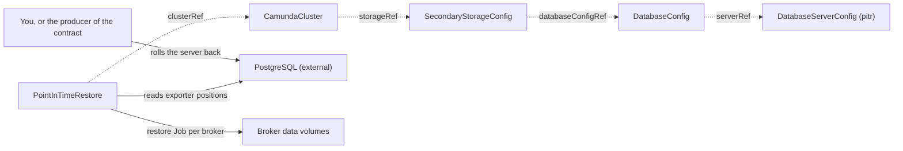

# PointInTimeRestore

`PointInTimeRestore` rolls a relational `CamundaCluster` back to a point in time. The database server rolls back to that point, and the operator aligns the Zeebe primary storage with it. It needs no [LogicalBackupRDBMS](logicalbackuprdbms.md). It uses two continuous sources instead: point-in-time recovery of the database server, and the continuous primary-storage backups of Zeebe.

For an Elasticsearch cluster, use a [LogicalRestoreElasticsearch](logicalrestoreelasticsearch.md). Elasticsearch has no point-in-time recovery.

One resource is one restore. The spec is immutable, and the restore runs once. To retry, create a new resource. `kubectl get pitr` lists the restores with their phase, cluster, and timestamp.

You do not suspend the cluster first. The restore does it, as [Operations: Restore a cluster](../guides/operations.md#restore-a-cluster) describes. That section also holds what every restore kind shares: when the cluster starts again, one operation at a time, failed restores, and GitOps. This kind writes no version on the cluster.

The smallest restore names the cluster and the point:

```yaml
apiVersion: core.camunda.io/v1
kind: PointInTimeRestore
metadata:
  name: my-cluster-pitr
  namespace: my-cluster-ns
spec:
  clusterRef:
    name: my-cluster
  timestamp: "2026-07-30T14:30:00Z"
```


```mermaid
graph LR
    PITR[PointInTimeRestore] -.->|clusterRef| CC[CamundaCluster]
    CC -.->|storageRef| SSC[SecondaryStorageConfig]
    SSC -.->|databaseConfigRef| DBC[DatabaseConfig]
    DBC -.->|serverRef| DBS["DatabaseServerConfig (pitr)"]
    EXT["You, or the producer of the contract"] -->|rolls the server back| PG["PostgreSQL (external)"]
    PITR -->|reads exporter positions| PG
    PITR -->|restore Job per broker| PVC[Broker data volumes]
```

## Who rolls the database back

`spec.pitr.recovery` on the [DatabaseServerConfig](databaseserverconfig.md) of the cluster decides this:

| `pitr.recovery` | Who rolls the database back | What you do first |
| --- | --- | --- |
| `external` (default) | You, before you create the restore. | Roll the database back to the point. Then create the restore. |
| `operator` | The producer of the contract, for example a [DatabaseServer](databaseserver.md), when the restore asks. | Nothing. Create the restore. |

With `external`, the database must hold the state of `spec.timestamp` when you create the restore. On a self-hosted server, use the point-in-time recovery of PostgreSQL. On a managed service, use the point-in-time restore of the provider. If the provider creates a new instance, for example Amazon RDS, update `host` on the `DatabaseServerConfig` before you create the restore.

With `operator`, the restore writes the request in `spec.recovery` of the contract and waits in `RestoringDatabase` until `spec.pitr.lastRecovery` answers it. The request carries the UID of the restore, so an answer to an earlier restore never counts for this one. A rollback usually moves the endpoint on the contract. The restore continues when the contract reports `Ready` for the new endpoint, and the cluster holds that endpoint. The answer ends the restore when it is not a success:

| Answer | Result |
| --- | --- |
| `Unavailable` | The server never held the point. The restore fails with the reason `PitrUnavailable`. |
| `Failed` | The rollback started and did not finish. The restore fails with the reason `Failed`. |

`status.failureMessage` carries the message of the server.

### The database during a rollback

With `operator`, the restore holds the database from just before its request until `Completed` or `Failed`. `status.backend` names the database and follows the endpoint of the contract. No other `CamundaCluster` starts on that database, and the next one reports `WaitingForHandover`. [CamundaCluster: Secondary storage](camundacluster.md#secondary-storage) describes that wait. The hold is on the `DatabaseServerConfig` and the database name, so it covers the old endpoint and the new one. With `external`, the restore holds nothing, because the operator writes nothing into the database.

The server finishes a rollback that it started. So these changes during the rollback take effect only when the contract answers:

- If you delete the cluster, replace it, or point it at another database, the restore fails after the answer.
- If you delete the restore, it stays and holds the database until the answer.
- If no `DatabaseServerConfig` can answer, for example because you deleted it, the restore fails, or goes, 10 minutes later.

Before a cluster uses the database again, wait until `spec.pitr.lastRecovery` on the `DatabaseServerConfig` answers the request. A contract that stops declaring `pitr.recovery: operator` holds the restore until you set it back or delete the restore.

## Choose the point to restore to

The point must lie inside the window that the continuous primary-storage backups of Zeebe cover. The operator turns these backups on for every relational cluster that names a `backupStorageRef`. Two fields of the `CamundaCluster` bound the window:

| Bound | Field on the cluster | Default |
| --- | --- | --- |
| Zeebe took a backup after the point | `spec.backup.primaryStorage.schedule` | `PT1H` |
| Zeebe still keeps that backup | `spec.backup.primaryStorage.retention.window` | `P7D` |

**Choose a point at least one backup interval before the cluster stopped writing, and inside the retention window.** With the defaults, a point between one hour and seven days before the brokers stopped is safe. "Now" is always outside the window, because the newest backup is always behind the brokers.

To read the real window, ask the cluster while it still runs:

```bash
kubectl exec -n my-cluster-ns my-cluster-zeebe-0 -- \
  curl -s localhost:9600/actuator/backupRuntime/state
```

The point must also lie within the retention period that the `DatabaseServerConfig` declares, and not in the future.

### What goes in spec.timestamp

`spec.timestamp` is the point that the database holds after the rollback. The cluster comes back at a Zeebe checkpoint near that point, not at the point itself. `spec.backup.primaryStorage.checkpointInterval` sets how far apart the checkpoints are, and it defaults to `PT15M`. A shorter value brings the cluster back closer to the point. Camunda documents the rule in [Point-in-time restore](https://docs.camunda.io/docs/self-managed/operational-guides/backup-restore/rdbms/rdbms-restore/#point-in-time-restore).

### If the point is outside the window

The operator cannot find this out before it erases the broker volumes. Only the restore application can, because it compares log positions in the backup store. The restore then fails with the reason `ExporterPositionNotCovered`, and `status.failureMessage` names the cause. The backups stay whole. Choose an earlier point, roll the database back to it, and create a new restore.

## Phases

`status.phase` records how far the restore got. A restore continues at that phase after the operator restarts.

| Phase | What happens |
| --- | --- |
| `Pending` | The restore waits. A rule in [Requirements](#requirements) does not hold, another operation holds the cluster, or the cluster is not suspended yet. The restore suspends the cluster here. It erases nothing. |
| `RestoringDatabase` | Only with `pitr.recovery: operator`. The restore asked the contract for the rollback and waits for the answer. Nothing limits this wait while the contract exists. It erases nothing. |
| `ValidatingDatabaseState` | The operator reads the exporter position of every partition from the database. The restore stays in this phase only while the operator cannot reach the database. |
| `RestoringPrimaryStorage` | The operator deletes and creates the broker data volumes, and runs the Camunda restore application once per broker with `--to=<spec.timestamp>`. |
| `Completed` | The restore finished. The cluster starts again, unless you suspended it yourself or another hold remains. |
| `Failed` | The restore ended. `status.failureMessage` says why. |

## Requirements

Each rule below holds the restore in `Pending` until it holds. Correct the cause, and the same resource continues.

| Rule | Reason while it does not hold |
| --- | --- |
| The cluster, its `SecondaryStorageConfig` of `type: rdbms`, its `DatabaseConfig`, and its `DatabaseServerConfig` exist, in the namespace of the restore. | `InvalidReference` |
| The cluster names a `spec.backupStorageRef`. Without it, Zeebe takes no primary-storage backup. | `InvalidReference` |
| The `DatabaseServerConfig` publishes `status.systemIdentifier` for its current spec. | `InvalidReference` |
| The `DatabaseServerConfig` declares `spec.pitr.enabled: true`, and `spec.timestamp` lies within its retention period and not in the future. | `PitrUnavailable` |
| The brokers run in UTC. See [The database-state check](#the-database-state-check). | `PitrUnavailable` |
| Exactly one `Database` resource runs a logical database on the PostgreSQL instance, and it is the database of the cluster. | `SharedServer`, or `InvalidReference` |
| The cluster holds its database, and nothing else writes it. | `StorageAlreadyAttached`, or `WaitingForHandover` |
| The database holds no state after `spec.timestamp`. | `DatabaseNotRestored` |

**A dedicated server.** Point-in-time recovery rolls back the whole PostgreSQL instance, not one logical database. So the operator counts the `Database` resources of every namespace that run a database on that instance. It identifies the instance by its system identifier. More than one holds the restore with `SharedServer`, and the message names each one as `<namespace>/<name>`. A `Database` that has not reached a server yet can be on any server, so it holds the restore with `InvalidReference`. Wait until every `Database` reports `Ready`, or delete the ones whose server no longer exists. A server that no `Database` uses also holds the restore with `InvalidReference`. Declare the database of the cluster as a `Database` on a server of its own.

The operator records the chain that it checked in `status.storage`. A cluster that you point at another database after the check fails the restore. Create a new restore for the database that the cluster uses now.

## The database-state check

Before it touches a volume, the operator connects to the database with the application credentials in `DatabaseConfig.spec.credentialsSecretRef`. It reads `last_updated` of every partition from the `exporter_position` table, and it records the values in `status.observedPositions`.

The restore waits in `Pending` with the reason `DatabaseNotRestored` in three cases. A partition has no row, the table does not exist, or a value is later than `spec.timestamp` plus one minute. The minute covers the difference between the clock of the database and the source of your timestamp. The operator reads the table without a prefix, so a cluster that sets `camunda.data.secondary-storage.rdbms.prefix` does not pass this check.

If the operator cannot reach the database, the restore stays in `ValidatingDatabaseState` with the reason `ConnectionFailed` or `MissingSecret`, and it fails after 10 minutes. It touches no volume there.

**The brokers must run in UTC.** The broker writes `last_updated` with its own wall clock and no time zone, and the operator reads it as UTC. The operator reads the environment of the broker container: `TZ`, and `-Duser.timezone` in `JAVA_TOOL_OPTIONS`, `JDK_JAVA_OPTIONS`, `_JAVA_OPTIONS`, `JAVA_OPTS`, or `EXTRA_JVM_OPTS`. It reads them from `extraEnv` and from each ConfigMap and Secret in `extraEnvFrom`. A zone other than UTC holds the restore with `PitrUnavailable`. So does a source that the operator cannot read, unless the source is optional and absent.

The check proves that the database is not ahead of the point. It cannot prove that the database holds exactly that point. A database that holds an earlier point passes, and the restore application aligns Zeebe with it.

## Primary storage

The operator deletes the data volume of every broker, creates it again, and runs the restore application once per broker. The new volume takes the size, the storage class, the access modes, and the labels of the claim template of the broker StatefulSet. The volumes belong to that StatefulSet, not to the restore. Deleting the restore leaves them in place.

The restore application reads the exporter position of each partition from the database. It restores a checkpoint whose position is not below that exporter position, so the restored Zeebe state is never behind the database.

Every Job carries the labels `camunda.io/component: restore`, `camunda.io/point-in-time-restore: <restore name>`, and `camunda.io/cluster: <cluster name>`. Its name is `<restore name>-pitr-<broker>`, for example `my-cluster-pitr-pitr-0`. A Job of that name from an earlier restore of the same name fails this restore, and the message names the Job. A failed restore keeps its Jobs, see [A failed restore holds the broker volumes](../guides/operations.md#a-failed-restore-holds-the-broker-volumes).

## Deletion

Deleting the restore removes its Jobs and their pods. The broker volumes stay. The restore wrote nothing to the backup store. The restore removes its suspension hold from the cluster when the last Job pod is gone, and `spec.suspend` stays. A restore that you delete during the rollback of its database stays until the rollback ends, see [The database during a rollback](#the-database-during-a-rollback).

## Status

| Type | Reason | Meaning | What to do |
| --- | --- | --- | --- |
| `Ready` | `Progressing` | A phase of the restore runs, or the restore prepares the cluster. | Wait. The message names the work. |
| `Ready` | `Completed` | The restore finished. `Ready` is `True`. The cluster starts again, unless you suspended it yourself or another hold remains. | Nothing. |
| `Ready` | `Failed` | The restore ended. | Read `status.failureMessage`. Correct the cause. Delete the failed restore, then create a new one. |
| `Ready` | `ClusterNotSuspended` | Somebody removed the suspension hold of the restore and cleared `spec.suspend`, after `Pending`. | Suspend the cluster again. The restore fails 10 minutes after the first outage. During a rollback, the 10 minutes start when the contract answers. |
| `Ready` | `ClusterClaimed` | Another backup or restore holds the cluster. The message names it. | Wait. The restore starts when the holder ends. |
| `Ready` | `InvalidReference` | A rule in [Requirements](#requirements) does not hold, or the broker StatefulSet is gone. During a rollback: the cluster was deleted, replaced, or pointed at another database. | Correct what the message names. After a change during a rollback, wait for the answer, then create a new restore. |
| `Ready` | `PitrUnavailable` | The server does not declare point-in-time recovery, or the point lies outside its retention period or in the future. Or the server answered `Unavailable`, or the brokers do not run in UTC. | Enable `pitr` on the server, choose a point that the server holds, or run the brokers in UTC. |
| `Ready` | `SharedServer` | More than one `Database` uses the PostgreSQL instance. The message names each one. | Move the cluster to a server of its own. |
| `Ready` | `StorageAlreadyAttached` | Another `CamundaCluster` holds the database of the cluster. The message names it. | Move one of the two clusters to a database of its own, or delete the other cluster. |
| `Ready` | `WaitingForHandover` | The cluster does not hold its database yet, or pods or a deleted restore still write it. The message names them. | Wait. |
| `Ready` | `DatabaseNotRestored` | The database is ahead of `spec.timestamp`, or it has no position for a partition. No volume is touched. | Roll the database back to the point, then wait. |
| `Ready` | `ExporterPositionNotCovered` | The point lies outside the window of the primary-storage backups. The broker volumes are already erased. | Read [If the point is outside the window](#if-the-point-is-outside-the-window). |
| `Ready` | `MissingSecret` | A credentials Secret of the cluster is missing or lacks a key. Or a pod of a restore Job cannot start, because a Secret it needs does not exist. | Create the Secret that the message names. |
| `Ready` | `ConnectionFailed` | The operator cannot read the database. | Correct the endpoint or the credentials. |

After `Pending`, a restore that loses a dependency waits 10 minutes, then fails with the reason `Failed`. Once the restore has deleted a broker volume, the 10 minutes count from the first outage, even when a dependency comes back in between.

Other status fields:

- `status.targetClusterUID` pins the cluster. A cluster that somebody deletes and creates again under the same name ends the restore.
- `status.backend` names the database that the restore holds during a rollback. It is empty with `pitr.recovery: external`.
- `status.storage` records the storage chain that the restore checked, down to the system identifier of the server.
- `status.observedPositions` holds the `last_updated` value that the check read for each partition.
- `status.clusterSuspended` is `true` when this restore suspended the cluster.
- `status.brokers` is the broker count that the restore read from the broker StatefulSet.
- `status.recreatedClaims` names the broker data volumes that the restore deleted and created again.
- `status.primaryJobNames` names the restore Job of every broker, in broker order.
- `status.terminalReason` is the `Ready` reason of the terminal phase.
- `status.failureMessage` says why a failed restore ended.
- `status.completionTime` is when the restore reached a terminal phase.
- `status.observedGeneration` is the last generation that the operator processed.

## Spec reference

Every field, with its type and whether it is required:

```yaml
apiVersion: core.camunda.io/v1
kind: PointInTimeRestore
metadata:
  name: my-cluster-pitr
  namespace: my-cluster-ns
spec:
  # object. Required. The cluster to roll back.
  clusterRef:
    # string. Required. Name of the CamundaCluster, in this namespace.
    name: my-cluster
  # string. Required. RFC 3339 timestamp to roll back to. It must lie within
  # the retention period of the server, and not in the future. With
  # pitr.recovery: external the database must already hold it.
  timestamp: "2026-07-30T14:30:00Z"
```

### Validation rules

- The whole `spec` is immutable.
- `spec.timestamp` is an RFC 3339 timestamp. The API server accepts a point in the future. The restore reports `PitrUnavailable` for it.
- `clusterRef` never crosses a namespace.
- The API server accepts a restore that breaks a rule of live state. The restore reports the breach on `Ready`, see [Requirements](#requirements).

### Roll back to just before a bad deployment

```yaml
apiVersion: core.camunda.io/v1
kind: PointInTimeRestore
metadata:
  name: my-cluster-pitr-pre-release
  namespace: my-cluster-ns
spec:
  clusterRef:
    name: my-cluster
  # One minute before the faulty process deployment. With pitr.recovery:
  # external, the database is already rolled back to this point.
  timestamp: "2026-07-30T14:29:00Z"
```

## Related

- [Operations: Restore a cluster](../guides/operations.md#restore-a-cluster): what every restore kind does to the cluster, and how to act on a failed restore.
- [LogicalRestoreRDBMS](logicalrestorerdbms.md) and [LogicalRestoreElasticsearch](logicalrestoreelasticsearch.md): restore a cluster from one of its own backups.
- [CamundaCluster](camundacluster.md): referenced through `clusterRef`. Its `spec.backup.primaryStorage` sets the window of the continuous backups.
- [SecondaryStorageConfig](secondarystorageconfig.md): resolved through the `storageRef` of the cluster. It must be `type: rdbms`.
- [DatabaseConfig](databaseconfig.md): its `credentialsSecretRef` holds the credentials that read the exporter positions.
- [DatabaseServerConfig](databaseserverconfig.md): declares `pitr`, the retention period, and who rolls the server back. This operator never uses its admin credentials.
- [DatabaseServer](databaseserver.md): a server that rolls itself back on request.
- [ObjectStorageConfig](objectstorageconfig.md): resolved through the `backupStorageRef` of the cluster. It holds the continuous primary-storage backups.
