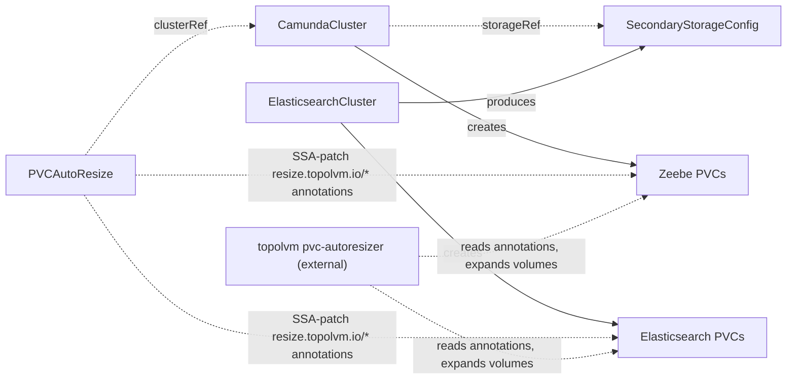

# PVCAutoResize

Manages topolvm pvc-autoresizer annotations on a cluster's PersistentVolumeClaims.

## Purpose

`PVCAutoResize` configures automatic volume expansion for the Zeebe and Elasticsearch PVCs belonging to one orchestration cluster.
It discovers the PVCs by their `camunda.io/cluster` labels and patches `resize.topolvm.io/*` annotations onto them, which the external topolvm pvc-autoresizer acts on.
You always create this CR explicitly — yourself or through a composition layer above; neither presets nor any other controller create it for you.

This is the purest extension-pattern exemplar in the doc set (see the [architecture overview](../architecture.md)): the controller attaches to a cluster's PVCs entirely from the outside, without any change to the `CamundaCluster` or `ElasticsearchCluster` specs.

!!! note "Deviation from the original proposal"
    The proposal let presets carry `autoResize` blocks so that a preset controller would create `PVCAutoResize` CRs automatically.
    That behavior is dropped: presets are passive data with no controllers, so `PVCAutoResize` is always created explicitly.
    This is Scope Decision 4 in the project spec; revisit only if real demand appears.

## How it works

StatefulSet PVC templates are immutable after creation, so resize configuration cannot be rolled out through the workload spec; the operator therefore patches the live PVC objects directly.

1. Resolve `clusterRef` to the target `CamundaCluster`.
2. When the `zeebe` block is set, discover the Zeebe broker PVCs: PVCs in the cluster's namespace labeled `camunda.io/cluster: <CamundaCluster name>` and `camunda.io/component: zeebe`.
3. When the `elasticsearch` block is set, resolve the cluster's `storageRef` to its `SecondaryStorageConfig`, then find the `ElasticsearchCluster` whose `secondaryStorageConfig` output names that contract (via a field indexer); the Elasticsearch data PVCs are the PVCs in that `ElasticsearchCluster`'s namespace labeled `camunda.io/cluster: <ElasticsearchCluster name>` and `camunda.io/component: elasticsearch`.
4. Server-Side Apply (SSA)-patch the `resize.topolvm.io/storage_limit`, `resize.topolvm.io/threshold`, and `resize.topolvm.io/increase` annotations onto each matched PVC, using the field manager `camunda-operator/pvcautoresize` so the controller owns only these three annotations and nothing else on the PVC.
5. Watch for PVC create events so PVCs added later — for example after scaling out brokers — are annotated as soon as they appear.
6. Reconcile on spec changes, updating the annotations on all matched PVCs, and record the result in status conditions and `status.observedGeneration`.

!!! note "Deviation from the original proposal"
    The proposal said only that PVCs are "discovered by cluster labels", leaving open how Elasticsearch PVCs are found given that they carry the `ElasticsearchCluster`'s own name — not the `CamundaCluster`'s — in their `camunda.io/cluster` label.
    This page pins the mechanism: Zeebe PVCs are matched through the `CamundaCluster` name directly, while Elasticsearch PVCs are located by following the cluster's `storageRef` back to the `ElasticsearchCluster` that produced it.
    When the cluster's secondary storage was not produced by an `ElasticsearchCluster` (for example a manually created contract pointing at an external Elasticsearch), the `elasticsearch` block cannot be applied and the operator reports `Ready=False` with reason `InvalidReference`.

The topolvm [pvc-autoresizer](https://github.com/topolvm/pvc-autoresizer) is an external prerequisite: it monitors annotated PVCs and expands them when free space drops below the threshold, up to the storage limit.
This operator only manages the annotations; it never resizes volumes itself, and the PVCs' storage class must support online volume expansion.



## API reference

```yaml
apiVersion: core.camunda.io/v1
kind: PVCAutoResize
metadata:
  name: my-cluster-autoresize
  namespace: my-cluster-ns
spec:
  # object. Required. Reference to the CamundaCluster whose PVCs are managed.
  clusterRef:
    # string. Required. Name of the CamundaCluster.
    name: my-cluster
    # string. Optional, default: this CR's namespace. Namespace of the CamundaCluster.
    namespace: my-cluster-ns
  # object. Optional. Auto-resize settings for Zeebe broker PVCs (camunda.io/component: zeebe).
  zeebe:
    # quantity. Required. Maximum size a PVC may grow to (resize.topolvm.io/storage_limit).
    storageLimit: "100Gi"
    # string. Optional, default: 10%. Free-space percentage below which the autoresizer expands the PVC (resize.topolvm.io/threshold).
    threshold: "20%"
    # string. Optional, default: 10%. Amount added per expansion, as a quantity or percentage of the current size (resize.topolvm.io/increase).
    increase: "10Gi"
  # object. Optional. Auto-resize settings for Elasticsearch data PVCs (camunda.io/component: elasticsearch).
  elasticsearch:
    # quantity. Required. Maximum size a PVC may grow to (resize.topolvm.io/storage_limit).
    storageLimit: "200Gi"
    # string. Optional, default: 10%. Free-space percentage below which the autoresizer expands the PVC (resize.topolvm.io/threshold).
    threshold: "20%"
    # string. Optional, default: 10%. Amount added per expansion, as a quantity or percentage of the current size (resize.topolvm.io/increase).
    increase: "20Gi"
```

## Status

| Type | Reason | Meaning |
| --- | --- | --- |
| `Ready` | `Healthy` | All matched PVCs carry the configured annotations. |
| `Ready` | `Progressing` | PVC discovery or annotation patching is still in progress. |
| `Ready` | `InvalidReference` | The referenced `CamundaCluster` does not exist, or the `elasticsearch` block is set but no `ElasticsearchCluster` produces the cluster's secondary storage contract. |

The operator records the last reconciled generation in `status.observedGeneration`.

## Validation

- At least one of `spec.zeebe` or `spec.elasticsearch` must be set.
- `storageLimit` must be a valid Kubernetes quantity, and `threshold` and `increase` must be valid quantities or percentage strings, per the topolvm pvc-autoresizer annotation formats.
- `storageLimit` must be greater than or equal to the corresponding component's configured storage size on the cluster; a limit below the current PVC size would make the annotations ineffective. This cross-resource check runs at reconcile time and is surfaced as a `Ready` condition, not enforced at admission, consistent with how references are checked across the doc set.

## Relationships

- [CamundaCluster](camundacluster.md) — referenced via `clusterRef`; its Zeebe broker PVCs (labeled `camunda.io/cluster` and `camunda.io/component: zeebe`) are the primary patch targets, and its `storageRef` is the path to the Elasticsearch PVCs.
- [ElasticsearchCluster](elasticsearchcluster.md) — not referenced directly; the operator locates it as the producer of the cluster's [SecondaryStorageConfig](secondarystorageconfig.md) and patches its data PVCs when the `elasticsearch` block is set.
- [SecondaryStorageConfig](secondarystorageconfig.md) — resolved through the cluster's `storageRef` to link the orchestration cluster to the [ElasticsearchCluster](elasticsearchcluster.md) backing it.
- The topolvm pvc-autoresizer is an external prerequisite that performs the actual volume expansion; a composition layer above may create this CR alongside the cluster it sizes.

## Examples

A minimal manifest:

```yaml
apiVersion: core.camunda.io/v1
kind: PVCAutoResize
metadata:
  name: my-cluster-autoresize
  namespace: my-cluster-ns
spec:
  clusterRef:
    name: my-cluster
  zeebe:
    storageLimit: "100Gi"
```

A realistic manifest:

```yaml
apiVersion: core.camunda.io/v1
kind: PVCAutoResize
metadata:
  name: my-cluster-autoresize
  namespace: my-cluster-ns
spec:
  clusterRef:
    name: my-cluster
    namespace: my-cluster-ns
  zeebe:
    storageLimit: "100Gi"
    threshold: "20%"
    increase: "10Gi"
  elasticsearch:
    storageLimit: "200Gi"
    threshold: "20%"
    increase: "20Gi"
```
