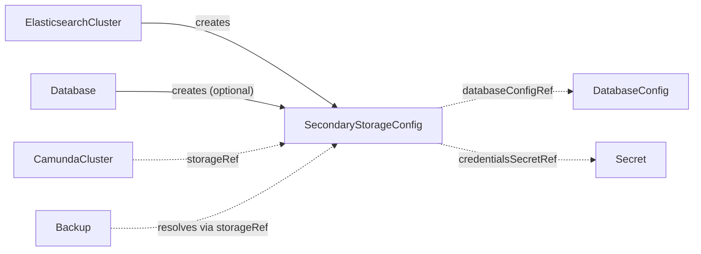

# SecondaryStorageConfig

`SecondaryStorageConfig` is the contract CRD that tells an orchestration cluster where its secondary storage lives — an Elasticsearch cluster or a relational database — and how to authenticate against it.

## Purpose

Camunda stores queryable workflow, decision, and task data in secondary storage, and the orchestration cluster needs connection details and credentials for whichever backend you run.
This namespaced contract CRD carries exactly that data, decoupling the controller that provisions the backend from the controllers that consume it, as described in the [architecture](../architecture.md).
It lives in the consuming cluster's namespace: consumers resolve it by name in their own namespace, and a producer such as [ElasticsearchCluster](elasticsearchcluster.md) creates it next to itself with a normal owner reference.

| Role | Who |
| --- | --- |
| Producers | [ElasticsearchCluster](elasticsearchcluster.md) (always, via its `secondaryStorageConfig` output name), [Database](database.md) (optionally, as a `rdbms`-type contract), a composition layer above, or you, by hand |
| Consumers | [CamundaCluster](camundacluster.md) (via `storageRef`), and the backup and restore controllers (Backup, [LogicalRestore](logicalrestore.md), [PointInTimeRestore](pointintimerestore.md)), which resolve it through the cluster's `storageRef` |

!!! note "Scope note"
    Camunda 8.9 itself also accepts `opensearch` and `none` as secondary-storage types; this contract models only the backends the operator integrates with (`elasticsearch` and `rdbms`).

## How it works

The contract has a lightweight validation-only controller: it never provisions anything, it only checks that the contract is usable and reports the result as conditions.

1. The operator watches every `SecondaryStorageConfig` and the Secrets and CRs it references, and re-runs validation whenever any of them change.
2. For `type: elasticsearch`, it checks that the Secret named by `credentialsSecretRef` exists and contains the configured `usernameKey` and `passwordKey`, and — when `caSecretRef` is set — that its Secret exists and contains the configured `key`.
3. For `type: rdbms`, it checks that the [DatabaseConfig](databaseconfig.md) named by `rdbms.databaseConfigRef` exists in this contract's own namespace.
4. It sets the `Ready` condition: `Healthy` when all checks pass, `MissingSecret` or `InvalidReference` otherwise.

Consumers read the contract by name and never care who produced it: an `ElasticsearchCluster` refreshing generated credentials, a `Database` wiring up an RDBMS backend, and a manifest you applied by hand all look identical to a consuming controller.

!!! note "Security posture: Secret references cross namespaces"
    `credentialsSecretRef` and `caSecretRef` carry an explicit namespace and may name a Secret in any namespace, and the validation controller reports precise existence and missing-key messages in status.
    Anyone permitted to create or update this kind can therefore learn whether an arbitrary Secret exists and which keys it lacks — an accepted existence oracle, unchanged from when the contract was cluster-scoped.
    Now that the kind is namespaced, namespace-level editors (not only cluster operators) may hold that permission; RBAC on this kind is the mitigation, so grant write access to it deliberately.



## API reference

```yaml
apiVersion: core.camunda.io/v1
kind: SecondaryStorageConfig
# Namespaced: consumers resolve this contract by name in their own namespace.
metadata:
  name: my-storage-config
  namespace: my-cluster-ns
spec:
  # string enum: elasticsearch | rdbms. Required. Which secondary storage backend this contract describes.
  type: elasticsearch
  # object. Required when type is elasticsearch, forbidden otherwise. Elasticsearch connection details.
  elasticsearch:
    # string. Required. HTTP(S) endpoint of the Elasticsearch cluster.
    endpoint: "https://my-cluster-es:9200"
    # object. Required. Basic-auth user with read/write access to the Camunda indices.
    credentialsSecretRef:
      # string. Required. Name of the Secret holding the credentials.
      name: my-cluster-es-credentials
      # string. Required. Namespace of the Secret (always explicit; it never defaults to this CR's namespace).
      namespace: my-cluster-ns
      # string. Required. Key in the Secret holding the plaintext username.
      usernameKey: username
      # string. Required. Key in the Secret holding the plaintext password.
      passwordKey: password
    # object. Optional. CA bundle consumers use to verify the endpoint's TLS certificate; set it when the endpoint serves a certificate not signed by a well-known CA, such as the self-signed certificate of an ECK-managed cluster.
    caSecretRef:
      # string. Required. Name of the Secret holding the CA bundle.
      name: my-cluster-es-http-certs-public
      # string. Required. Namespace of the Secret (always explicit; it never defaults to this CR's namespace).
      namespace: my-cluster-ns
      # string. Required. Key in the Secret holding the CA bundle.
      key: ca.crt
    # string. Optional. Name of the snapshot repository, registered in this Elasticsearch, that backups write to. An ElasticsearchCluster with a snapshotStorageRef fills this field once it has registered the repository, never before. Fill it by hand for an Elasticsearch this operator does not manage, after registering the repository yourself. A cluster that takes backups needs it.
    snapshotRepository: my-cluster-es
  # object. Required when type is rdbms, forbidden otherwise. Relational database backend details.
  rdbms:
    # string. Required. Name of the DatabaseConfig, in this contract's own namespace, describing the logical database to use.
    databaseConfigRef: my-camunda-db
```

## Status

| Type | Reason | Meaning |
| --- | --- | --- |
| `Ready` | `Healthy` | All referenced Secrets and CRs exist and have the required keys. |
| `Ready` | `MissingSecret` | A Secret named by `credentialsSecretRef` or `caSecretRef` is missing or lacks the configured keys. |
| `Ready` | `InvalidReference` | The `DatabaseConfig` named by `rdbms.databaseConfigRef` does not exist in this contract's namespace. |

The operator records the last reconciled generation in `status.observedGeneration`.

## Validation

- `spec.type` must be `elasticsearch` or `rdbms`.
- Exactly the block matching `spec.type` must be set: `elasticsearch` requires `spec.elasticsearch` and forbids `spec.rdbms`, and vice versa.
- `spec.elasticsearch.endpoint` must be a valid `http` or `https` URL.
- `spec.elasticsearch.caSecretRef` may only be set when the endpoint is `https` — a CA bundle is meaningless for a plaintext endpoint.

## Relationships

- [DatabaseConfig](databaseconfig.md) — referenced via `spec.rdbms.databaseConfigRef` when `type` is `rdbms`; resolved in this contract's own namespace.
- [ElasticsearchCluster](elasticsearchcluster.md) — creates and refreshes this contract, named by its `secondaryStorageConfig` output field.
- [Database](database.md) — optionally creates a `rdbms`-type contract wired to the [DatabaseConfig](databaseconfig.md) it produces.
- [CamundaCluster](camundacluster.md) — consumes this contract via `storageRef`.
- Backup, [LogicalRestore](logicalrestore.md), [PointInTimeRestore](pointintimerestore.md) — resolve this contract through the target cluster's `storageRef`.

See the [CRD overview](index.md) for where this contract sits in the reconciler dependency graph.

## Examples

A minimal manifest for an Elasticsearch backend:

```yaml
apiVersion: core.camunda.io/v1
kind: SecondaryStorageConfig
metadata:
  name: my-storage-config
  namespace: my-cluster-ns
spec:
  type: elasticsearch
  elasticsearch:
    endpoint: "https://my-cluster-es:9200"
    credentialsSecretRef:
      name: my-cluster-es-credentials
      namespace: my-cluster-ns
      usernameKey: username
      passwordKey: password
```

A realistic manifest for an ECK-managed Elasticsearch cluster serving its default self-signed certificate, carrying the CA bundle for TLS verification:

```yaml
apiVersion: core.camunda.io/v1
kind: SecondaryStorageConfig
metadata:
  name: my-storage-config
  namespace: my-cluster-ns
spec:
  type: elasticsearch
  elasticsearch:
    endpoint: "https://my-cluster-es-http.my-cluster-ns.svc:9200"
    credentialsSecretRef:
      name: my-cluster-es-user
      namespace: my-cluster-ns
      usernameKey: username
      passwordKey: password
    caSecretRef:
      name: my-cluster-es-http-certs-public
      namespace: my-cluster-ns
      key: ca.crt
```

A realistic manifest for an RDBMS backend, pointing at a [DatabaseConfig](databaseconfig.md) produced by a `Database`:

```yaml
apiVersion: core.camunda.io/v1
kind: SecondaryStorageConfig
metadata:
  name: my-storage-config
  namespace: my-cluster-ns
spec:
  type: rdbms
  rdbms:
    databaseConfigRef: my-camunda-db
```
