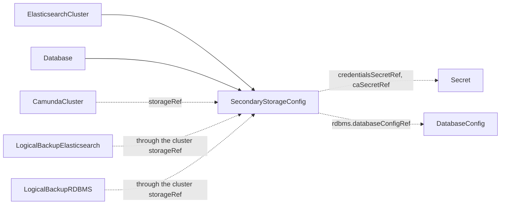

# SecondaryStorageConfig

`SecondaryStorageConfig` is a namespaced contract kind that tells an orchestration cluster where its secondary storage is and how to authenticate. An `ElasticsearchCluster` or a `Database` creates it, or you create it by hand.

Camunda stores workflow, decision, and task data in secondary storage. The orchestration cluster needs the connection details and the credentials of that backend. This kind carries them, so the thing that provisions the backend and the thing that uses it do not need to know each other. The operator only validates the contract and reports the result on `Ready`. It never provisions anything from it.

The contract lives in the namespace of the consuming cluster. A `CamundaCluster` finds it by name in its own namespace.

| Role | Who |
| --- | --- |
| Producers | [ElasticsearchCluster](elasticsearchcluster.md) (always, named by its `secondaryStorageConfig` field), [Database](database.md) (when its `secondaryStorageConfig` field is set, as a `rdbms` contract), or you, by hand |
| Consumers | [CamundaCluster](camundacluster.md) (through `storageRef`, one cluster per contract, see [Secondary storage](camundacluster.md#secondary-storage)), [LogicalBackupElasticsearch](logicalbackupelasticsearch.md) and [LogicalBackupRDBMS](logicalbackuprdbms.md) (through the `storageRef` of the cluster they back up) |

This contract models the two backends the operator integrates with: `elasticsearch` and `rdbms`.

## The claim

One `CamundaCluster` holds one contract. The first cluster to name the contract in `spec.storageRef` claims it. The operator marks the claim with the annotations `camunda.io/claim-holder` and `camunda.io/claim-holder-uid`, and keeps them through an apply of the contract by its producer.

To move the contract to another cluster by hand, remove both annotations. The next cluster that names the contract claims it.

The contract is the unit of the claim, not the endpoint or the database it names. Give one contract to one backend, so two contracts never point the operator at data that one cluster already owns.

The smallest contract for an Elasticsearch backend names the endpoint and the credentials:

```yaml
apiVersion: core.camunda.io/v1
kind: SecondaryStorageConfig
metadata:
  name: my-storage-config
  namespace: my-cluster-ns
spec:
  type: elasticsearch
  elasticsearch:
    endpoint: "https://my-cluster-es:9200"
    credentialsSecretRef:
      name: my-cluster-es-credentials
      namespace: my-cluster-ns
      usernameKey: username
      passwordKey: password
```



## Validation checks

The operator creates no resources from this kind. It validates the contract and writes the result to `status`.

- For `type: elasticsearch`, the operator makes sure that the Secret in `credentialsSecretRef` exists and holds `usernameKey` and `passwordKey`. If `caSecretRef` is set, it makes sure that this Secret exists and holds `key`.
- For `type: rdbms`, the operator makes sure that the [DatabaseConfig](databaseconfig.md) named in `rdbms.databaseConfigRef` exists in the same namespace as the contract.

If a Secret or a key is missing, `Ready` is `False` with reason `MissingSecret`. If the `DatabaseConfig` is missing, `Ready` is `False` with reason `InvalidReference`. The message names the missing object.

When you edit the contract, a referenced Secret, or the referenced `DatabaseConfig`, the operator validates the contract again. Consumers read the contract by name and do not care who produced it.

> **Note:** A Secret reference can name any namespace, and the status message says whether it exists. Grant write access to this kind with care.

## Status

| Type | Reason | Meaning | What to do |
| --- | --- | --- | --- |
| `Ready` | `Healthy` | All referenced Secrets and kinds exist and hold the required keys. | Nothing. |
| `Ready` | `MissingSecret` | A Secret named by `credentialsSecretRef` or `caSecretRef` is missing, or it lacks a configured key. | Create the Secret, or add the key. The message names the Secret and the key. |
| `Ready` | `InvalidReference` | The `DatabaseConfig` named by `rdbms.databaseConfigRef` does not exist in the namespace of the contract. | Create the `DatabaseConfig`, or fix the name. |

`status.observedGeneration` is the last generation of the contract that the operator validated.

## Spec reference

Every field, with its type, whether it is required, and its default:

```yaml
apiVersion: core.camunda.io/v1
kind: SecondaryStorageConfig
metadata:
  name: my-storage-config
  namespace: my-cluster-ns
spec:
  # string enum: elasticsearch | rdbms. Required. The secondary storage backend this contract describes.
  type: elasticsearch
  # object. Required when type is elasticsearch, forbidden otherwise. Elasticsearch connection details.
  elasticsearch:
    # string. Required. HTTP or HTTPS endpoint of the Elasticsearch cluster.
    endpoint: "https://my-cluster-es:9200"
    # object. Required. Basic-auth user with read and write access to the Camunda indices.
    credentialsSecretRef:
      # string. Required. Name of the Secret that holds the credentials.
      name: my-cluster-es-credentials
      # string. Required. Namespace of the Secret. It never defaults to the namespace of this contract.
      namespace: my-cluster-ns
      # string. Required. Key in the Secret that holds the username.
      usernameKey: username
      # string. Required. Key in the Secret that holds the password.
      passwordKey: password
    # object. Optional. CA bundle that consumers use to verify the TLS certificate of the endpoint. Set it when the certificate is not signed by a well-known CA, for example the self-signed certificate of an ECK cluster.
    caSecretRef:
      # string. Required. Name of the Secret that holds the CA bundle.
      name: my-cluster-es-http-certs-public
      # string. Required. Namespace of the Secret. It never defaults to the namespace of this contract.
      namespace: my-cluster-ns
      # string. Required. Key in the Secret that holds the CA bundle.
      key: ca.crt
    # string. Optional. Name of the snapshot repository, registered in this Elasticsearch cluster, that backups write to. An ElasticsearchCluster with a snapshotStorageRef fills it. Set it by hand for an Elasticsearch cluster the operator does not manage. A cluster that takes backups needs it.
    snapshotRepository: my-cluster-es
  # object. Required when type is rdbms, forbidden otherwise. Relational database backend details.
  rdbms:
    # string. Required. Name of the DatabaseConfig, in the namespace of this contract, that describes the logical database.
    databaseConfigRef: my-camunda-db
```

### Validation rules

- `spec.type` must be `elasticsearch` or `rdbms`.
- Exactly the block that matches `spec.type` must be set. `elasticsearch` requires `spec.elasticsearch` and forbids `spec.rdbms`. `rdbms` requires `spec.rdbms` and forbids `spec.elasticsearch`.
- `spec.elasticsearch.endpoint` must be a valid `http` or `https` URL.
- `spec.elasticsearch.caSecretRef` is only valid when the endpoint is `https`.
- `spec.elasticsearch.snapshotRepository` must match `^[a-zA-Z0-9][a-zA-Z0-9._-]*$` and must be at most 253 characters.
- `spec.rdbms.databaseConfigRef` must not be empty.
- No field is immutable.

### An ECK cluster with a self-signed certificate

A manifest for an ECK cluster with a self-signed certificate and a registered snapshot repository:

```yaml
apiVersion: core.camunda.io/v1
kind: SecondaryStorageConfig
metadata:
  name: my-storage-config
  namespace: my-cluster-ns
spec:
  type: elasticsearch
  elasticsearch:
    endpoint: "https://my-cluster-es-http.my-cluster-ns.svc:9200"
    credentialsSecretRef:
      name: my-cluster-es-user
      namespace: my-cluster-ns
      usernameKey: username
      passwordKey: password
    caSecretRef:
      name: my-cluster-es-http-certs-public
      namespace: my-cluster-ns
      key: ca.crt
    snapshotRepository: my-cluster-es
```

### A relational database backend

A manifest for a relational database backend that points to a `DatabaseConfig`:

```yaml
apiVersion: core.camunda.io/v1
kind: SecondaryStorageConfig
metadata:
  name: my-storage-config
  namespace: my-cluster-ns
spec:
  type: rdbms
  rdbms:
    databaseConfigRef: my-camunda-db
```

## Related

- [DatabaseConfig](databaseconfig.md): the logical database a `rdbms` contract points to through `spec.rdbms.databaseConfigRef`.
- [ElasticsearchCluster](elasticsearchcluster.md): creates and refreshes an `elasticsearch` contract, named by its `secondaryStorageConfig` field.
- [Database](database.md): creates a `rdbms` contract when its `secondaryStorageConfig` field is set.
- [CamundaCluster](camundacluster.md): consumes this contract through `storageRef`.
- [LogicalBackupElasticsearch](logicalbackupelasticsearch.md) and [LogicalBackupRDBMS](logicalbackuprdbms.md): find this contract through the `storageRef` of the cluster they back up.
- [Secondary storage guide](../guides/secondary-storage.md): how to set up Elasticsearch or a relational database for a cluster.
- [Backup guide](../guides/backup.md): how `snapshotRepository` takes part in a backup.
- [Getting started](../getting-started.md): the order in which you create the resources.
