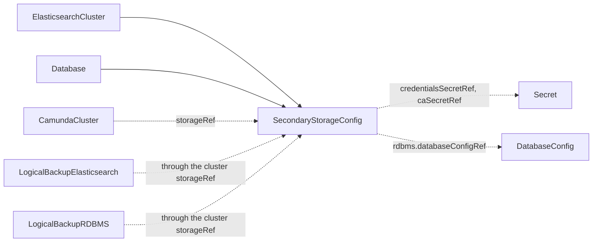

# SecondaryStorageConfig

`SecondaryStorageConfig` is a namespaced [contract](index.md#contracts) kind that tells an orchestration cluster where its secondary storage is and how to authenticate. An `ElasticsearchCluster` or a `Database` creates it, or you create it by hand.

The orchestration cluster needs the connection details and the credentials of its secondary storage. This kind carries them, so the producer of the backend and the cluster that uses it do not need to know each other. The operator provisions nothing from it. It checks the references and reports the result on `Ready`.

The contract lives in the namespace of the consuming cluster. A `CamundaCluster` finds it by name in its own namespace.

| Role | Who |
| --- | --- |
| Producers | [ElasticsearchCluster](elasticsearchcluster.md) (always, named by its `secondaryStorageConfig` field), [Database](database.md) (when its `secondaryStorageConfig` field is set, as a `rdbms` contract), or you, by hand |
| Consumers | [CamundaCluster](camundacluster.md) through `spec.storageRef`. [CamundaOptimize](camundaoptimize.md), and the backup and restore kinds, read the contract of their cluster. |

The two backends are `elasticsearch` and `rdbms`.

## One cluster per backend

One `CamundaCluster` writes one backend. The operator claims the address that the contract resolves to, not the contract. Two contracts that resolve to one address are one backend, in any namespace. A deleted contract does not free the backend for another cluster. [Secondary storage](camundacluster.md#secondary-storage) of the cluster reference has the rule in full, and the reasons a cluster reports on `Ready` for its backend.

The smallest contract for an Elasticsearch backend names the endpoint and the credentials:

```yaml
apiVersion: core.camunda.io/v1
kind: SecondaryStorageConfig
metadata:
  name: my-storage-config
  namespace: my-cluster-ns
spec:
  type: elasticsearch
  elasticsearch:
    endpoint: "https://my-cluster-es:9200"
    credentialsSecretRef:
      name: my-cluster-es-credentials
      usernameKey: username
      passwordKey: password
```

## Node count

`elasticsearch.nodeCount` is the number of data nodes of the Elasticsearch cluster. A consumer that sets no index replica count of its own takes its count from it. One node gives 0 replicas. Two or more nodes give 1 replica. A one-node Elasticsearch then keeps green health while Camunda writes to it.

An [ElasticsearchCluster](elasticsearchcluster.md) fills `nodeCount` from its `replicas`. For an Elasticsearch that you run yourself, set it by hand:

```yaml
apiVersion: core.camunda.io/v1
kind: SecondaryStorageConfig
metadata:
  name: my-storage-config
  namespace: my-cluster-ns
spec:
  type: elasticsearch
  elasticsearch:
    endpoint: "https://my-cluster-es:9200"
    credentialsSecretRef:
      name: my-cluster-es-credentials
    nodeCount: 1
```

Without `nodeCount`, each consumer keeps the default of its Camunda application. The consumers are [CamundaCluster](camundacluster.md#index-replicas) and [CamundaOptimize](camundaoptimize.md#index-replicas), and each one can set its own count.


```mermaid
graph LR
    ESC[ElasticsearchCluster] --> SSC[SecondaryStorageConfig]
    DB[Database] --> SSC
    SSC -.->|credentialsSecretRef, caSecretRef| SEC[Secret]
    SSC -.->|rdbms.databaseConfigRef| DBC[DatabaseConfig]
    CC[CamundaCluster] -.->|storageRef| SSC
    LBE[LogicalBackupElasticsearch] -.->|through the cluster storageRef| SSC
    LBR[LogicalBackupRDBMS] -.->|through the cluster storageRef| SSC
```

## Validation checks

- For `type: elasticsearch`, the operator makes sure that the Secret in `credentialsSecretRef` exists and holds `usernameKey` and `passwordKey`. If `caSecretRef` is set, it makes sure that this Secret exists and holds `key`. Both Secrets must be in the namespace of the contract.
- For `type: rdbms`, the operator makes sure that the [DatabaseConfig](databaseconfig.md) named in `rdbms.databaseConfigRef` exists in the namespace of the contract.

The operator checks again when you edit the contract, a referenced Secret, or the referenced `DatabaseConfig`.

The operator does not connect to the Elasticsearch endpoint. A wrong or unreachable endpoint still gives `Ready` `True`. The Camunda pods then do not become ready, and the [CamundaCluster](camundacluster.md#status) reports it on its own `Ready` condition.

A change of the spec, `nodeCount` included, restarts the pods of every `CamundaCluster` that uses the contract.

## Deletion

Deleting the contract removes nothing from the backend. A `CamundaCluster` that references it reports `Ready` `False` with reason `InvalidReference`, and its running workloads stay.

## Status

`kubectl get secondarystorageconfig` shows `Ready`, its reason, the storage type, and the age.

| Type | Reason | Meaning | What to do |
| --- | --- | --- | --- |
| `Ready` | `Healthy` | All referenced Secrets and kinds exist and hold the required keys. | Nothing. |
| `Ready` | `MissingSecret` | A Secret named by `credentialsSecretRef` or `caSecretRef` is missing, or it lacks a configured key. | Create the Secret, or add the key. The message names the Secret and the key. |
| `Ready` | `InvalidReference` | The `DatabaseConfig` named by `rdbms.databaseConfigRef` does not exist in the namespace of the contract. | Create the `DatabaseConfig`, or fix the name. |

A missing Secret reads:

```yaml
status:
  conditions:
    - type: Ready
      status: "False"
      reason: MissingSecret
      message: Secret my-cluster-ns/my-cluster-es-credentials not found
```

`status.observedGeneration` is the last generation of the contract that the operator validated.

## Spec reference

Every field, with its type, whether it is required, and its default:

```yaml
apiVersion: core.camunda.io/v1
kind: SecondaryStorageConfig
metadata:
  name: my-storage-config
  namespace: my-cluster-ns
spec:
  # string enum: elasticsearch | rdbms. Required. The secondary storage backend this contract describes.
  type: elasticsearch
  # object. Required when type is elasticsearch, forbidden otherwise. Elasticsearch connection details.
  elasticsearch:
    # string. Required. HTTP or HTTPS endpoint of the Elasticsearch cluster.
    endpoint: "https://my-cluster-es:9200"
    # object. Required. Basic-auth user with read and write access to the Camunda indices.
    credentialsSecretRef:
      # string. Required. Name of the Secret that holds the credentials.
      name: my-cluster-es-credentials
      # string. Optional, default: username. Key in the Secret that holds the username.
      usernameKey: username
      # string. Optional, default: password. Key in the Secret that holds the password.
      passwordKey: password
    # object. Optional. CA bundle that consumers use to verify the TLS certificate of the endpoint. Set it when the certificate is not signed by a well-known CA, for example the self-signed certificate of an ECK cluster.
    caSecretRef:
      # string. Required. Name of the Secret that holds the CA bundle.
      name: my-cluster-es-es-http-certs-public
      # string. Required. Key in the Secret that holds the CA bundle.
      key: ca.crt
    # string. Optional. Name of the snapshot repository, registered in this Elasticsearch cluster, that backups write to. An ElasticsearchCluster with a snapshotStorageRef fills it. Set it by hand for an Elasticsearch cluster the operator does not manage. A cluster that takes backups needs it.
    snapshotRepository: my-cluster-ns.my-cluster-es
    # integer. Optional, minimum 1. Number of data nodes of the Elasticsearch cluster. An ElasticsearchCluster fills it. Consumers take their default index replica count from it: 0 on one node, 1 on more.
    nodeCount: 3
  # object. Required when type is rdbms, forbidden otherwise. Relational database backend details.
  rdbms:
    # string. Required. Name of the DatabaseConfig, in the namespace of this contract, that describes the logical database.
    databaseConfigRef: my-camunda-db
```

### Validation rules

- `spec.type` must be `elasticsearch` or `rdbms`.
- Exactly the block that matches `spec.type` must be set. `elasticsearch` requires `spec.elasticsearch` and forbids `spec.rdbms`. `rdbms` requires `spec.rdbms` and forbids `spec.elasticsearch`.
- `spec.elasticsearch.endpoint` must be a valid `http` or `https` URL.
- `spec.elasticsearch.caSecretRef` is only valid when the endpoint is `https`.
- `spec.elasticsearch.nodeCount` must be at least 1.
- `spec.elasticsearch.snapshotRepository` must match `^[a-zA-Z0-9][a-zA-Z0-9._-]*$` and must be at most 253 characters.
- `spec.rdbms.databaseConfigRef` must not be empty.
- No field is immutable.

### An ECK cluster with a self-signed certificate

A manifest for an ECK cluster with a self-signed certificate and a registered snapshot repository. The names are the ones that an `ElasticsearchCluster` named `my-cluster-es` publishes:

```yaml
apiVersion: core.camunda.io/v1
kind: SecondaryStorageConfig
metadata:
  name: my-storage-config
  namespace: my-cluster-ns
spec:
  type: elasticsearch
  elasticsearch:
    endpoint: "https://my-cluster-es-es-http.my-cluster-ns.svc:9200"
    credentialsSecretRef:
      name: my-cluster-es-es-user
      usernameKey: username
      passwordKey: password
    caSecretRef:
      name: my-cluster-es-es-http-certs-public
      key: ca.crt
    snapshotRepository: my-cluster-ns.my-cluster-es
```

### A relational database backend

A manifest for a relational database backend that points to a `DatabaseConfig`:

```yaml
apiVersion: core.camunda.io/v1
kind: SecondaryStorageConfig
metadata:
  name: my-storage-config
  namespace: my-cluster-ns
spec:
  type: rdbms
  rdbms:
    databaseConfigRef: my-camunda-db
```

## Related

- [DatabaseConfig](databaseconfig.md): the logical database a `rdbms` contract points to through `spec.rdbms.databaseConfigRef`.
- [ElasticsearchCluster](elasticsearchcluster.md): creates and refreshes an `elasticsearch` contract, named by its `secondaryStorageConfig` field.
- [Database](database.md): creates a `rdbms` contract when its `secondaryStorageConfig` field is set.
- [CamundaCluster](camundacluster.md): consumes this contract through `storageRef`.
- [LogicalBackupElasticsearch](logicalbackupelasticsearch.md) and [LogicalBackupRDBMS](logicalbackuprdbms.md): find this contract through the `storageRef` of the cluster they back up.
- [Secondary storage guide](../guides/secondary-storage.md): how to set up Elasticsearch or a relational database for a cluster.
- [Backup guide](../guides/backup.md): how `snapshotRepository` takes part in a backup.
- [Getting started](../getting-started.md): the order in which you create the resources.
