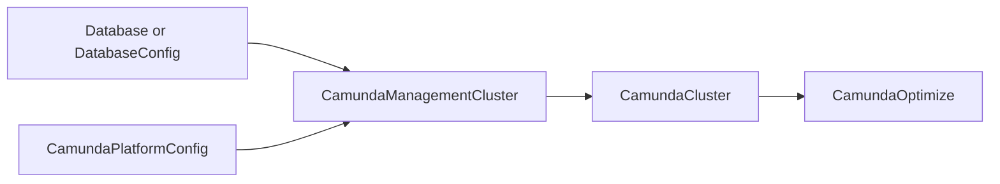

# Management plane

Console, Web Modeler, and Optimize are not part of an orchestration cluster. They sign in against Management Identity, which is its own identity system. Camunda explains the split in [Management Identity](https://docs.camunda.io/docs/self-managed/components/management-identity/overview/).

This guide brings one management plane up, from the databases to the first sign-in. It uses a [CamundaManagementCluster](../crds/camundamanagementcluster.md), which is the resource that runs Management Identity, Console, and Web Modeler, and that writes the contract Optimize reads.

Read the [CamundaManagementCluster](../crds/camundamanagementcluster.md) page for every field. This page is the order to do things in.

## Before you start

You need:

- The operator installed. See [Installation](../installation.md).
- A PostgreSQL server, described by a [DatabaseServerConfig](../crds/databaseserverconfig.md). The management plane needs one logical database per component.
- The [Keycloak Operator](https://www.keycloak.org/operator/installation), if you want the operator to run Keycloak for you. Install the Keycloak Operator release that matches the Keycloak `version` you set in [step 3a](#step-3a-the-operator-runs-keycloak), which stays below 26.7.0. If you run your own Keycloak, or your own OIDC provider, skip it.
- A way to route traffic from outside the Kubernetes cluster to a Service. The operator creates no Ingress.

## The order of creation



The operator checks every reference after the resources exist, not when you apply them, so you can create the resources in any order. The order above is the one where nothing waits.

## Step 1: The databases

Management Identity, Web Modeler, and Keycloak each own every table of the database they open. Give each one a database of its own. Two components that name one [DatabaseConfig](../crds/databaseconfig.md) report `Ready=False` with reason `InvalidReference`.

Let the operator create them with a [Database](../crds/database.md), one per component:

```yaml
apiVersion: core.camunda.io/v1
kind: Database
metadata:
  name: my-identity-db
  namespace: my-management-ns
spec:
  serverRef: "my-db-server"
  databaseName: "identity"
```

Repeat it for `my-keycloak-db` and `my-web-modeler-db`, with a `databaseName` of its own each time. Each `Database` publishes a `DatabaseConfig` of the same name in its own namespace, and that name is what the `CamundaManagementCluster` references. The `DatabaseServerConfig` that `serverRef` names lives in the management namespace too.

Set no `secondaryStorageConfig` on these three. That field is for a database an orchestration cluster stores its data in.

To use databases that already exist, write the three [DatabaseConfig](../crds/databaseconfig.md) resources by hand instead.

## Step 2: The platform configuration

The [CamundaPlatformConfig](../crds/camundaplatformconfig.md) carries the license and the image settings of the whole environment. One resource serves the orchestration clusters and the management plane alike.

```yaml
apiVersion: core.camunda.io/v1
kind: CamundaPlatformConfig
metadata:
  name: my-platform-config
spec:
  auth:
    method: basic
  licenseSecretRef:
    name: "my-camunda-license"
    namespace: "camunda-system"
    key: "license-key"
```

The `auth` block above says how the **orchestration** clusters authenticate. It is a separate choice from how the management plane authenticates. Both are free: a basic-auth orchestration cluster and a management plane on Keycloak work together, and Web Modeler still deploys to that cluster.

A management plane in the `oidc` mode is the one case that constrains this block. It reads its clients from the platform config it names, so that config must set `spec.auth.method: oidc`. It does not have to be the same platform config the orchestration clusters use. Every resource names its own through `platformConfigRef`, so a second `CamundaPlatformConfig` for the management plane leaves the clusters on basic authentication. [Step 3c](#step-3c-your-own-oidc-provider) covers the mode.

## Step 3: The CamundaManagementCluster

Pick one of the three identity provider modes below. Everything else on the resource is the same.

### Step 3a: The operator runs Keycloak

Use this when you want a self-contained platform. The operator creates a Keycloak for the Keycloak Operator to run, and Management Identity creates the realm, every client, and the first user in it. With Management Identity 8.9, set a `version` below `26.7.0`. See [The operator runs Keycloak](../crds/camundamanagementcluster.md#the-operator-runs-keycloak) for why.

```yaml
apiVersion: core.camunda.io/v1
kind: CamundaManagementCluster
metadata:
  name: my-management
  namespace: my-management-ns
spec:
  platformConfigRef: "my-platform-config"
  clusterSelector: {}
  identityProvider:
    keycloak:
      version: "26.6.4"
      externalUrl: "https://camunda.example.com/auth"
      databaseConfigRef: "my-keycloak-db"
  identity:
    version: "8.9.0"
    externalUrl: "https://identity.camunda.example.com"
    databaseConfigRef: "my-identity-db"
    admin:
      username: "admin"
      email: "admin@example.com"
  console:
    version: "8.9.0"
    externalUrl: "https://console.camunda.example.com"
```

Two things about this manifest are easy to miss:

1. `identityProvider.keycloak.externalUrl` must carry the `/auth` path. Camunda publishes its Keycloak build under that path, and every token names this URL as its issuer.
2. `clusterSelector: {}` selects every `CamundaCluster` of the Kubernetes cluster. An unset selector selects none. See [Step 4](#step-4-the-orchestration-clusters).

Route the four URLs to the Service in front of each component: `my-management-keycloak-service` for `/auth`, `my-management-identity`, `my-management-console`, and later the Optimize webapp. The Keycloak Operator creates the first of those Services, and this operator creates the rest.

Wait for the resource:

```bash
kubectl wait --for=condition=Ready --timeout=10m \
  camundamanagementcluster/my-management -n my-management-ns
```

Then read the password of the first user:

```bash
kubectl get secret my-management-identity-admin -n my-management-ns \
  -o jsonpath='{.data.password}' | base64 -d
```

Sign in to Management Identity at `https://identity.camunda.example.com` with `admin` and that password.

The operator generates one more Secret in this mode, `my-management-optimize-client`. It holds the client secret that Management Identity gives to the Optimize client. You read it only to rotate it. See [The generated Secrets](../crds/camundamanagementcluster.md#the-generated-secrets).

> **Caution:** Do not delete `my-management-identity-admin` to rotate that password. Management Identity sets it on the Keycloak user once, on its first start, and never reads it again. A deleted Secret comes back with a new password that the Keycloak user does not hold. To rotate the password, change it in Keycloak.

### Step 3b: You run Keycloak

Use this when your organization already runs Keycloak. Management Identity still creates the realm, the clients, and the first user in it, so it needs an administrator of that Keycloak.

Create the Secret with those credentials first:

```bash
kubectl create secret generic my-keycloak-admin -n my-management-ns \
  --from-literal=username=admin --from-literal=password='<the password>'
```

Then name it:

```yaml
apiVersion: core.camunda.io/v1
kind: CamundaManagementCluster
metadata:
  name: my-management
  namespace: my-management-ns
spec:
  platformConfigRef: "my-platform-config"
  clusterSelector: {}
  identityProvider:
    externalKeycloak:
      url: "https://keycloak.example.com/auth"
      realm: "camunda-platform"
      adminCredentialsSecretRef:
        name: "my-keycloak-admin"
        usernameKey: "username"
        passwordKey: "password"
  identity:
    version: "8.9.0"
    externalUrl: "https://identity.camunda.example.com"
    databaseConfigRef: "my-identity-db"
    admin:
      username: "admin"
      email: "admin@example.com"
```

One URL serves browsers and containers alike here, so `url` must resolve from inside the Kubernetes cluster as well as from a browser. Keycloak keeps no database reference on this resource, because you run it.

The rest reads the same as [Step 3a](#step-3a-the-operator-runs-keycloak): the first user, its generated password, and the same caution about the Secret.

### Step 3c: Your own OIDC provider

Use this when you already run an identity provider, for example Microsoft Entra ID, Okta, or a central Keycloak that you administer yourself. Nothing is created for you.

First register one application per component at your provider. Camunda lists which is confidential and which is public in [Connect Management Identity to an identity provider](https://docs.camunda.io/docs/self-managed/components/management-identity/configuration/connect-to-an-oidc-provider/), and it names the redirect URI of each one under [component-specific configuration](https://docs.camunda.io/docs/self-managed/components/management-identity/configuration/connect-to-an-oidc-provider/#component-specific-configuration).

Register the applications of the components you deploy: Management Identity and Optimize always, Console when you deploy Console, and two for Web Modeler when you deploy Web Modeler.

Then name them on the platform config:

```yaml
apiVersion: core.camunda.io/v1
kind: CamundaPlatformConfig
metadata:
  name: my-platform-config
spec:
  auth:
    method: oidc
    oidc:
      issuerUrl: "https://login.example.com/realms/camunda"
      authUrl: "https://login.example.com/realms/camunda/protocol/openid-connect/auth"
      tokenUrl: "https://login.example.com/realms/camunda/protocol/openid-connect/token"
      jwksUrl: "https://login.example.com/realms/camunda/protocol/openid-connect/certs"
      clientId: "camunda-orchestration"
      clientSecretRef:
        name: "my-oidc-credentials"
        namespace: "camunda-system"
        key: "client-secret"
      management:
        clients:
          identity:
            clientId: "camunda-identity"
            clientSecretRef:
              name: "my-management-identity-credentials"
              namespace: "camunda-system"
              key: "client-secret"
          optimize:
            clientId: "camunda-optimize"
            clientSecretRef:
              name: "my-optimize-credentials"
              namespace: "camunda-system"
              key: "client-secret"
          console:
            clientId: "camunda-console"
  # ... the rest of your platform config
```

`authUrl`, `tokenUrl`, and `jwksUrl` are optional for an orchestration cluster, which reads them from the discovery document of your provider. The management plane needs all three. Read them from the discovery document at `https://<your provider>/.well-known/openid-configuration` and set them here.

`console` carries no `clientSecretRef` above, and `identity` and `optimize` do. Console runs in a browser, so its application is a public client and holds no secret. Web Modeler has one of each: a public client for the user interface and a confidential one for the API behind it.

Then point the `CamundaManagementCluster` at that provider:

```yaml
apiVersion: core.camunda.io/v1
kind: CamundaManagementCluster
metadata:
  name: my-management
  namespace: my-management-ns
spec:
  platformConfigRef: "my-platform-config"
  clusterSelector: {}
  identityProvider:
    oidc: {}
  identity:
    version: "8.9.0"
    externalUrl: "https://identity.camunda.example.com"
    databaseConfigRef: "my-identity-db"
    admin:
      claimName: "oid"
      claimValue: "8f1c...e2"
  console:
    version: "8.9.0"
    externalUrl: "https://console.camunda.example.com"
```

`spec.externalUrl` on a `CamundaOptimize` has no effect in this mode. The platform config declares the Optimize client, and you registered its redirect URIs at your provider.

`spec.identity.admin` names a token claim instead of a user. Sign in to your provider once and decode the access token. Then read the value of the claim you want to use. Camunda explains how in [JWT token claims](https://docs.camunda.io/docs/self-managed/deployment/helm/configure/authentication-and-authorization/jwt-token-claims/).

Get this pair right the first time. Management Identity reads it on its first start only and stores the result in its database. A later change has no effect, and the operator says so with `IdentityReady` and the reason `ImmutableAfterStart`:

```yaml
status:
  conditions:
    - type: IdentityReady
      status: "False"
      reason: ImmutableAfterStart
      message: 'Management Identity started with the administrator claim "oid=8f1c...e2" and stores it in its database; spec.identity.admin now asks for "oid=41ab...77", which only a change in the database can do'
```

If it happens anyway, the operator cannot correct it for you. Two ways out are open.

The first works while the recorded claim belongs to a real person. Put the recorded value back on `spec.identity.admin`. Sign in as that person, and grant the rest in the Management Identity user interface.

The second is for a claim that nobody holds. The operator records the claim that Management Identity started with, and renders that recorded value from then on. Put the claim you want on the annotation that carries it:

```bash
kubectl annotate --overwrite camundamanagementcluster my-management -n my-management-ns \
  camunda.io/identity-initial-claim=oid=41ab...77
```

The operator renders what the annotation records, so that claim reaches Management Identity on its next start. Set the annotation to the pair that `spec.identity.admin` names, and the condition clears. Management Identity itself reads the claim on its first start only, so the administrator in its own database has to change as well. Camunda names the values in [OIDC configuration](https://docs.camunda.io/docs/self-managed/components/management-identity/miscellaneous/configuration-variables/#oidc-configuration).

An empty database does the same. Point `spec.identity.databaseConfigRef` at one, and Management Identity starts over. It then loses the roles and the tenants it held, and your provider keeps every user.

### Step 3d: Web Modeler

Web Modeler is optional. Add this block to the manifest of your mode before you apply it, or to the resource later. The operator treats both the same. Web Modeler needs a database of its own (`my-web-modeler-db` from step 1) and an SMTP server. It does not start without either.

```yaml
apiVersion: core.camunda.io/v1
kind: CamundaManagementCluster
metadata:
  name: my-management
  namespace: my-management-ns
spec:
  webModeler:
    version: "8.9.0"
    externalUrl: "https://modeler.camunda.example.com"
    websocketsExternalUrl: "https://modeler.camunda.example.com/ws"
    databaseConfigRef: "my-web-modeler-db"
    mail:
      smtpHost: "smtp.example.com"
      fromAddress: "noreply@example.com"
      credentialsSecretRef:
        name: "my-smtp-credentials"
        usernameKey: "username"
        passwordKey: "password"
  # ... the rest of your management cluster
```

Route both URLs. `externalUrl` goes to `my-management-web-modeler-restapi` and `websocketsExternalUrl` to `my-management-web-modeler-websockets`. A browser opens both.

The mode examples above set `identity.admin.email` already. Web Modeler is the reason: in the two Keycloak modes it needs an address for every person who signs in. In these two modes the API server refuses a `spec.webModeler` block without that address.

In the `oidc` mode, Web Modeler needs two clients on the platform config: `webModeler` for the user interface, and `webModelerApi` for the API behind it. Declare both before you deploy it. See [The clients of the management plane](../crds/camundaplatformconfig.md#the-clients-of-the-management-plane).

## Step 4: The orchestration clusters

`spec.clusterSelector` decides which clusters Console lists and Web Modeler deploys to. It reaches every namespace of the Kubernetes cluster, which is why creating a `CamundaManagementCluster` is a platform-administrator action.

The selector follows the Kubernetes convention: unset selects no cluster, `{}` selects every cluster, and terms select the clusters whose labels match. `spec.namespaceSelector` narrows the search to the namespaces whose labels match; unset or `{}` puts no bound on the namespace. See [Clusters](../crds/camundamanagementcluster.md#clusters).

```yaml
apiVersion: core.camunda.io/v1
kind: CamundaManagementCluster
metadata:
  name: my-management
  namespace: my-management-ns
spec:
  clusterSelector:
    matchLabels:
      environment: "production"
  # ... the rest of your management cluster
```

Label the clusters you want served:

```bash
kubectl label camundacluster my-cluster -n my-cluster-ns environment=production
```

`status.clusters` then reports one row per selected cluster:

```yaml
status:
  clusters:
    - name: my-cluster
      namespace: my-cluster-ns
      attached: true
    - name: my-other-cluster
      namespace: my-other-ns
      attached: false
      reason: NotReady
      message: The cluster publishes no gateway endpoints yet
```

A cluster is attached once it publishes `status.gateway`. Every cluster publishes that block unless `spec.suspend` is true, so a suspended cluster stays `NotReady`.

An OIDC cluster must also validate the tokens of the identity provider that this management plane signs people in to. Console and Web Modeler call the cluster with the token of the person who is signed in. A cluster whose platform config names another issuer stays `attached: false` with the reason `InvalidReference`, and the message names both issuers. Set `spec.auth.oidc.issuerUrl` on the platform config of that cluster to the issuer of the management plane. [Clusters](../crds/camundamanagementcluster.md#an-oidc-cluster-must-name-the-same-issuer) names that issuer for each identity provider mode.

One cluster answers to one management plane. A cluster that another one already serves stays `ClaimedElsewhere`, and the message names the holder. To move it, take it out of the selector of the management plane that holds it. The claim is withdrawn, and the next management plane that selects the cluster takes it.

A cluster the operator attached carries the annotation `camunda.io/management-cluster`. While the management plane sets `spec.console`, it also carries four `CAMUNDA_CONSOLE_PING_*` entries in `spec.extraEnv`. The entries are what makes it appear in Console. See [Management plane](../crds/camundacluster.md#management-plane) on the cluster page.

### Deploy from Web Modeler

The deploy dialog of Web Modeler lists every attached cluster. How it authenticates follows the cluster:

- An OIDC cluster takes the token of the person who is signed in.
- A basic-auth cluster asks that person for a user name and a password.

For a basic-auth cluster the operator creates the user `web-modeler` on that cluster. That user holds the permissions that deploying and starting a process needs. Read its password from the management namespace:

```bash
kubectl get secret -n my-management-ns \
  -l camunda.io/component=web-modeler-cluster-user,camunda.io/cluster=my-cluster,camunda.io/cluster-namespace=my-cluster-ns \
  -o jsonpath='{range .items[*]}{.metadata.name}{"\t"}{.data.password}{"\n"}{end}'
```

The two cluster labels select the Secret of one cluster by its name and namespace. Drop them from the selector to list them all.

Decode a password with `base64 -d` and give it to the people who deploy from Web Modeler. They type `web-modeler` and that password in the deploy dialog, so nobody needs the administrator of the orchestration cluster.

Each of those Secrets also carries the key `applied`, which means that the cluster holds the user under that password. A Secret without `applied` holds a password that never reached the cluster.

## Step 5: Optimize

[CamundaOptimize](../crds/camundaoptimize.md) is a resource of its own, in the namespace of the cluster it reports on. It reads the contract that the management plane wrote:

```yaml
apiVersion: core.camunda.io/v1
kind: CamundaOptimize
metadata:
  name: my-cluster-optimize
  namespace: my-cluster-ns
spec:
  version: "8.9.0"
  managementAuthRef: "my-management"
  externalUrl: "https://optimize.camunda.example.com"
  clusterRef:
    name: my-cluster
```

`managementAuthRef` names the [ManagementAuthConfig](../crds/managementauthconfig.md), which is cluster-scoped. Its name is the name of the `CamundaManagementCluster`, unless `spec.managementAuthConfigName` on that resource gave it another:

```yaml
apiVersion: core.camunda.io/v1
kind: CamundaManagementCluster
metadata:
  name: my-management
  namespace: my-management-ns
spec:
  managementAuthConfigName: "my-management-auth"
  # ... the rest of your management cluster
```

If a `ManagementAuthConfig` of the default name already exists, set this field. Read the name in use:

```bash
kubectl get camundamanagementcluster my-management -n my-management-ns \
  -o jsonpath='{.status.managementAuthConfig}'
```

`externalUrl` is the URL a browser signs in at. Route it to the `my-cluster-optimize-webapp` Service.

In the two Keycloak modes the management plane registers the login callback under that URL, and it does so for every `CamundaOptimize` behind it. Read what it registered on the `CamundaManagementCluster`:

```yaml
status:
  optimize:
    - namespace: my-cluster-ns
      name: my-cluster-optimize
      externalUrl: "https://optimize.camunda.example.com"
  conditions:
    - type: OptimizeCallbacksReady
      status: "True"
      reason: Healthy
      message: Client "optimize" of realm "camunda-platform" carries the login callback of every Optimize (1)
```

In the `oidc` mode the field has no effect. Register the callback at your provider yourself.

## Check the result

```bash
kubectl get camundamanagementcluster -A
```

```
NAMESPACE          NAME            READY   REASON    AGE
my-management-ns   my-management   True    Healthy   12m
```

`Ready=True` with reason `Healthy` means every component is up and the contract is written. Any other reason has a row in [Status](../crds/camundamanagementcluster.md#status) that says what to do.

For a component that is not up, read its own condition:

```bash
kubectl get camundamanagementcluster my-management -n my-management-ns \
  -o jsonpath='{range .status.conditions[*]}{.type}{"\t"}{.status}{"\t"}{.reason}{"\t"}{.message}{"\n"}{end}'
```

## Change the management plane later

- **Add or remove Console or Web Modeler.** Add or remove `spec.console` or `spec.webModeler`. There is no field that turns a component on. Removing the block removes the workloads, and the condition of that component reads `Disabled`.
- **Serve another cluster.** Change `spec.clusterSelector`, or label the cluster. A cluster that leaves the selector loses the annotation and the Console settings by itself.
- **Rotate the Optimize client secret.** In the two Keycloak modes, delete `my-management-optimize-client`. The operator generates a new value and rolls the pods that read it. In the `oidc` mode, rotate the secret at your provider and update the Secret the platform config names.
- **Take the management plane down for maintenance.** Set `spec.suspend: true`. Every workload goes to zero, Keycloak included. The contract, the annotation on each served cluster, and the Console settings stay, so nothing else has to change. `Ready` reads `True` with reason `Suspended`. Nobody can sign in to Console, Web Modeler, or Optimize while the management plane is down, because all three authenticate through Management Identity. The orchestration clusters run on.
- **Upgrade a component.** Raise `identity.version`, `console.version`, `webModeler.version`, or `identityProvider.keycloak.version`. Each component carries its own version, so each one rolls on its own. The Keycloak Operator rolls Keycloak. In the two Keycloak modes, an upgrade keeps the realm, its clients, and its users.
- **Move to another identity provider.** Change `spec.identityProvider`. The workloads roll into the new mode. The first administrator does not move with them: Management Identity keeps the one it started with, in its database.

## Related

- [CamundaManagementCluster](../crds/camundamanagementcluster.md): every field, condition, and generated Secret.
- [CamundaPlatformConfig](../crds/camundaplatformconfig.md): the clients of the management plane and the image settings.
- [ManagementAuthConfig](../crds/managementauthconfig.md): the contract that Optimize reads.
- [CamundaOptimize](../crds/camundaoptimize.md): Optimize for one orchestration cluster.
- [Authentication guide](authentication.md): how an orchestration cluster authenticates, which is a separate choice.
- [Getting started](../getting-started.md): the first orchestration cluster.
