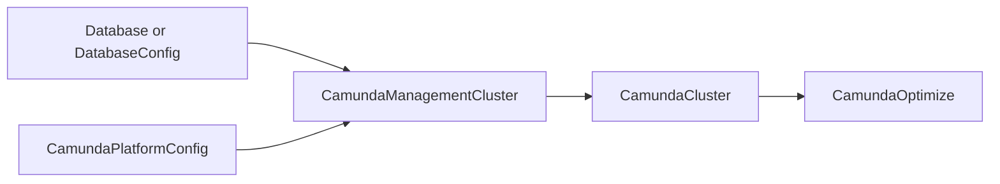

# Management plane

Console, Web Modeler, and Optimize are not part of an orchestration cluster. They sign in through Management Identity, which is a separate identity system. Camunda explains the split in [Management Identity](https://docs.camunda.io/docs/self-managed/components/management-identity/overview/).

This guide brings one management plane up, from the databases to the first sign-in. To try a management plane on a local kind cluster first, follow [Getting started with the management plane](../getting-started-management-plane.md). It takes one path, with port forwards instead of an Ingress. The management plane is a [CamundaManagementCluster](../crds/camundamanagementcluster.md). It runs Management Identity, Console, and Web Modeler, and it writes the contract that Optimize reads. The [CamundaManagementCluster](../crds/camundamanagementcluster.md) page describes every field and condition. This page gives the order of the steps.

## Before you start

You need:

- The operator installed. See [Installation](../installation.md).
- A PostgreSQL server, described by a [DatabaseServerConfig](../crds/databaseserverconfig.md). The management plane needs one logical database per component.
- The [Keycloak Operator](https://www.keycloak.org/operator/installation), if the operator runs Keycloak for you ([step 3a](#step-3a-the-operator-runs-keycloak)). Install the release that matches the Keycloak `version` you set, below 26.7.0. If you run your own Keycloak or your own OIDC provider, you do not need it.
- A way to route traffic from outside the Kubernetes cluster to a Service. The operator creates no Ingress.

## The order of creation


```mermaid
graph LR
    DB["Database or DatabaseConfig"] --> MC[CamundaManagementCluster]
    PFC[CamundaPlatformConfig] --> MC
    MC --> CC[CamundaCluster]
    CC --> OPT[CamundaOptimize]
```

You can create these resources in any order. A resource that names a missing resource reports it on `Ready` until that resource exists. The order above is the one where nothing waits.

Two complete sets of manifests follow this order and are ready to apply: [`config/example/camunda-management-cluster/keycloak`](https://github.com/konsole-is/camunda-operator/tree/<version>/config/example/camunda-management-cluster/keycloak) for step 3a, and [`config/example/camunda-management-cluster/oidc`](https://github.com/konsole-is/camunda-operator/tree/<version>/config/example/camunda-management-cluster/oidc) for step 3c.

## Step 1: The databases

Management Identity, Web Modeler, and Keycloak each need a database of their own. Two components that name one [DatabaseConfig](../crds/databaseconfig.md) report `Ready=False` with reason `InvalidReference`.

Let the operator create them with a [Database](../crds/database.md), one per component:

```yaml
apiVersion: core.camunda.io/v1
kind: Database
metadata:
  name: my-identity-db
  namespace: my-management-ns
spec:
  serverRef: "my-db-server"
  databaseName: "identity"
```

Repeat it for `my-keycloak-db` and `my-web-modeler-db`, each with a different `databaseName`. Each `Database` creates a `DatabaseConfig` of the same name in its namespace, and the `CamundaManagementCluster` references that name. The `DatabaseServerConfig` that `serverRef` names is in the management namespace too. Do not set `secondaryStorageConfig` on these three.

To use databases that already exist, write the three [DatabaseConfig](../crds/databaseconfig.md) resources by hand instead.

## Step 2: The platform configuration

The [CamundaPlatformConfig](../crds/camundaplatformconfig.md) carries the license and the image settings of the whole environment. One resource can serve the orchestration clusters and the management plane.

```yaml
apiVersion: core.camunda.io/v1
kind: CamundaPlatformConfig
metadata:
  name: my-platform-config
spec:
  auth:
    method: basic
  licenseSecretRef:
    name: "my-camunda-license"
    namespace: "camunda-system"
    key: "license-key"
```

The `auth` block sets how the **orchestration** clusters authenticate. This is a separate choice from the identity provider of the management plane. For example, a basic-auth orchestration cluster works with a management plane on Keycloak, and Web Modeler deploys to that cluster.

Only the `oidc` mode of the management plane needs a platform config with `spec.auth.method: oidc`. That platform config can be a second `CamundaPlatformConfig`, so the orchestration clusters can stay on basic authentication. [Step 3c](#step-3c-your-own-oidc-provider) covers the mode.

## Step 3: The CamundaManagementCluster

Select one of the three identity provider modes below. The rest of the resource is the same in all three.

### Step 3a: The operator runs Keycloak

Use this mode for a self-contained platform. The operator creates a Keycloak for the Keycloak Operator to run. Management Identity creates the realm, every client, and the first user in it. With Management Identity 8.9, set a `version` below `26.7.0`. See [The operator runs Keycloak](../crds/camundamanagementcluster.md#the-operator-runs-keycloak).

```yaml
apiVersion: core.camunda.io/v1
kind: CamundaManagementCluster
metadata:
  name: my-management
  namespace: my-management-ns
spec:
  platformConfigRef: "my-platform-config"
  clusterSelector: {}
  identityProvider:
    keycloak:
      version: "26.6.4"
      externalUrl: "https://camunda.example.com/auth"
      databaseConfigRef: "my-keycloak-db"
  identity:
    version: "8.9.0"
    externalUrl: "https://identity.camunda.example.com"
    databaseConfigRef: "my-identity-db"
    admin:
      username: "admin"
      email: "admin@example.com"
  console:
    version: "8.9.0"
    externalUrl: "https://console.camunda.example.com"
```

Two things about this manifest are easy to miss:

1. The path of `identityProvider.keycloak.externalUrl` must be exactly `/auth`. Every token names this URL as its issuer.
2. `clusterSelector: {}` selects every `CamundaCluster` of the Kubernetes cluster. An unset selector selects none. See [Step 4](#step-4-the-orchestration-clusters).

Route each URL to its Service:

| URL | Service and port |
| --- | --- |
| `https://camunda.example.com/auth` | `my-management-keycloak-service`, port 8080 |
| `https://identity.camunda.example.com` | `my-management-identity`, port 80 |
| `https://console.camunda.example.com` | `my-management-console`, port 80 |

Wait for the resource:

```bash
kubectl wait --for=condition=Ready --timeout=10m \
  camundamanagementcluster/my-management -n my-management-ns
```

Then read the password of the first user:

```bash
kubectl get secret my-management-identity-admin -n my-management-ns \
  -o jsonpath='{.data.password}' | base64 -d
```

Sign in to Management Identity at `https://identity.camunda.example.com` with `admin` and that password. To rotate this password, change it in Keycloak. Do not delete the Secret. See [The generated Secrets](../crds/camundamanagementcluster.md#the-generated-secrets).

### Step 3b: You run Keycloak

Use this mode when your organization already runs Keycloak. Management Identity still creates the realm, the clients, and the first user, so it needs an administrator of that Keycloak. Give every management plane a realm of its own. See [One realm answers to one management plane](../crds/camundamanagementcluster.md#one-realm-answers-to-one-management-plane).

Create the Secret with the administrator credentials first:

```bash
kubectl create secret generic my-keycloak-admin -n my-management-ns \
  --from-literal=username=admin --from-literal=password='<the password>'
```

Then name it:

```yaml
apiVersion: core.camunda.io/v1
kind: CamundaManagementCluster
metadata:
  name: my-management
  namespace: my-management-ns
spec:
  platformConfigRef: "my-platform-config"
  clusterSelector: {}
  identityProvider:
    externalKeycloak:
      url: "https://keycloak.example.com/auth"
      realm: "camunda-platform"
      adminCredentialsSecretRef:
        name: "my-keycloak-admin"
        usernameKey: "username"
        passwordKey: "password"
  identity:
    version: "8.9.0"
    externalUrl: "https://identity.camunda.example.com"
    databaseConfigRef: "my-identity-db"
    admin:
      username: "admin"
      email: "admin@example.com"
```

`url` must resolve from a browser and from inside the Kubernetes cluster. If your Keycloak uses a certificate from your own authority, also set `caBundleSecretRef`. See [Trust of an https Keycloak](../crds/camundamanagementcluster.md#trust-of-an-https-keycloak).

The first user and its password work as in [Step 3a](#step-3a-the-operator-runs-keycloak).

### Step 3c: Your own OIDC provider

Use this mode when you already run an identity provider. Examples are Microsoft Entra ID, Okta, and a central Keycloak that you administer. The operator creates no client and no user.

First register one application per component at your provider. Camunda lists which is confidential and which is public in [Connect Management Identity to an identity provider](https://docs.camunda.io/docs/self-managed/components/management-identity/configuration/connect-to-an-oidc-provider/). It gives the redirect URI of each one under [component-specific configuration](https://docs.camunda.io/docs/self-managed/components/management-identity/configuration/connect-to-an-oidc-provider/#component-specific-configuration).

Register the applications of the components you deploy:

- Management Identity and Optimize, always.
- Console, when you deploy Console.
- Two for Web Modeler, when you deploy Web Modeler.

Then name them on the platform config:

```yaml
apiVersion: core.camunda.io/v1
kind: CamundaPlatformConfig
metadata:
  name: my-platform-config
spec:
  auth:
    method: oidc
    oidc:
      issuerUrl: "https://login.example.com/realms/camunda"
      authUrl: "https://login.example.com/realms/camunda/protocol/openid-connect/auth"
      tokenUrl: "https://login.example.com/realms/camunda/protocol/openid-connect/token"
      jwksUrl: "https://login.example.com/realms/camunda/protocol/openid-connect/certs"
      clientId: "camunda-orchestration"
      clientSecretRef:
        name: "my-oidc-credentials"
        namespace: "camunda-system"
        key: "client-secret"
      management:
        clients:
          identity:
            clientId: "camunda-identity"
            clientSecretRef:
              name: "my-management-identity-credentials"
              namespace: "camunda-system"
              key: "client-secret"
          optimize:
            clientId: "camunda-optimize"
            clientSecretRef:
              name: "my-optimize-credentials"
              namespace: "camunda-system"
              key: "client-secret"
          console:
            clientId: "camunda-console"
  # ... the rest of your platform config
```

The management plane needs `authUrl`, `tokenUrl`, and `jwksUrl`. Copy them from the discovery document at `https://<your provider>/.well-known/openid-configuration`.

Console is a public client, so it has no `clientSecretRef`. Management Identity and Optimize are confidential clients.

Then point the `CamundaManagementCluster` at that provider:

```yaml
apiVersion: core.camunda.io/v1
kind: CamundaManagementCluster
metadata:
  name: my-management
  namespace: my-management-ns
spec:
  platformConfigRef: "my-platform-config"
  clusterSelector: {}
  identityProvider:
    oidc: {}
  identity:
    version: "8.9.0"
    externalUrl: "https://identity.camunda.example.com"
    databaseConfigRef: "my-identity-db"
    admin:
      claimName: "oid"
      claimValue: "8f1c...e2"
  console:
    version: "8.9.0"
    externalUrl: "https://console.camunda.example.com"
```

`spec.identity.admin` names a token claim instead of a user. Sign in to your provider once and decode the access token. Then read the value of the claim that you want to use. Camunda explains how in [JWT token claims](https://docs.camunda.io/docs/self-managed/deployment/helm/configure/authentication-and-authorization/jwt-token-claims/).

Set the correct claim before the first start. Management Identity reads it on its first start only, and a later change has no effect. If you must change it, see [The first administrator](../crds/camundamanagementcluster.md#the-first-administrator).

### Step 3d: Web Modeler

Web Modeler is optional. Add this block to the manifest of your mode before you apply it, or to the resource later. Web Modeler needs a database of its own (`my-web-modeler-db` from step 1) and an SMTP server.

```yaml
apiVersion: core.camunda.io/v1
kind: CamundaManagementCluster
metadata:
  name: my-management
  namespace: my-management-ns
spec:
  webModeler:
    version: "8.9.0"
    externalUrl: "https://modeler.camunda.example.com"
    websocketsExternalUrl: "https://modeler.camunda.example.com/ws"
    databaseConfigRef: "my-web-modeler-db"
    mail:
      smtpHost: "smtp.example.com"
      fromAddress: "noreply@example.com"
      credentialsSecretRef:
        name: "my-smtp-credentials"
        usernameKey: "username"
        passwordKey: "password"
  # ... the rest of your management cluster
```

Route `externalUrl` to `my-management-web-modeler-restapi` and `websocketsExternalUrl` to `my-management-web-modeler-websockets`, both on port 80. A browser opens both.

In the two Keycloak modes, Web Modeler needs an email address for every person who signs in. The API server refuses a `spec.webModeler` block when `identity.admin.email` is not set. The examples above set it.

In the `oidc` mode, declare two more clients on the platform config: `webModeler` for the user interface, and `webModelerApi` for the API behind it. See [The clients of the management plane](../crds/camundaplatformconfig.md#the-clients-of-the-management-plane).

## Step 4: The orchestration clusters

`spec.clusterSelector` selects the clusters that Console lists and Web Modeler deploys to. `spec.namespaceSelector` limits the search to the namespaces whose labels match. See [Clusters](../crds/camundamanagementcluster.md#clusters).

```yaml
apiVersion: core.camunda.io/v1
kind: CamundaManagementCluster
metadata:
  name: my-management
  namespace: my-management-ns
spec:
  clusterSelector:
    matchLabels:
      environment: "production"
  # ... the rest of your management cluster
```

Label the clusters that the management plane serves:

```bash
kubectl label camundacluster my-cluster -n my-cluster-ns environment=production
```

`status.clusters` then reports one row per selected cluster:

```yaml
status:
  clusters:
    - name: my-cluster
      namespace: my-cluster-ns
      attached: true
    - name: my-other-cluster
      namespace: my-other-ns
      attached: false
      reason: NotReady
      message: The cluster publishes no gateway endpoints yet
```

A cluster is attached after it publishes `status.gateway`. A suspended cluster publishes none, so it stays `NotReady`.

An OIDC cluster must also accept the tokens of the management plane. Set `spec.auth.oidc.issuerUrl` on the platform config of that cluster to the issuer of the management plane. Otherwise the row reads `InvalidReference`, and the message names both issuers. [An OIDC cluster must name the same issuer](../crds/camundamanagementcluster.md#an-oidc-cluster-must-name-the-same-issuer) gives that issuer for each mode.

One cluster answers to one management plane. A cluster that another management plane serves reads `ClaimedElsewhere`, and the message names the holder. To move the cluster, remove it from the selector of the holder. The next management plane that selects it then takes it.

An attached cluster appears in Console without a change on your side. See [Console](../crds/camundamanagementcluster.md#console).

### Deploy from Web Modeler

The deploy dialog of Web Modeler lists every attached cluster. An OIDC cluster takes the token of the person who is signed in. A basic-auth cluster asks that person for a user name and a password.

For a basic-auth cluster, the operator creates the user `web-modeler` on that cluster. Read its password from the management namespace:

```bash
kubectl get secret -n my-management-ns \
  -l camunda.io/component=web-modeler-cluster-user,camunda.io/cluster=my-cluster,camunda.io/cluster-namespace=my-cluster-ns \
  -o jsonpath='{.items[0].data.password}' | base64 -d
```

Give the password to the people who deploy from Web Modeler. They type `web-modeler` and that password in the deploy dialog, so nobody needs the administrator of the orchestration cluster. See [Deploy to a cluster](../crds/camundamanagementcluster.md#deploy-to-a-cluster).

## Step 5: Optimize

[CamundaOptimize](../crds/camundaoptimize.md) is a separate resource, in the namespace of the cluster that it reads. It reads the contract that the management plane wrote:

```yaml
apiVersion: core.camunda.io/v1
kind: CamundaOptimize
metadata:
  name: my-cluster-optimize
  namespace: my-cluster-ns
spec:
  version: "8.9.0"
  managementAuthRef: "my-management"
  externalUrl: "https://optimize.camunda.example.com"
  clusterRef:
    name: my-cluster
```

`managementAuthRef` names the [ManagementAuthConfig](../crds/managementauthconfig.md). Its name is the name of the `CamundaManagementCluster`, unless `spec.managementAuthConfigName` sets another. Read the name in use:

```bash
kubectl get camundamanagementcluster my-management -n my-management-ns \
  -o jsonpath='{.status.managementAuthConfig}'
```

`externalUrl` is the URL that a browser signs in at. Route it to the `my-cluster-optimize-webapp` Service, on port 8090.

In the two Keycloak modes, the management plane registers the login callback of that URL in the realm. It also gives the `Optimize` role to the first administrator, so that person can open Optimize at once. The condition `OptimizeCallbacksReady` reads `True` with the reason `NoCallbacks` before any Optimize exists, so wait for the reason `Healthy`:

```bash
kubectl wait camundamanagementcluster/my-management -n my-management-ns \
  --for=jsonpath='{.status.conditions[?(@.type=="OptimizeCallbacksReady")].reason}'=Healthy \
  --timeout=5m
```

In the `oidc` mode, `externalUrl` has no effect. Add `https://optimize.camunda.example.com/api/authentication/callback` to the Optimize application at your provider yourself.

## Check the result

```bash
kubectl get camundamanagementcluster -A
```

```
NAMESPACE          NAME            READY   REASON    AGE
my-management-ns   my-management   True    Healthy   12m
```

`Ready=True` with reason `Healthy` means that every component runs and the contract is written. Every other reason has a row in [Status](../crds/camundamanagementcluster.md#status) that says what to do.

For a component that does not run, read its own condition:

```bash
kubectl get camundamanagementcluster my-management -n my-management-ns \
  -o jsonpath='{range .status.conditions[*]}{.type}{"\t"}{.status}{"\t"}{.reason}{"\t"}{.message}{"\n"}{end}'
```

## Change the management plane later

- **Add or remove Console or Web Modeler.** Add or remove `spec.console` or `spec.webModeler`. When you remove a block, the operator removes its workloads, and its condition reads `Disabled`.
- **Serve another cluster.** Change `spec.clusterSelector`, or label the cluster. A cluster that leaves the selector loses the Console settings and the Web Modeler user.
- **Rotate the Optimize client secret.** In the two Keycloak modes, delete `my-management-optimize-client`. The operator generates a new value and rolls the pods that read it. In the `oidc` mode, rotate the secret at your provider and update the Secret that the platform config names.
- **Stop the management plane for maintenance.** Set `spec.suspend: true`. Every workload goes to zero, and `Ready` reads `True` with reason `Suspended`. Nobody can sign in to Console, Web Modeler, or Optimize until you set it back to `false`. The orchestration clusters continue to run. See [Suspension](../crds/camundamanagementcluster.md#suspension).
- **Upgrade a component.** Increase `identity.version`, `console.version`, `webModeler.version`, or `identityProvider.keycloak.version`. Each component rolls on its own. The realm, its clients, and its users stay.
- **Move to another identity provider.** Change `spec.identityProvider`. The first administrator does not move with it. If the old mode is `externalKeycloak`, keep the old Keycloak and its Secrets until `status.callbackRealm` stops naming the old realm. See [Change the identity provider](../crds/camundamanagementcluster.md#change-the-identity-provider).

## Related

- [CamundaManagementCluster](../crds/camundamanagementcluster.md): every field, condition, and generated Secret.
- [CamundaPlatformConfig](../crds/camundaplatformconfig.md): the clients of the management plane and the image settings.
- [ManagementAuthConfig](../crds/managementauthconfig.md): the contract that Optimize reads.
- [CamundaOptimize](../crds/camundaoptimize.md): Optimize for one orchestration cluster.
- [Authentication guide](authentication.md): how an orchestration cluster authenticates, which is a separate choice.
- [Getting started](../getting-started.md): the first orchestration cluster.
