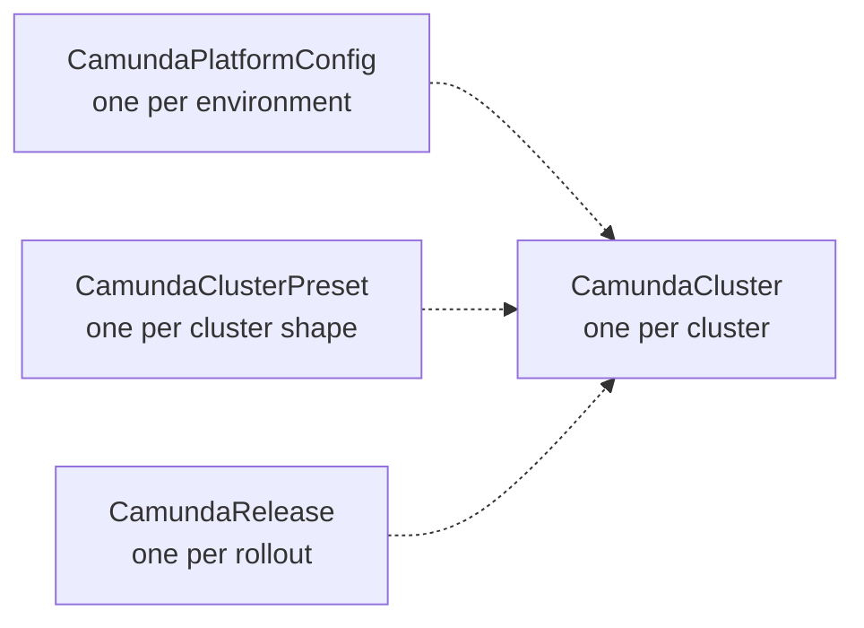

# Presets

A preset is a baseline that many clusters inherit. You write the sizing, the topology, the backup policy, and the authentication defaults once. Each cluster then names the preset and sets only what is its own. What runs on that shape, the versions and the pinned images, lives in a `CamundaRelease`. The result is a small manifest per cluster, one place to change the shape of a fleet, and one place to roll its version.

The operator has two preset kinds:

| Preset | Inherited by | Reference field |
| --- | --- | --- |
| `CamundaClusterPreset` | `CamundaCluster` | `spec.presetRef` |
| `ElasticsearchClusterPreset` | `ElasticsearchCluster` | `spec.presetRef` |

Both are cluster-scoped. No controller reconciles them, and they create nothing. The cluster that references a preset reads it on every reconcile and merges its own spec over `spec.cluster` of the preset.

## The four layers of a Camunda cluster

A `CamundaCluster` gets its configuration from four layers:



| Layer | Holds | Who writes it | How often |
| --- | --- | --- | --- |
| `CamundaPlatformConfig` | The authentication method, the identity provider, the license, the image repositories | The platform team | Once per environment |
| `CamundaClusterPreset` | Sizing, topology, connectors, backup policy, auth defaults, administrators | The platform team | Once per cluster shape, for example `small`, `medium`, `large` |
| `CamundaRelease` | The Camunda and connectors versions, pinned images, the environment a version needs | The platform team | Once per rollout, for example `camunda-8-9-4` |
| `CamundaCluster` | The references, the URL, the storage, and any override | The team that owns the cluster | Once per cluster |

The platform config does not merge. Every cluster that references it gets the same values. The preset merges under the release, and both merge under the cluster, field by field, as the [merge rules](../crds/camundaclusterpreset.md#merge-rules) describe.

## A cluster in a few lines

With a platform config, a preset, and a release in place, a team creates a cluster like this:

```yaml
apiVersion: core.camunda.io/v1
kind: CamundaCluster
metadata:
  name: orders
  namespace: orders
spec:
  presetRef: medium
  releaseRef: camunda-8-9-4
  platformConfigRef: production
  storageRef: orders-storage
  externalUrl: "https://orders.camunda.example.com"
```

The broker count, the partitions, the volumes, the connectors, the backup policy, and the administrators all come from the preset `medium`. The versions come from the release `camunda-8-9-4`. The authentication method and the identity provider come from the platform config `production`.

The fields that a cluster must set itself are the ones that belong to one cluster: `platformConfigRef`, `presetRef`, `releaseRef`, `storageRef`, `backupStorageRef`, `documentStorageRef`, `externalUrl`, `serviceAccount`, `monitoring`, `suspend`, and `pause`. A preset that sets one of them is rejected, and so is a preset that sets `version` or `connectors.version`.

An `ElasticsearchCluster` works the same way. The instance-bound fields are `presetRef`, `secondaryStorageConfig`, and `suspend`:

```yaml
apiVersion: core.camunda.io/v1
kind: ElasticsearchCluster
metadata:
  name: orders-es
  namespace: orders
spec:
  presetRef: standard
  secondaryStorageConfig: orders-storage
```

## Write a preset

Name a preset for the shape it describes, not for a team. A team picks a shape. A preset that carries a team name invites a copy per team, and then a fleet change becomes many changes.

A `CamundaClusterPreset` that defines a medium production cluster, with connectors and administrators:

```yaml
apiVersion: core.camunda.io/v1
kind: CamundaClusterPreset
metadata:
  name: medium
spec:
  cluster:
    zeebe:
      replicas: 3
      partitions: 3
      replicationFactor: 3
      storageClassName: "ssd"
      storageSize: "32Gi"
      resources:
        requests: { cpu: "1", memory: "2Gi" }
        limits: { cpu: "2", memory: "4Gi" }
    gateway:
      mode: Standalone
      replicas: 2
    connectors:
      enabled: true
    backup:
      primaryStorage:
        continuous: true
        schedule: "PT1H"
        retention:
          window: "P7D"
    auth:
      admin:
        mappingRules:
          - id: "platform-admins"
            claimName: "groups"
            claimValue: "camunda-admins"
```

A `CamundaRelease` for the rollout that runs on it:

```yaml
apiVersion: core.camunda.io/v1
kind: CamundaRelease
metadata:
  name: camunda-8-9-4
spec:
  version: "8.9.4"
  connectors:
    version: "8.9.7"
```

An `ElasticsearchClusterPreset` for the storage that goes with it:

```yaml
apiVersion: core.camunda.io/v1
kind: ElasticsearchClusterPreset
metadata:
  name: standard
spec:
  cluster:
    version: "9.2.4"
    replicas: 3
    storageSize: "64Gi"
    storageClassName: "ssd"
    resources:
      requests: { cpu: "1", memory: "2Gi" }
      limits: { memory: "2Gi" }
```

The backup policy of the preset takes effect on a cluster that sets `spec.backupStorageRef`. A cluster without a bucket takes no backups and ignores the policy. See the [backup guide](backup.md).

The [CamundaClusterPreset](../crds/camundaclusterpreset.md) and [ElasticsearchClusterPreset](../crds/elasticsearchclusterpreset.md) pages list every field.

## Override one field

A cluster overrides a field of the preset by setting it. The other fields of the preset stay. A cluster that needs more brokers than `medium` gives, and nothing else:

```yaml
apiVersion: core.camunda.io/v1
kind: CamundaCluster
metadata:
  name: payments
  namespace: payments
spec:
  presetRef: medium
  platformConfigRef: production
  storageRef: payments-storage
  externalUrl: "https://payments.camunda.example.com"
  zeebe:
    replicas: 5
    partitions: 5
```

Most fields merge like this, value by value. A few blocks replace as a whole, because a half-merged block is not a valid configuration: `scheduling`, and `auth.admin`. A cluster that sets `auth.admin` names every administrator again. The [merge rules](../crds/camundaclusterpreset.md#merge-rules) hold the full table.

## Change a fleet

When you edit a preset, every cluster that references it reads the new baseline on its next reconcile. A larger `storageSize` grows the volumes of every cluster in place. A lower `storageSize` is ignored for a running cluster, which keeps its volumes and records the event `StorageShrinkIgnored`.

To roll a fleet to a new version, edit the release. Every cluster that references it rolls its pods, whatever preset sizes it. To roll in steps, create a second release, for example `camunda-8-9-5`, and move clusters to it one at a time by changing `releaseRef`. When every cluster is on the new release, delete the old one.

Every cluster whose brokers run a higher version refuses a lower one. Each one reports `Ready: False` with reason `VersionDowngradeRefused` and keeps the version its brokers run. To lower a fleet on purpose, lower the release first and let every cluster refuse. Then set the annotation `camunda.io/allow-version-downgrade` to the version of the release, on each cluster you want to move. The [CamundaCluster page](../crds/camundacluster.md#version) states the rule.

A cluster that references a preset or a release that does not exist reports `Ready: False` with reason `InvalidReference` and keeps running as it is.

## Related

- [Authentication](authentication.md): the auth defaults and the administrators that a preset carries, with a complete example.
- [Operations](operations.md): how a preset change reaches the pods, and how storage grows.
- [CamundaClusterPreset](../crds/camundaclusterpreset.md): every field and the merge rules.
- [CamundaRelease](../crds/camundarelease.md): the versions, the pinned images, and the environment of a rollout.
- [ElasticsearchClusterPreset](../crds/elasticsearchclusterpreset.md): every field and the merge rules.
