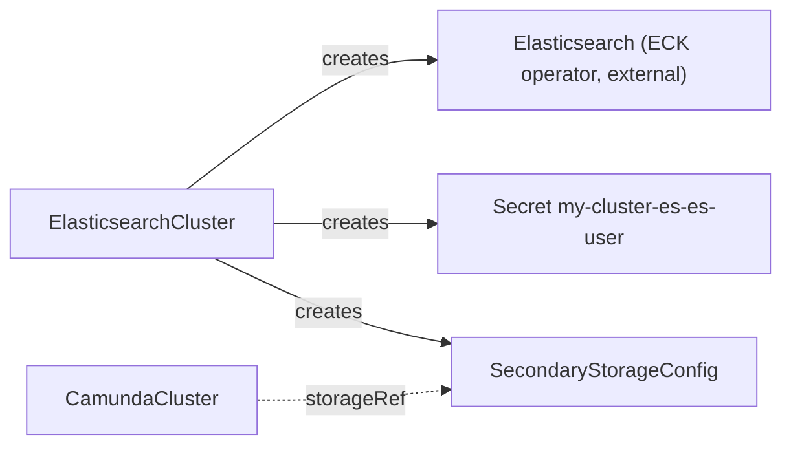
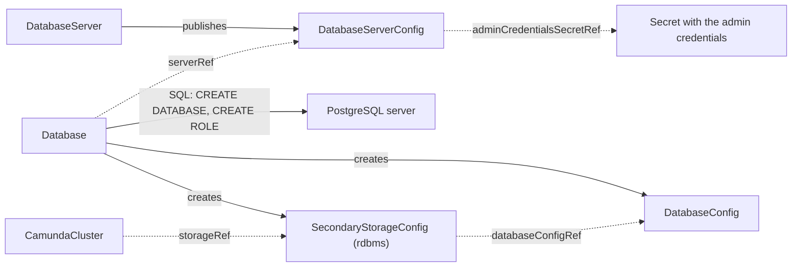

# Secondary storage

Camunda keeps its data in two places. Primary storage is the Zeebe log and state on the broker volumes. Secondary storage holds the exported process, decision, and task data that Operate, Tasklist, and the search API read. The operator supports two secondary storage backends: Elasticsearch and PostgreSQL. It runs Elasticsearch through the ECK operator. It runs PostgreSQL through the CloudNativePG operator, or it prepares a database on a server you run. A `CamundaCluster` never sees the backend. It only references a `SecondaryStorageConfig` by name, through `spec.storageRef`.

This guide tells you which backend to pick, which resources to create for each backend, and in which order.

## Choose a backend

| | Elasticsearch | PostgreSQL |
| --- | --- | --- |
| Who runs the backend | The ECK operator, in your Kubernetes cluster. You install ECK first. | The CloudNativePG operator, or you. See [PostgreSQL](#postgresql). |
| What you create | One `ElasticsearchCluster`. | One `DatabaseServer` and one `Database`, or a `DatabaseServerConfig` for your own server and one `Database`. |
| What the operator creates | The ECK `Elasticsearch` resource, a user Secret, and the `SecondaryStorageConfig`. | A logical database, two SQL roles, two credential Secrets, a `DatabaseConfig`, and the `SecondaryStorageConfig`. With a `DatabaseServer`, the PostgreSQL instances and their archive as well. |
| Camunda 8.9 support | Elasticsearch 8.19+ and 9.2+. | RDBMS secondary storage is available since Camunda 8.9. The operator prepares PostgreSQL servers only. |
| Backup | Elasticsearch snapshots, through [LogicalBackupElasticsearch](../crds/logicalbackupelasticsearch.md). | A `pg_dump` of the database plus a Zeebe backup of primary storage, through [LogicalBackupRDBMS](../crds/logicalbackuprdbms.md). |
| Optimize | Supported. | Not supported. Camunda Optimize needs Elasticsearch or OpenSearch. |
| Not supported by the operator | OpenSearch. The operator does not model it. | Other database engines. `DatabaseServerConfig` accepts `engine: postgres` only. |

If you have no strong reason to pick one, pick Elasticsearch. It is the backend that Camunda benchmarks the most. If your organization already runs PostgreSQL at scale and you do not need Optimize, pick PostgreSQL.

## One cluster per contract

A contract belongs to one `CamundaCluster`. Camunda fixes the index names in Elasticsearch and the tables in a database, so two clusters on one backend write each other's data. Give every cluster its own `ElasticsearchCluster` or its own `Database`, each with its own contract. Two clusters can share one PostgreSQL server, each with its own database.

If a second cluster names a contract that another cluster holds, the operator suspends the second cluster. Its `Ready` condition reads `False` with reason `StorageAlreadyAttached` and names the holder. It resumes on its own when the holder releases the contract. The operator compares contracts, not endpoints: give one contract to one backend. The [CamundaCluster reference](../crds/camundacluster.md#secondary-storage) has the rule in full.

## Elasticsearch

Prerequisite: the ECK operator is installed in the Kubernetes cluster, and the camunda-operator started after the ECK CRDs were installed. The operator does not run Elasticsearch nodes itself. It creates an ECK `Elasticsearch` resource, and ECK runs the nodes.

This chain is ready to apply in [`config/example/camunda-cluster/elasticsearch`](https://github.com/konsole-is/camunda-operator/tree/<version>/config/example/camunda-cluster/elasticsearch).

1. Create an `ElasticsearchCluster`. The sizes below are for trying out. For production, use more nodes and larger volumes.

    ```yaml
    apiVersion: core.camunda.io/v1
    kind: ElasticsearchCluster
    metadata:
      name: my-cluster-es
      namespace: my-cluster-ns
    spec:
      version: "9.2.4"
      replicas: 1
      storageSize: "1Gi"
      resources:
        requests: { cpu: "500m", memory: "1Gi" }
      secondaryStorageConfig: "my-storage-config"
    ```

2. Wait until the `ElasticsearchCluster` is `Ready` with reason `Healthy`.

    ```bash
    kubectl wait elasticsearchcluster/my-cluster-es -n my-cluster-ns --for=condition=Ready --timeout=15m
    ```

    The first start takes some minutes while ECK pulls the image and forms the cluster. When it is done, the status reads:

    ```yaml
    status:
      conditions:
        - type: Ready
          status: "True"
          reason: Healthy
    ```

    If `Ready` stays `False`, read the message of the `Ready` condition with `kubectl get elasticsearchcluster my-cluster-es -n my-cluster-ns -o yaml`.

3. Make sure that the `SecondaryStorageConfig` `my-storage-config` exists in the same namespace and is `Ready` with reason `Healthy`. The operator created it for you.

    ```bash
    kubectl get secondarystorageconfig my-storage-config -n my-cluster-ns
    ```

    ```
    NAME                READY   REASON    TYPE            AGE
    my-storage-config   True    Healthy   elasticsearch   2m
    ```

4. Point the `CamundaCluster` at it with `spec.storageRef: my-storage-config`. The `CamundaCluster` must be in the same namespace as the `SecondaryStorageConfig`, because `storageRef` is a name without a namespace.

    ```yaml
    apiVersion: core.camunda.io/v1
    kind: CamundaCluster
    metadata:
      name: my-cluster
      namespace: my-cluster-ns
    spec:
      version: "8.9.9"
      platformConfigRef: "my-platform-config"
      storageRef: "my-storage-config"
    ```



What the `SecondaryStorageConfig` carries:

- `type: elasticsearch` and the endpoint `https://my-cluster-es-es-http.my-cluster-ns.svc:9200`.
- `credentialsSecretRef` to the Secret `my-cluster-es-es-user` with the keys `username` and `password`. The username is `camunda`. The operator generates the password once. To rotate it, delete the Secret.
- `caSecretRef` to the Secret `my-cluster-es-es-http-certs-public`, key `ca.crt`. ECK creates this Secret with the CA of the self-signed HTTPS certificate. The orchestration cluster uses it to trust the endpoint.
- `snapshotRepository`, only when `spec.snapshotStorageRef` names a backup bucket and the repository is registered. See [Backup](./backup.md).

For all fields, see [ElasticsearchCluster](../crds/elasticsearchcluster.md) and [SecondaryStorageConfig](../crds/secondarystorageconfig.md).

## PostgreSQL

The chain has two halves. The first half is the server, and you get it in one of two ways. The second half is the logical database on that server, and it is the same either way.

[`config/example/camunda-cluster/rdbms`](https://github.com/konsole-is/camunda-operator/tree/<version>/config/example/camunda-cluster/rdbms) is ready to apply. It takes the `DatabaseServer` route, and it holds the `Database`, the platform configuration, and the `CamundaCluster`.

| | A `DatabaseServer` | A server you run |
| --- | --- | --- |
| Who runs PostgreSQL | The CloudNativePG operator, in your Kubernetes cluster. | You. The server can run in the cluster or outside it, for example as a managed service. |
| What you create | One `DatabaseServer`. | One Secret with the admin credentials and one `DatabaseServerConfig`. |
| Admin credentials | CloudNativePG writes them into a Secret. | You write them. |
| Point-in-time restore | `spec.archive` gives the server a continuous archive, and a [PointInTimeRestore](../crds/pointintimerestore.md) rolls the server back for you. | Only if you archive the server yourself and roll it back before you create the restore. |
| Prerequisite | The CloudNativePG operator. An archive also needs the Barman Cloud plugin and cert-manager. | Nothing on the Kubernetes cluster. |

### One server per orchestration cluster

Give every orchestration cluster a PostgreSQL server of its own. Two clusters can share one server with a database each, and the operator allows it. A shared server gives up two things.

A point-in-time restore rolls back the whole server, not one database. Every database on it goes back to the same point. A restore for one cluster therefore erases the recent data of every other cluster on that server. A `PointInTimeRestore` holds in `Pending` while more than one `Database` uses the server. Its `Ready` condition reads `False` with reason `SharedServer`. The hold lifts when one `Database` is left.

Sizing and the PostgreSQL version are shared too. One `DatabaseServer` carries one instance count, one `spec.storageSize`, one `spec.walStorageSize` when it is set, and one PostgreSQL major. Every change reaches every cluster on the server. A larger `spec.storageSize` or `spec.walStorageSize` grows that volume in place, and it needs a StorageClass that allows expansion. New resources or a new image restart the instances, and every cluster on the server sees that restart.

The major cannot change once the server runs. A `spec.version` that names another major is refused: `Ready` reads `False` with reason `VersionChangeRefused`, and the server keeps the major it has. To reach a later major, create a `DatabaseServer` on that version and move the data to it. A [LogicalBackupRDBMS](../crds/logicalbackuprdbms.md) and a [LogicalRestoreRDBMS](../crds/logicalrestorerdbms.md) move the data of one cluster. See [The PostgreSQL version](../crds/databaseserver.md#the-postgresql-version).

A shared server is cheaper, and it fits a fleet of small clusters that never needs a point-in-time restore. Choose it only when you accept both losses above.

### Run the server with a DatabaseServer

Prerequisites: the CloudNativePG operator is installed in the Kubernetes cluster, and the camunda-operator started after its CRDs were installed. An archive also needs the Barman Cloud plugin and cert-manager. See [Installation](../installation.md#install-cloudnativepg-and-the-barman-cloud-plugin).

1. Create a `DatabaseServer`. The sizes below are for production. Leave out `archive` when you do not need a point-in-time restore.

    ```yaml
    apiVersion: core.camunda.io/v1
    kind: DatabaseServer
    metadata:
      name: my-db
      namespace: my-cluster-ns
    spec:
      version: "17"
      instances: 2
      storageSize: "64Gi"
      resources:
        requests: { cpu: "1", memory: "2Gi" }
      databaseServerConfig: my-db-server
      archive:
        objectStorageRef: my-backup-bucket
        retentionPeriodDays: 30
    ```

    `objectStorageRef` names an [ObjectStorageConfig](../crds/objectstorageconfig.md). The [backup guide](./backup.md#the-bucket) creates one.

2. Wait until the `DatabaseServer` is `Ready` with reason `Healthy`.

    ```bash
    kubectl wait databaseserver/my-db -n my-cluster-ns --for=condition=Ready --timeout=15m
    ```

    The first start pulls the PostgreSQL image, bootstraps the instances, and takes the first base backup of the archive. When it is done, the status reads:

    ```yaml
    status:
      cluster: my-db
      systemIdentifier: "7412345678901234567"
      conditions:
        - type: Ready
          status: "True"
          reason: Healthy
    ```

    The server publishes the `DatabaseServerConfig` `my-db-server` in the same namespace, with the host `my-db-rw.my-cluster-ns.svc`, port 5432, and the Secret `my-db-superuser` as its admin credentials. With an archive it also carries `pitr.enabled: true` and `pitr.recovery: operator`.

    [DatabaseServer](../crds/databaseserver.md) covers sizing, the archive, monitoring, presets, and the rollback in full.

3. Continue with [The logical database](#the-logical-database). Use `serverRef: my-db-server`.

### Use a server that you run

Prerequisites: a PostgreSQL server that the operator can reach over the network, and an admin user that can create databases and roles. The steps below use a server at `postgres.my-cluster-ns.svc` on port `5432` and an admin user `postgres`.

1. Create a Secret with the admin credentials in the namespace of the `CamundaCluster`. The `DatabaseServerConfig` names it by name, and reads it from its own namespace.

    ```yaml
    apiVersion: v1
    kind: Secret
    metadata:
      name: my-db-server-admin-credentials
      namespace: my-cluster-ns
    type: Opaque
    stringData:
      username: postgres
      password: change-me
    ```

2. Create a `DatabaseServerConfig` in the namespace of the cluster. It describes the server and names the admin credentials Secret beside it.

    ```yaml
    apiVersion: core.camunda.io/v1
    kind: DatabaseServerConfig
    metadata:
      name: my-db-server
      namespace: my-cluster-ns
    spec:
      engine: postgres
      host: "postgres.my-cluster-ns.svc"
      port: 5432
      adminCredentialsSecretRef:
        name: my-db-server-admin-credentials
    ```

3. Wait until the `DatabaseServerConfig` is `Ready` with reason `Healthy`. The operator connects to the server with the admin credentials, and reports the major version and the identity of the instance:

    ```yaml
    status:
      serverVersion: "17"
      systemIdentifier: "7412345678901234567"
      conditions:
        - type: Ready
          status: "True"
          reason: Healthy
          message: Reached the server; it runs major version 17
    ```

    If the operator cannot reach the server, or the server rejects the credentials, the reason is `ConnectionFailed` and the message names the endpoint and the error:

    ```yaml
    status:
      conditions:
        - type: Ready
          status: "False"
          reason: ConnectionFailed
          message: "Connecting to postgres.my-cluster-ns.svc:5432: failed to connect: password authentication failed for user \"postgres\""
    ```

    If the reason is `MissingSecret`, the Secret or one of its keys does not exist.

### The logical database

Both paths above end with a `DatabaseServerConfig` in the namespace of the cluster. The steps below turn it into secondary storage. They use the contract `my-db-server`.

1. Create a `Database` in the namespace of the `CamundaCluster`. Set `secondaryStorageConfig` to the name of the contract you want. The `Database` resolves `serverRef` in its own namespace. It publishes the `DatabaseConfig` and the `SecondaryStorageConfig` there, where the cluster reads them.

    ```yaml
    apiVersion: core.camunda.io/v1
    kind: Database
    metadata:
      name: my-camunda-db
      namespace: my-cluster-ns
    spec:
      serverRef: "my-db-server"
      databaseName: "camunda"
      secondaryStorageConfig: "my-storage-config"
    ```

2. Wait until the `Database` is `Ready` with reason `Healthy`.

    ```bash
    kubectl wait database/my-camunda-db -n my-cluster-ns --for=condition=Ready --timeout=5m
    ```

    If the reason is `ServerIdentityUnknown`, the `DatabaseServerConfig` has not reached the server yet. Read its `Ready` condition.

3. Make sure that the `DatabaseConfig` `my-camunda-db` and the `SecondaryStorageConfig` `my-storage-config` exist in `my-cluster-ns` and are `Ready` with reason `Healthy`. The `Database` created both. The `SecondaryStorageConfig` has `type: rdbms` and references the `DatabaseConfig`.

    ```bash
    kubectl get databaseconfig,secondarystorageconfig -n my-cluster-ns
    ```

4. Point the `CamundaCluster` at the contract, as in step 4 of the Elasticsearch procedure:

    ```yaml
    apiVersion: core.camunda.io/v1
    kind: CamundaCluster
    metadata:
      name: my-cluster
      namespace: my-cluster-ns
    spec:
      # ... version, platformConfigRef, and the rest of your cluster
      storageRef: my-storage-config
    ```



What the `Database` creates on the server and in the cluster:

- The logical database `camunda`.
- The application role `camunda`. It owns the database. Its credentials are in the Secret `my-camunda-db-credentials` in `my-cluster-ns`, keys `username` and `password`.
- The backup role `camunda_backup`. It can read every table and run a restore. Its credentials are in the Secret `my-camunda-db-backup-credentials`. If you do not want this role, turn it off on the `Database`:

    ```yaml
    spec:
      backupCredentials:
        disabled: true
    ```

- The `DatabaseConfig` `my-camunda-db` in `my-cluster-ns`. It references the server, the database name, and both credential Secrets.
- The `SecondaryStorageConfig` `my-storage-config` in `my-cluster-ns`, with `type: rdbms` and `rdbms.databaseConfigRef: my-camunda-db`.

The operator generates each password once. To rotate one, delete its Secret. The operator sets a new password on the server and publishes it in a new Secret.

> **Note:** Deletion of a `Database` removes the `DatabaseConfig`, the `SecondaryStorageConfig`, and the credential Secrets. It never drops the logical database or the SQL roles. Data removal is a manual act.

For all fields, see [DatabaseServerConfig](../crds/databaseserverconfig.md), [Database](../crds/database.md), [DatabaseConfig](../crds/databaseconfig.md), and [SecondaryStorageConfig](../crds/secondarystorageconfig.md).

## Bring your own backend

If you already run Elasticsearch or a PostgreSQL database that the operator does not manage, write the contracts by hand. The `CamundaCluster` does not know who created them.

The rule of [one cluster per contract](#one-cluster-per-contract) holds for a hand-written contract. Write one contract per backend.

For Elasticsearch, write a `SecondaryStorageConfig` with `type: elasticsearch`. Create the Secret with the username and password first. If the endpoint serves a certificate that the orchestration cluster does not trust by default, name the CA Secret as well.

```yaml
apiVersion: core.camunda.io/v1
kind: SecondaryStorageConfig
metadata:
  name: my-storage-config
  namespace: my-cluster-ns
spec:
  type: elasticsearch
  elasticsearch:
    endpoint: "https://elasticsearch.example.com:9200"
    credentialsSecretRef:
      name: my-elasticsearch-credentials
      usernameKey: username
      passwordKey: password
    # Only when the certificate of the endpoint is not trusted by default.
    caSecretRef:
      name: my-elasticsearch-ca
      key: ca.crt
```

For PostgreSQL, write a `DatabaseServerConfig` for the server, a `DatabaseConfig` for the database, and a `SecondaryStorageConfig` with `type: rdbms`. All three live in the namespace of the cluster. Create the database, the application role, and the credentials Secret on your side first. The `DatabaseServerConfig` still needs admin credentials, because the operator validates it by a connection to the server.

```yaml
apiVersion: core.camunda.io/v1
kind: DatabaseConfig
metadata:
  name: my-camunda-db
  namespace: my-cluster-ns
spec:
  serverRef: my-db-server
  databaseName: camunda
  credentialsSecretRef:
    name: my-camunda-db-credentials
    usernameKey: username
    passwordKey: password
---
apiVersion: core.camunda.io/v1
kind: SecondaryStorageConfig
metadata:
  name: my-storage-config
  namespace: my-cluster-ns
spec:
  type: rdbms
  rdbms:
    databaseConfigRef: my-camunda-db
```

The reference pages list every field: [SecondaryStorageConfig](../crds/secondarystorageconfig.md), [DatabaseConfig](../crds/databaseconfig.md), and [DatabaseServerConfig](../crds/databaseserverconfig.md). A backup of a hand-written Elasticsearch contract needs `elasticsearch.snapshotRepository` set by hand, after you register the repository yourself. A backup of a hand-written `DatabaseConfig` needs `backupCredentialsSecretRef`. The [backup guide](./backup.md) shows both.

## Related

- [Getting started](../getting-started.md): the full path from an empty namespace to a running orchestration cluster.
- [Backup](./backup.md): how backups work on each backend, and which bucket both sides must share.
- [SecondaryStorageConfig](../crds/secondarystorageconfig.md): the contract that a `CamundaCluster` references through `storageRef`.
- [ElasticsearchCluster](../crds/elasticsearchcluster.md): the kind that runs Elasticsearch through ECK and creates the contract.
- [DatabaseServer](../crds/databaseserver.md): the kind that runs PostgreSQL through CloudNativePG, archives it, and creates the contract.
- [DatabaseServerConfig](../crds/databaseserverconfig.md): the contract that describes a PostgreSQL server and its admin credentials.
- [Database](../crds/database.md): the kind that prepares a logical database and creates the contracts.
- [DatabaseConfig](../crds/databaseconfig.md): the contract that describes one logical database and its credentials.
- [CamundaCluster](../crds/camundacluster.md): the orchestration cluster, and the meaning of `storageRef`.
