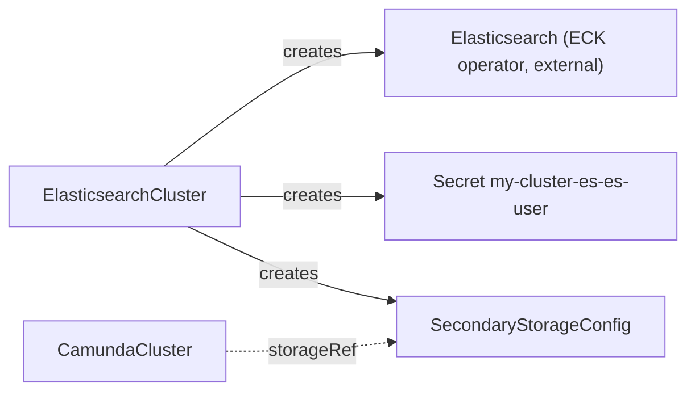
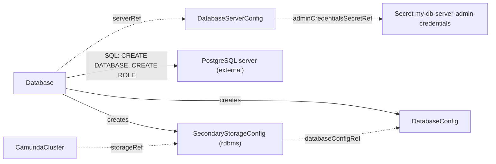

# Secondary storage

Camunda keeps its data in two places. Primary storage is the Zeebe log and state on the broker volumes. Secondary storage holds the exported process, decision, and task data that Operate, Tasklist, and the search API read. The operator supports two secondary storage backends: Elasticsearch, which it runs through the ECK operator, and PostgreSQL, which you run and the operator prepares. A `CamundaCluster` never sees the backend. It only references a `SecondaryStorageConfig` by name, through `spec.storageRef`.

This guide tells you which backend to pick, which resources to create for each backend, and in which order.

## Choose a backend

| | Elasticsearch | PostgreSQL |
| --- | --- | --- |
| Who runs the backend | The ECK operator, in your Kubernetes cluster. You install ECK first. | You. The PostgreSQL server can run in the cluster or outside it, for example as a managed service. |
| What you create | One `ElasticsearchCluster`. | One Secret with the admin credentials, one `DatabaseServerConfig`, and one `Database`. |
| What the operator creates | The ECK `Elasticsearch` resource, a user Secret, and the `SecondaryStorageConfig`. | A logical database, two SQL roles, two credential Secrets, a `DatabaseConfig`, and the `SecondaryStorageConfig`. |
| Camunda 8.9 support | Elasticsearch 8.19+ and 9.2+. | RDBMS secondary storage is available since Camunda 8.9. The operator prepares PostgreSQL servers only. |
| Backup | Elasticsearch snapshots, through [LogicalBackupElasticsearch](../crds/logicalbackupelasticsearch.md). | A `pg_dump` of the database plus a Zeebe backup of primary storage, through [LogicalBackupRDBMS](../crds/logicalbackuprdbms.md). |
| Optimize | Supported. | Not supported. Camunda Optimize needs Elasticsearch or OpenSearch. |
| Not supported by the operator | OpenSearch. The operator does not model it. | Other database engines. `DatabaseServerConfig` accepts `engine: postgres` only. |

If you have no strong reason to pick one, pick Elasticsearch. It is the backend that Camunda benchmarks the most. If your organization already runs PostgreSQL at scale and you do not need Optimize, pick PostgreSQL.

## Elasticsearch

Prerequisite: the ECK operator is installed in the Kubernetes cluster. The operator does not run Elasticsearch nodes itself. It creates an ECK `Elasticsearch` resource, and ECK runs the nodes.

1. Create an `ElasticsearchCluster`. The sizes below are for trying out. For production, use more nodes and larger volumes.

   ```yaml
   apiVersion: core.camunda.io/v1
   kind: ElasticsearchCluster
   metadata:
     name: my-cluster-es
     namespace: my-cluster-ns
   spec:
     version: "9.2.4"
     replicas: 1
     storageSize: "1Gi"
     resources:
       requests: { cpu: "500m", memory: "1Gi" }
     secondaryStorageConfig: "my-storage-config"
   ```

2. Wait until the `ElasticsearchCluster` is `Ready` with reason `Healthy`.

   ```bash
   kubectl get elasticsearchcluster my-cluster-es -n my-cluster-ns -w
   ```

   The first start takes some minutes while ECK pulls the image and forms the cluster. If `Ready` stays `False`, read the message of the `Ready` condition with `kubectl describe`.

3. Make sure that the `SecondaryStorageConfig` `my-storage-config` exists in the same namespace and is `Ready` with reason `Healthy`. The operator created it for you.

   ```bash
   kubectl get secondarystorageconfig my-storage-config -n my-cluster-ns
   ```

4. Point the `CamundaCluster` at it with `spec.storageRef: my-storage-config`. The `CamundaCluster` must be in the same namespace as the `SecondaryStorageConfig`, because `storageRef` is a name without a namespace.

   ```yaml
   apiVersion: core.camunda.io/v1
   kind: CamundaCluster
   metadata:
     name: my-cluster
     namespace: my-cluster-ns
   spec:
     version: "8.9.9"
     platformConfigRef: "my-platform-config"
     storageRef: "my-storage-config"
   ```



What the `SecondaryStorageConfig` carries:

- `type: elasticsearch` and the endpoint `https://my-cluster-es-es-http.my-cluster-ns.svc:9200`.
- `credentialsSecretRef` to the Secret `my-cluster-es-es-user` with the keys `username` and `password`. The username is `camunda`. The operator generates the password once. To rotate it, delete the Secret.
- `caSecretRef` to the Secret `my-cluster-es-es-http-certs-public`, key `ca.crt`. ECK creates this Secret with the CA of the self-signed HTTPS certificate. The orchestration cluster uses it to trust the endpoint.
- `snapshotRepository`, only when `spec.snapshotStorageRef` names a backup bucket and the repository is registered. See [Backup](./backup.md).

For all fields, see [ElasticsearchCluster](../crds/elasticsearchcluster.md) and [SecondaryStorageConfig](../crds/secondarystorageconfig.md).

## PostgreSQL

Prerequisites: a PostgreSQL server that the operator can reach over the network, and an admin user that can create databases and roles. The operator never creates the server. The steps below use a server at `postgres.my-cluster-ns.svc` on port `5432` and an admin user `postgres`.

1. Create a Secret with the admin credentials. It can live in any namespace. The `DatabaseServerConfig` names the namespace.

   ```yaml
   apiVersion: v1
   kind: Secret
   metadata:
     name: my-db-server-admin-credentials
     namespace: my-cluster-ns
   type: Opaque
   stringData:
     username: postgres
     password: change-me
   ```

2. Create a `DatabaseServerConfig`. It is cluster-scoped and describes the server and the admin credentials.

   ```yaml
   apiVersion: core.camunda.io/v1
   kind: DatabaseServerConfig
   metadata:
     name: my-db-server
   spec:
     engine: postgres
     host: "postgres.my-cluster-ns.svc"
     port: 5432
     adminCredentialsSecretRef:
       name: my-db-server-admin-credentials
       namespace: my-cluster-ns
       usernameKey: username
       passwordKey: password
   ```

3. Wait until the `DatabaseServerConfig` is `Ready` with reason `Healthy`. The operator connects to the server with the admin credentials and reports the major version in `status.serverVersion`.

   ```bash
   kubectl get databaseserverconfig my-db-server -o jsonpath='{.status.serverVersion}'
   ```

   If the reason is `ConnectionFailed`, the operator cannot reach the server, or the server rejects the credentials. The message names the endpoint and the error. If the reason is `MissingSecret`, the Secret or one of its keys does not exist.

4. Create a `Database`. Set `secondaryStorageConfig` to the name of the contract you want. Set `targetNamespace` to the namespace of the `CamundaCluster`, because the cluster resolves the contract in its own namespace.

   ```yaml
   apiVersion: core.camunda.io/v1
   kind: Database
   metadata:
     name: my-camunda-db
   spec:
     serverRef: "my-db-server"
     databaseName: "camunda"
     targetNamespace: "my-cluster-ns"
     secondaryStorageConfig: "my-storage-config"
   ```

5. Wait until the `Database` is `Ready` with reason `Healthy`.

   ```bash
   kubectl get database my-camunda-db -w
   ```

6. Make sure that the `DatabaseConfig` `my-camunda-db` and the `SecondaryStorageConfig` `my-storage-config` exist in `my-cluster-ns` and are `Ready` with reason `Healthy`. The `Database` created both. The `SecondaryStorageConfig` has `type: rdbms` and references the `DatabaseConfig`.

   ```bash
   kubectl get databaseconfig,secondarystorageconfig -n my-cluster-ns
   ```

7. Point the `CamundaCluster` at the contract with `spec.storageRef: my-storage-config`, as in step 4 of the Elasticsearch procedure.



What the `Database` creates on the server and in the cluster:

- The logical database `camunda`.
- The application role `camunda`. It owns the database. Its credentials are in the Secret `my-camunda-db-credentials` in `my-cluster-ns`, keys `username` and `password`.
- The backup role `camunda_backup`. It can read every table and run a restore. Its credentials are in the Secret `my-camunda-db-backup-credentials`. If you do not want this role, set `spec.backupCredentials.disabled: true`.
- The `DatabaseConfig` `my-camunda-db` in `my-cluster-ns`. It references the server, the database name, and both credential Secrets.
- The `SecondaryStorageConfig` `my-storage-config` in `my-cluster-ns`, with `type: rdbms` and `rdbms.databaseConfigRef: my-camunda-db`.

The operator generates each password once. To rotate one, delete its Secret. The operator sets a new password on the server and publishes it in a new Secret.

> **Note:** Deletion of a `Database` removes the `DatabaseConfig`, the `SecondaryStorageConfig`, and the credential Secrets. It never drops the logical database or the SQL roles. Data removal is a manual act.

For all fields, see [DatabaseServerConfig](../crds/databaseserverconfig.md), [Database](../crds/database.md), [DatabaseConfig](../crds/databaseconfig.md), and [SecondaryStorageConfig](../crds/secondarystorageconfig.md).

## Bring your own backend

If you already run Elasticsearch or a PostgreSQL database that the operator does not manage, write the contracts by hand. The `CamundaCluster` does not know who created them.

For Elasticsearch, write a `SecondaryStorageConfig` with `type: elasticsearch`. Create the Secret with the username and password first. If the endpoint serves a certificate that the orchestration cluster does not trust by default, set `caSecretRef` as well.

```yaml
apiVersion: core.camunda.io/v1
kind: SecondaryStorageConfig
metadata:
  name: my-storage-config
  namespace: my-cluster-ns
spec:
  type: elasticsearch
  elasticsearch:
    endpoint: "https://elasticsearch.example.com:9200"
    credentialsSecretRef:
      name: my-elasticsearch-credentials
      namespace: my-cluster-ns
      usernameKey: username
      passwordKey: password
```

For PostgreSQL, write a `DatabaseServerConfig` for the server, a `DatabaseConfig` for the database, and a `SecondaryStorageConfig` with `type: rdbms`. Create the database, the application role, and the credentials Secret on your side first. The `DatabaseServerConfig` still needs admin credentials, because the operator validates it by a connection to the server.

```yaml
apiVersion: core.camunda.io/v1
kind: DatabaseConfig
metadata:
  name: my-camunda-db
  namespace: my-cluster-ns
spec:
  serverRef: my-db-server
  databaseName: camunda
  credentialsSecretRef:
    name: my-camunda-db-credentials
    namespace: my-cluster-ns
    usernameKey: username
    passwordKey: password
---
apiVersion: core.camunda.io/v1
kind: SecondaryStorageConfig
metadata:
  name: my-storage-config
  namespace: my-cluster-ns
spec:
  type: rdbms
  rdbms:
    databaseConfigRef: my-camunda-db
```

The reference pages list every field: [SecondaryStorageConfig](../crds/secondarystorageconfig.md), [DatabaseConfig](../crds/databaseconfig.md), and [DatabaseServerConfig](../crds/databaseserverconfig.md). A backup of a hand-written Elasticsearch contract needs `snapshotRepository` set by hand, after you register the repository yourself. A backup of a hand-written `DatabaseConfig` needs `backupCredentialsSecretRef`.

## Related

- [Getting started](../getting-started.md): the full path from an empty namespace to a running orchestration cluster.
- [Backup](./backup.md): how backups work on each backend, and which bucket both sides must share.
- [SecondaryStorageConfig](../crds/secondarystorageconfig.md): the contract that a `CamundaCluster` references through `storageRef`.
- [ElasticsearchCluster](../crds/elasticsearchcluster.md): the kind that runs Elasticsearch through ECK and creates the contract.
- [DatabaseServerConfig](../crds/databaseserverconfig.md): the contract that describes a PostgreSQL server and its admin credentials.
- [Database](../crds/database.md): the kind that prepares a logical database and creates the contracts.
- [DatabaseConfig](../crds/databaseconfig.md): the contract that describes one logical database and its credentials.
- [CamundaCluster](../crds/camundacluster.md): the orchestration cluster, and the meaning of `storageRef`.
