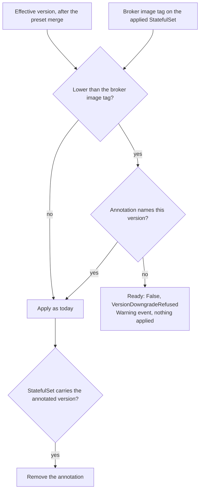

# Version downgrade guard for CamundaCluster

- Date: 2026-08-22
- Status: accepted
- Issue: #168
- Design record after merge: `docs/crds/camundacluster.md`, the three restore pages under
  `docs/crds/`, and `docs/guides/backup.md`

## Problem

`CamundaCluster.spec.version` accepts any value of the form `x.y.z`. Nothing refuses a change that
moves a running cluster to an older version. Camunda does not support that move. A broker compares
the version in its data directory with its own binary at startup. On a patch or minor downgrade it
reports `PatchDowngrade` or `MinorDowngrade`, starts, marks itself unhealthy, and applies no
migration. The operator accepts the edit, and the cluster goes unhealthy with nothing that names the
cause.

Since #157 the operator performs this edit itself. A `LogicalRestoreElasticsearch` or a
`LogicalRestoreRDBMS` sets the target to the version of its backup. That is a downgrade whenever the
cluster was upgraded past its backup. The restore is safe because of its order: the cluster is
suspended before the version changes, and the broker volumes are erased before any broker of the
older version starts. Nothing tells that case apart from a hand edit. The operator now does the
unsupported operation itself, which tells a user that the operation is supported. The CAUTION that
#157 added competes with observed behavior and loses.

## Goals

- Refuse a change that moves the effective version of a `CamundaCluster` backwards, and name the
  cause and the remedy where the user looks.
- Let a restore sanction its own version write, so a restore of #157 completes with no user action
  on the cluster. A restore that fails, or a restore that somebody deletes while it runs, leaves no
  standing sanction behind.
- Let a user downgrade by hand on purpose, and document the way to do it.
- Answer what happens when `spec.version` is removed and the preset supplies a lower version, or
  when the preset itself moves backwards, and document the answer.
- Correct or remove the CAUTION of #157 wherever it stops being true.

## Non-goals

- A validating webhook, cert-manager wiring, or a CEL transition rule. See the first decision.
- A guard for a skipped minor version (for example 8.9 to 8.11). Camunda does not support it either.
  It sits at the same comparison site and is a natural follow-up, but it is not this issue.
- A guard on `spec.connectors.version`. Connectors hold no state. A downgrade of Connectors is a
  normal roll.
- A change to the restore order that #157 decided. The restore keeps its suspend, version, erase,
  restore, unsuspend order.
- A migration of every local `x.y.z` parser in the repository to one shared helper. The guard adds
  one shared helper and uses it. The other sites stay as they are. A later sweep can move them.
- Any opinion on whether `version` belongs in a `CamundaClusterPreset` at all. That is a question
  about the fleet model, and it is open. This guard covers the case either way.

## Design overview

The guard lives in the `CamundaCluster` controller, not in admission. On every reconcile the
controller already resolves the effective spec from the cluster and its preset, and it already reads
the applied broker StatefulSet without the cache. The guard compares the effective version with the
tag of the broker image on that StatefulSet. When the effective version is lower, and nothing
sanctions the move, the reconcile stops before it applies anything. The cluster reports
`Ready: False` with reason `VersionDowngradeRefused` and a Warning event of the same reason, and it
keeps running as it is.

The sanction is one annotation on the `CamundaCluster`: `camunda.io/allow-version-downgrade`, with
the exact target version as its value. The controller accepts a downgrade to that version and no
other. Once the broker StatefulSet carries the sanctioned version, the controller removes the
annotation. A sanction therefore lives only as long as the move it permits, whoever set it.

A restore sets the annotation in the same server-side apply as `spec.version`, under the field
manager `camunda-operator/restore-version` that it already owns. The two land together or not at
all. A user who downgrades by hand sets the annotation and lowers the version, in one edit or in
two.

## Decision: the guard is controller-side, not admission-side

The issue offered a validating webhook and a controller-side refusal, and asked which experience is
wanted. The controller-side refusal is chosen, and for a reason that is stronger than the cost of
certificates.

A webhook on `CamundaCluster` sees a write to the cluster. It does not see the two other ways the
effective version moves backwards. A user can remove `spec.version` so that the preset supplies a
lower one, which `docs/crds/logicalrestoreelasticsearch.md` tells the user to do after a restore.
A platform team can lower the version in the preset, and every cluster that references the preset
rolls. Neither write touches the cluster object in a way that a transition rule on it can judge.
A CEL rule with `oldSelf` has the same blind spot, and it cannot read the annotation either.

The controller sees all three cases with one comparison, because it already holds the merged spec
(`internal/controller/camundacluster/precheck.go`) and the applied StatefulSet
(`internal/controller/camundacluster/storage.go`). It needs no certificate, no cert-manager, no
kustomize or Helm change, and no failure policy. The operator has no webhook today, and this work
does not add one.

The experience that a controller-side refusal gives is the one the issue named as its weakness: the
write is accepted and the cluster then disagrees with its own spec. That is how the operator already
reports a version below the floor (`InvalidReference`) and a missing preset. The cluster keeps
running as it is until the spec is corrected. A GitOps tool sees the object as applied and the
`Ready` condition as false, which is the same signal those cases give today.

## Decision: the comparison reads the effective version and the broker image tag

The new value is the effective version: `spec.version` of the cluster merged over the preset, as
`components.MergePreset` computes it. This is the only value that covers a removed field and a
preset edit.

The running value is the tag of the broker image on the applied broker StatefulSet, read without
the cache. This is what the next broker that starts will run. It is also what the restore reads
(`pkg/restore/target.go`), so the two controllers agree on what "running" means. The cluster has no
`status.version`, and a new one records what the controller wrote rather than what a broker
reads.

The rule is: if the effective version is lower than the tag, the change is a downgrade. Lower means
a smaller major, or the same major and a smaller minor, or the same major and minor and a smaller
patch. When there is no StatefulSet yet, or the tag is not of the form `x.y.z`, there is no running
version and no rule.

One consequence is accepted. A cluster that was just moved to 8.10.0 carries that tag on its
StatefulSet before any pod rolled. A user who reverts to 8.9.17 at that moment is refused, because
the tag is what the next broker reads. The user sets the annotation if the revert is intended.

## Decision: the refusal is a precheck failure, with a condition and an event

The guard runs as a precheck, after the preset merge and the storage read and before the components
are built. On a refusal the reconcile stops. Nothing is applied. This matches the version floor,
which also stops the reconcile on an invalid effective spec. The controller does not apply a
partial spec with the version clamped, because the version is a value the user can correct, unlike
a volume size that cannot shrink.

The cluster reports:

- `Ready: False`, reason `VersionDowngradeRefused`. `ReasonVersionDowngradeRefused` is a new
  constant in `api/v1/camundacluster_types.go`, because one CRD reports it. The message names the effective version, the running version,
  the fact that Camunda does not support a downgrade of a running cluster, and the three remedies:
  set the version to the running one or later, restore a backup taken with the lower version, or
  set the annotation to downgrade on purpose.
- One Warning event with reason `VersionDowngradeRefused`, recorded once per distinct refusal. The
  precheck already emits no event for the floor, so the event is new here. It is added because a
  refused downgrade is an action somebody took a moment ago, and an event is what `kubectl describe`
  and most alerting read first.

## Decision: the sanction is an annotation with the target version as its value

The annotation is `camunda.io/allow-version-downgrade`. Its value is the exact version that the
move is allowed to reach, for example `"8.9.9"`. The `camunda.io/` domain is the one the operator
already uses for its annotations (`camunda.io/config-hash`, `camunda.io/claim-holder-kind`).

The value is a version and not `"true"` for two reasons. A sanction for one move cannot be reused
for another move later. And the restore and the user both know the version they want, so the value
costs nothing to give. A value that is not of the form `x.y.z`, or that does not equal the effective
version, sanctions nothing, and the refusal message names the value that the annotation has to carry.

The controller consumes the annotation. At the end of a reconcile in which the broker StatefulSet
carries the version that the annotation names, the controller removes the annotation from the
cluster with a merge patch. It does not use server-side apply for that, because the annotation was
written by another manager and the controller wants it gone, not co-owned. This is the first write
that the `CamundaCluster` controller makes to the metadata of its own resource. It is small, and it
is what lets the sanction be safe without a lifecycle that somebody else has to remember.

Consumption answers the acceptance criterion about restores that fail or that are deleted while they
run. The annotation exists only between the write and the roll of the StatefulSet template, and the
roll happens whether or not the restore is still there. A restore that is deleted before its write
never wrote the annotation. A restore that is deleted after its write already had its annotation
consumed, or will have it consumed on the next reconcile of the cluster.

Two edges are stated rather than handled:

- A user who sets the annotation and never lowers the version keeps an annotation that permits one
  exact move. That is the user's own standing sanction, and the documentation says so.
- A cluster whose reconcile stops for another reason (`spec.pause`, a missing preset) keeps the
  annotation until the reconcile runs again. Then the move is applied and consumed as usual.

## Decision: the restore writes the annotation in the apply that writes the version

`pkg/restore/prepare.go` already builds a `CamundaCluster` that carries the name, the namespace, the
UID, and one spec field, and applies it under `camunda-operator/restore-version`. The change adds
the annotation to that object. One apply, one manager, two fields that belong together.

The issue asked when the annotation goes on and when it comes off, and named the crash between the
annotation write and the version write as the hazard. With one apply there is no between. The
#157 order is untouched: the restore still suspends, waits for zero replicas, writes the version,
and waits for the tag. The cluster controller accepts the version because the annotation names it,
rolls the image at zero replicas, and consumes the annotation before the restore sees the tag
converge. The restore removes nothing at `Completed` or `Failed`, and it needs no finalizer for
this, which keeps the "no finalizer" decision of #157 intact.

`PointInTimeRestore` writes no version and is not changed.

A `LogicalRestoreRDBMS` writes the version of its backup even when the target was already
compatible, which #157 decided and documented. That write is now sanctioned like every other. The
question of whether it is wanted stays with #157.

## Decision: removing the field, and a preset that moves backwards

Both are answered by the same rule, and the documentation says so in one place.

When `spec.version` is removed and the preset carries a lower version, the effective version drops,
and the cluster refuses the move with `VersionDowngradeRefused`. The remedy is to set the annotation
before, or together with, the removal. `docs/crds/logicalrestoreelasticsearch.md` and
`docs/crds/logicalrestorerdbms.md` tell the user to remove the field after a restore so that the
preset supplies the version again. That advice stays, with the guard named next to it.

When the version in a `CamundaClusterPreset` is lowered, every cluster that references the preset
refuses the move on its own, and each one reports the refusal on its own `Ready` condition. A
preset edit is a fleet operation with no per-cluster admission point, and the controller is the
only place that sees it. `docs/guides/presets.md` states this in "Change a fleet".

## Documentation

| Page | Change |
| --- | --- |
| `docs/crds/camundacluster.md` | The rule, the condition and the event, the annotation, the hand-downgrade procedure, the removed-field case. |
| `docs/crds/logicalrestoreelasticsearch.md` | The restore writes the annotation with the version. The rule, stated. The CAUTION corrected. |
| `docs/crds/logicalrestorerdbms.md` | Same as the Elasticsearch page. |
| `docs/crds/pointintimerestore.md` | The rule, stated, and that this kind writes no version and needs no sanction. |
| `docs/guides/backup.md` | The CAUTION in "What an upgrade does to the backups you hold" corrected. |
| `docs/guides/presets.md` | "Change a fleet": a lower version is refused by each cluster. |
| `docs/guides/operations.md` | The annotation, next to the other operator-consumed metadata, if the page has such a place. |
| `api/v1/` GoDoc | `Version` field comment names the guard. New reason constant documented. |

The hand-downgrade procedure is written as a procedure with a CAUTION first: a downgrade over data
that a newer version wrote leaves every broker unhealthy, and the remedy is to go forward again or to
restore a backup.

## Testing

- Pure unit tests with testify for the comparison, the sanction check, and the refusal message,
  next to the file that holds them.
- Unit tests on `pkg/restore` that the version apply carries the annotation with the same value.
- Ginkgo envtest specs on the `CamundaCluster` controller: a lower `spec.version` is refused with the
  condition and the event, a sanctioned move is applied, the annotation is consumed once the
  StatefulSet carries the version, a removed `spec.version` over a lower preset is refused, and a
  preset whose version is lowered is refused.
- An end-to-end spec is decided during planning with the `testing-end-to-end` skill. The existing
  restore e2e flows are same-version by construction, so they exercise neither the guard nor the
  sanction. A spec that lowers `spec.version` on a running cluster and asserts
  `VersionDowngradeRefused` costs no roll and proves the user-visible rule against a real cluster.

## Consequences

- A hand downgrade is refused and reported. The unsupported case and the supported case are told
  apart by the operator itself, not by a paragraph.
- A restore of #157 completes with no user action, and leaves no standing sanction.
- The `CamundaCluster` controller gains one read it already had (the StatefulSet tag) and one write
  it did not have (removal of its own annotation).
- The operator still has no webhook, no cert-manager dependency, and no new install step.
- The cloud operator above this one, and any GitOps tool, see the same signals they see for every
  other precheck failure: `Ready: False` with a reason, plus an event.

## Risks

- The tag on the StatefulSet is the running version. A cluster whose StatefulSet was edited by hand
  to a different image carries a tag the operator did not write. The guard then compares against
  that tag. The next reconcile rewrites the StatefulSet anyway, so the window is one reconcile.
- The annotation is consumed by a write from the cluster controller. If that write fails, the
  annotation stays until the next reconcile, which retries it. A permanent failure to patch the
  cluster's own metadata is a permission problem that every other write of the operator shares.
- A GitOps tool that manages the cluster's annotations with server-side apply and declares none
  keeps its hands off this one, because the tool owns only the keys it declares. A tool that prunes
  unknown annotations removes the sanction before the controller consumes it, and the restore's
  version write is then refused. That is the same class of conflict that #157 documented for
  `spec.suspend` and `spec.version`, and the restore pages name it next to the existing paragraph.

## Alternatives considered

- **Validating webhook with the annotation as sanction.** The issue's proposal. Rejected because it
  cannot see a removed field or a preset edit, and because it adds certificates, cert-manager, and
  a failure policy to an operator that has none of them. See the first decision.
- **CEL transition rule on `spec.version`.** Zero infrastructure, and the CEL semver library exists
  since Kubernetes 1.33. Rejected for the same blind spot, and because a CEL rule cannot read
  annotations, so the sanction has to be a spec field.
- **The restore's cluster claim as the sanction.** The claim Lease is taken before the first write
  and released at the end, which is the right shape. Rejected because backups hold the same claim,
  because a user has no way to hold it by hand, and because the cluster controller then has to
  read a Lease and its holder to decide a spec question.
- **Absence of broker volumes as the sanction.** The safety of the restore comes from the erased
  volumes, so "no volumes, no state to protect" is the most honest rule. Rejected because the restore
  writes the version before it erases the volumes, and reordering #157 to make this work is a
  bigger change than the guard.
- **Sanction removed by the restore at a terminal phase.** The issue's proposal for the lifecycle.
  Rejected because the restore has no finalizer, by decision of #157, so a deleted restore leaves the
  annotation behind. Consumption by the controller covers that case without a finalizer.
